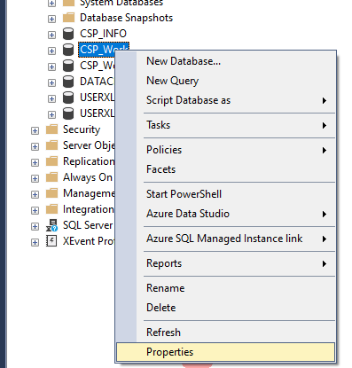
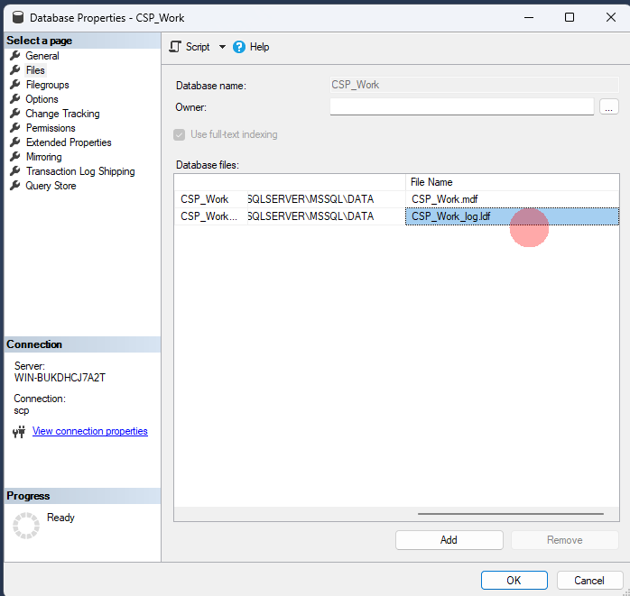
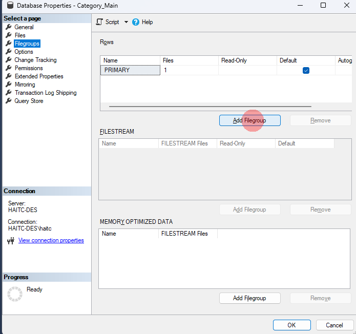
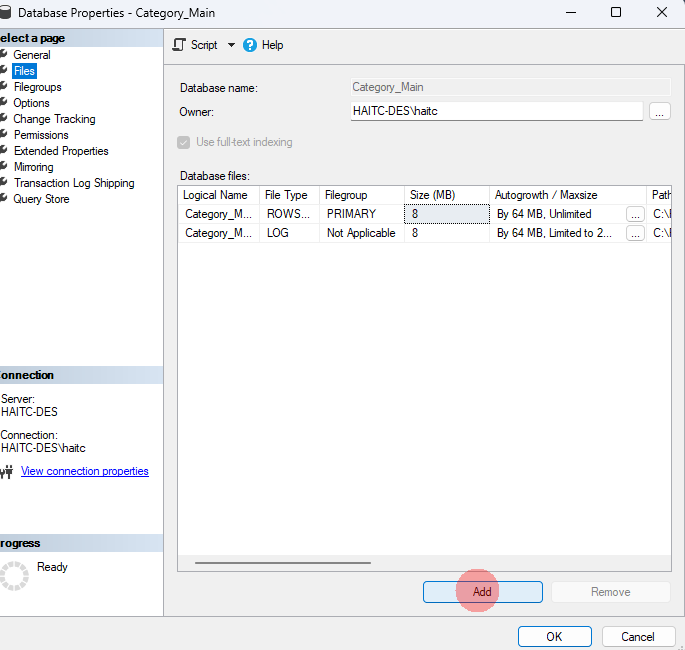
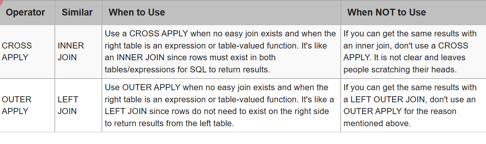
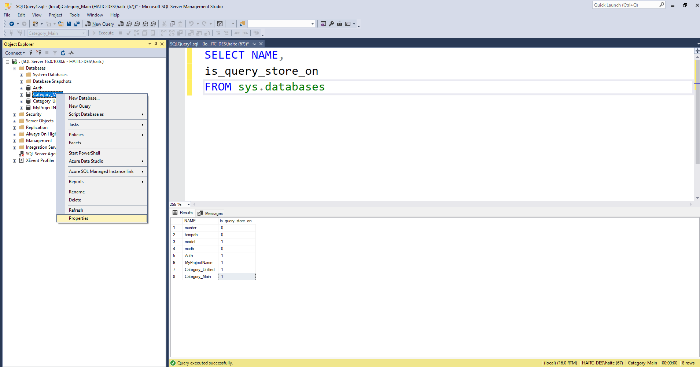
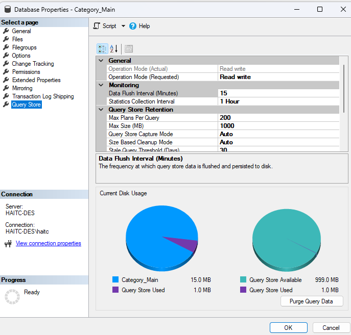
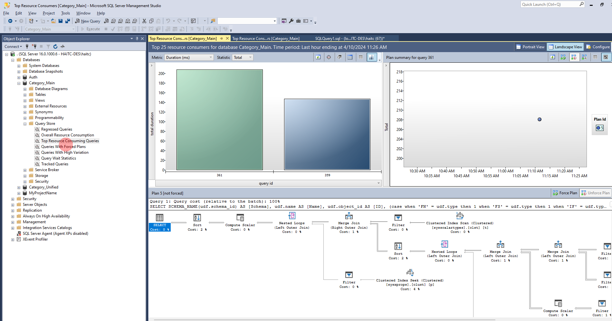

# Học SQL Server trong 60p

- [link khóa học](https://www.youtube.com/watch?v=alqEF4I23nw&t=633s)

## Kiến trúc logic

- System Database:

  - Lưu trữ System Catalogs:

    - Thông tin cấu hình.
    - Thông tin các DB trong instance.
    - thông tin Datafiles.
    - Login.

  - Bản chất **dữ liệu không nằm ở System Databas** mà nằm ở **Resource DataBase**.
- Model Database: Lưu trữ template để tạo DB cho nhanh.
- **TampDB Database**:

  - Được tạo lại mỗi lần tạo DB: Không cần Recovery, Backup.
  - Chứa tất cả những gì dùng tạm khi thực thi câu lệnh: Tamp table, câu lệnh sort...
  - Cách tối ưu:
    - Tạo thêm Tempfile (mặc định SQL Server tạo 1 file gây nghẽn IO).
    - Ưu tiên lưu Tempfile ở phân vùng có tốc độ đọc ghi cao.
    - **Tempory table có thể tối ưu**: Index...

- MSDB:
  - Sử dụng cho SQL Server Agent Service (là 1 Window Service quản lý các task theo lịch - job trong SQL Server).
  - Sử dụng cho một số service quản trị khác: Đặt job, cấu hình giải pháp HA (Highe Availability ).
- Resource Database (DB ẩn) trong thư mục \bin.

>**NOTE**:  Khi backup DB sang instance khác **phải backup DB hệ thông** để đảm bảo hoạt động.

## Kiến trúc vật lý




Tất cả DB đều bao gồm 2 loại file:

- Data File: Lưu trữ tất cả dữ liệu trong quá trình tạo bảng, insert, update, delete...
  - MDF File (Master Database FIle) **Bắt buộc có**
    - Đây là file lưu trữ thông tin chính:
      - INTERNAL CONFIGURATION
      - INTERNAL SYSTEM
    - Chứa thông tin vị trí các Data File khác.

  - NDF File (Secondary Database FIle):
    - Tất cả các Data Fuke khác đều gọi là Second Database File.
    - Có thể có hoặc không.
    - Có thể thay đổi định dạng mặc định NDF.

>**NOTE**: Trong các dự án lớn có thể có nhiều Data File (nên làm). Nhóm các file NDF cùng logic ví dụ: Sale vào 1 NDF, HR vào 1 NDF khác. Tất cả dữ liệu của Sale được đổ cùng vào 1 nươi là File Group.

>**NOTE**: **Không nên lưu dữ liệu người dùng vào MDF** Khi tạo DB tạo các File Group \>  NDF \> Khi tạo bảng chỉ định table đó ở FIle Group nào.



``` SQL
CREATE TABLE Employees (
  Id int,
  Name nvarchar(250)
) on HR;
```

- Transection Log File:
  - Lưu thông tin thay đổi dữ liệu.
  - Phục vụ cho khôi phục dữ liệu.

>**NOTE** Phải có chiến lược Backup Transacetion Logs. Không tự co kích thước file dẫn đến chậm dần.

## Các bước thực thi câu lệnh

- Phân tích cú pháp và ngữ nghĩa: Kiểm tra cú pháp đã đúng chưa. có quyền truy cập vào các bảng, cột không? Nếu sai sẽ dừng việc thực thi và đưa cảnh báo cho người dùng.
- Kiểm tra chiến lược thực thi (tương tự như map sẽ tìm ra cách có chi phí thấp nhất). Có 2 trường hợp:
  - Nếu câu lệnh đã từng thực hiện thì sẽ lấy chiến lược thực thi cũ. **NOTE** SQL Server sẽ so sánh text của câu lệnh giống nhau 100% (Tính cả dấu xuống dòng).
  - Nếu chưa có thì sẽ phân tích và đưa ra chiến lược thực thi.
- Thực thi câu lệnh theo chiến lược đã phân tích.

``` SQL
-- Truy vấn chiến lược thực thi các câu lệnh đã thực thi
-- UseCountL: Hệ thống đã thực thi câu lệnh bao nhiêu lần. Nếu câu lệnh giống nhau thì UseCount > 1
-- TEXT: Câu lệnh
-- query_plan: Chiến lược thực thi
SELECT UseCount, TEXT, query_plan
FROM sys.dm_exec_plans cp
CROSS APPLY sys.dm_exec_sql_text(plan_handle) sqltext
CROSS APPLY sys.dm_exec_query_plan(plan_handle) queryplan
WHERE text LIKE '% FROM Wecommit%' AND text NOT LIKE '%SELECT UseCount$'

-- tạo clustered index
CREATE CLUSTERED INDEX IDX_BussinessEntityId
ON Wecommit_persion(BussinessEntityId)

-- tạo non clustered index trên cột tìm kiếm
CREATE INDEX IDX_Firstname
ON Wecommit_persion(Firstname)

-- Xóa lịch sử chiến lược thực thi
-- Toàn bộ
DBCC FREEPROCCACHE; 
-- trong phiên làm việc (Transaction)
DBCC FREESESSIONCACHE;
-- Tất cả phiên làm việc
DBCC FREESYSTEMCACHE;


```

> So sánh **APPLY và JOIN**

>**Clustered index**: Khi đánh clustered index thì dữ liệu trong bảng sẽ được sắp xếp lại theo cột được đánh. **Primary Key** là 1 Clustered Index.

- Các đọc chiến lược thực thi:
  - Đọc từ phải qua trái.
  - Mũi tên càng to thì dung lượng dữ liệu càng lớn.
  - tập trung vào Estimated Subtree **Cost**.

## GIams sát thực thi câu lệnh trong hệ thống

1. **Lock**

- Hiện tượng khi có nhiều câu lệnh khác tran cùng tác động vào cùng các bản ghi trong bảng.

- Gỉa sử có 2 tran sau:

``` SQL
BEGIN TRAN
UPDATE wecommit_persion 
SET lastname = 'wecommit'
WHERE  BussinessEntityId BETWEEN 10 AND 20
```

``` SQL
BEGIN TRAN
DELETE wecommit_persion 
WHERE  BussinessEntityId BETWEEN 10 AND 20
```

- Tran 2 sẽ mãi mãi pending vì tran 1 chưa được đóng.
- **Sử ụng Activity Monitor** để kiểm tra các tiến trình đang bị **lock**:
  - Chuột phải vào Database Instance \> Activity Monitor.
  - Có thể quan sát tất cả các tiến trình trong DB.
  - Để ý cột SessionId và BlockedBy.
  - Kích vào filter ở cột BlockedBy = NonBlanks.
  - Xem chi tiết tiến trình: Chuột phải \> **Details**.
  - Để xử lý lock thì đơn gian nhất là **Kill Process**.
- Sử dụng query để tìm Process bị lock:

``` SQL
SELECT session_id,
command,
blocking_session_id
FROM sys.dm_exec_requests
WHERE blocking_session_id <> 0

-- Kiểm tra sesion 53 làm gì
DBCC INPUTBUFFER(53)

-- kILL SESSION 53
kill 53
-- * KIỂM TRA XEM BẢNG NÀO ĐANG BỊ LOCK
SELECT request_session_id ssid,
OBJECT_NAMR(resource_associated_entity_id) table_name
FROM sys.dm_tran_locks
WHERE respirce_type = 'OBJECT'
```

2. **Query Store**

- Lưu thông tin lịch sử thực hiện câu lệnh SQL.
- Chức năng này chỉ có từ phiên bản SQL Server 2016 trở lên. Phiên bản **2022 là mặc định** còn lại phải tự cấu hình để bật Query Store.

``` SQL
-- Kiểm tra Query Store đã bật chưa
SELECT NAME,
is_query_store_on
FROM sys.databases

-- Bật Query Store
ALTER DATABASE AdvantureWork
SET QUERY_STORE = ON (OPERATION_MODE = READ_WRITE)
```

- Cấu hình Query Store


  - Data Flush Interval (minutes): Sau bao nhiêu phút thì snapshot lại 1 lần. Nên để **5** cho mịn hơn.
  - Statistics Collection Interval: Thời gian lưu trữ lịch sử. Nên để 45 hoặc 90 ngày tùy dự án.
- Xem báo cáo Query Store
  - Dùng giao diện
  
  - Dùng câu lệnh

``` SQL
-- tOP 10 câu lệnh đọc ổ đĩa nhiều nhất trong vòng 24h qua
SELECT TOP 10
rs.avg_physical_io_reads,
 qt.query_sql_text,
q.query_id,
qt.query_text_id,
p.plan_id,
rs.last_execution_time
FROM  sys.query_store_query_text qt
JOIN sys.query_store_query q
ON qt.query_text_id = q.query_text_id
JOIN sys.query_store_plan p
ON  q.query_id = p.query_id
JOIN sys.query_store_runtime_stats rs
ON p.plan_id = rs.plan_id
JOIN sys.query_store_runtime_stats_interval rsi
ON rs.runtime_stats_interval_id = rsi.runtime_stats_interval_id
WHERE rsi.start_time >= DATEADD(HOUR, -24, GETDATE())
ORDER BY rs.avg_physical_io_reads DESC
  ```
