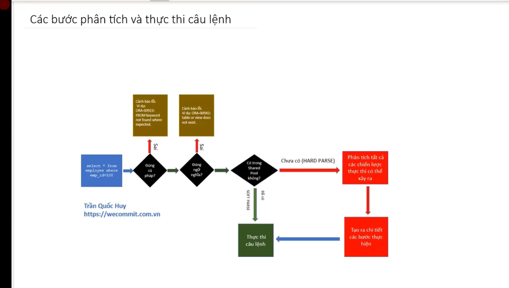

# Sử dụng giá trị trực tiếp nhiều lần trong câu lệnh giống nhau

[Video](https://wecommit.com.vn/courses/chuong-trinh-dao-tao-toi-uu-co-so-du-lieu-cao-cap/lesson/sai-lam-01/)

## Các bước DB thực hiện câu lệnh



- Bước 1: Thực hiện kiểm tra cú pháp của câu lệnh.
- Bước 2: Kiểm tra ngữ nghĩa của câu lệnh.
  - Kiểm tra các Object (table, view, column...) trong câu lệnh có tồn tại không?
  - Kiểm tra người dùng có quyền tương tác với các Object đó.
- Bước 3: Kiểm tra thông tin trong Shared Pool (bộ nhớ lưu giữ các chiến lược thực thi của những câu lệnh đã từng thực hiện trong hệ thống.
  - Trường hợp nếu Oracle không tìm thấy thông tin trong Shared Pool và buộc phải làm đầy đủ cả 6 bước, chúng ta gọi là HARD PARSE.
  - Trường hợp nếu Oracle tìm thấy thông tin và bỏ qua bước 4,5, chúng ta gọi là SOFT PARSE.
  - Trước khi hoàn thành bước số 3 này, Oracle sử dụng một giải thuật HASH để chuyển câu lênh SQL FULL TEXT ban đầu thành một mã SQL_ID. Hàm HASH này có thể thay đổi tùy vào phiên bản của Oracle database mà bạn sử dụng.
  - Các câu lệnh SQL có giá trị FULL TEXT giống nhau 100% thì sẽ cùng có SQL_ID, mặc dù các câu lệnh này có thể chạy trên các hệ thống khác nhau (miễn là cùng phiên bản Oracle database).
- **Bước 4**: Thực hiện tính toán và phân tích tất cả những chiến lược thực thi có thể sử dụng để thực hiện câu lệnh mà người dùng yêu cầu. và lựa chọn ra chiến lược thực thi có chi phí tối ưu.
- **Bước 5**: Nhận chiến lược thực thi tối ưu và sinh ra 1 kế hoạch thực thi cụ thể, chi tiết cho câu lệnh (Step by step). Dựa vào thông tin này, Cơ sở dữ liệu sẽ biết chính xác mình cần xử lý những gì để lấy được kết quả mong muốn.
- Bước 6: Câu lệnh thực thi theo kế hoạch đã được lựa chọn.

>**NOTE** bước 4 và 5 tốn tài nguyên nhất trong 6 bước.
>
## Sai lầm

- Giải sử cần lấy 2 nhân viên theo EMP_ID bằng 2 câu lệnh sau:

``` SQL
select * from employees where emp_id=1;

select * from employees where emp_id=2;
```

- Kiểm tra lịch sử thực hiện câu lệnh

``` SQL
SELECT sql_text, sql_id, executions, hash_value, plan_hash_value
FROM v$sql
WHERE sql_text LIKE '%select * from employees where emp_id=%';
```

>Kết quả: 2 câu lệnh trên có cùng plan_hash_value tức là cung 1 chiến lược thực thi nhưng vẫn phải phân tích chiến lược thực thi 2 lần (bước 4,5) điều này gây lãng phí tài nguyên giảm hiệu năng hệ thống.

- Cách khắc phục là sử dụng biến

``` SQL
select * from employees where emp_id=:B1;
SELECT sql_text, sql_id, executions, hash_value, plan_hash_value
FROM v$sql
WHERE sql_text LIKE '%select * from employees where emp_id=%';
```

- Có thể thấy rằng cả 2 cách cùng trả về cùng kết qua nhưng cách 2 chỉ phân tích plan 1 lần duy nhất. Khi truy vấn này được thức hiện nhiều lần sẽ tiết kiệm đáng kể tài nguyên.
