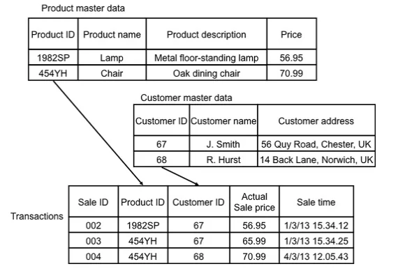

# Vòng đời dữ liệu

# 1. Trạng thái dữ liệu

[Video](https://wecommit.com.vn/courses/chuong-trinh-dao-tao-toi-uu-co-so-du-lieu-cao-cap/lesson/sai-lam-09-cuc-ky-quan-trong/)

- Hot: Đọc/ghi tần suất cao.
- Cool: Sau 1 thời gian dữ liệu có tần suất đọc/ghi giảm dần đi.
- Cold: Dữ liệu ít thay đổi, chỉnh sửa, đọc ghi. VD: dữ liệu lịch sử.

## Loại dữ liệu

- Cấu hình: Config, System
- Master Data: thông tin người dùng,danh mục...
- Transactional Data: Dữ liều lớn, đọc ghi nhiều => cần có chiến lược cho vòng đời dữ liệu như bao lâu dữ liệu là Hot => Cool => Cold.

## Chiến lược vòng đời dữ liệu

- Xác định loại dữ liệu.
- Đưa ra chiến lược cho từng loại dữ liệu: Bao lâu là hot? Bao lâu chuyển thành Cool, Cold?
- Lựa chọn công nghệ để thao tác: Partition
- Dữ liệu cũ
  - Read only.
  - Bỏ ra khỏi chiến lược Backup.
  - Nén
  - Lưu vào phân vùng đọc/ghi kém hơn.

# 2. Các vấn đề gặp phải khi không có chiến lược vòng đời dữ liệu

[Bài viết](https://wecommit.com.vn/courses/chuong-trinh-dao-tao-toi-uu-co-so-du-lieu-cao-cap/lesson/case-study-xay-dung-chien-luoc-vong-doi-du-lieu-cho-nhung-he-thong-trong-yeu/)

## 2.1. Mới triển khai xong thì hiệu năng tốt, sau đó một thời gian thì hệ thống chậm dần

Một trong những nguyên nhân gây ra “hậu quả” trên đó là: lượng dữ liệu cần làm việc của câu lệnh luôn tăng lên theo thời gian. Ngay cả khi chúng ta thiết kế Index hợp lý thì Index cũng tăng trưởng do dung lượng Table tăng lên.

1.2. Chi phí đầu tư cho lưu trữ dữ liệu ngày càng tăng
Nếu dữ liệu luôn luôn tăng trưởng, nhưng chúng ta lại đối xử với tất cả các DỮ LIỆU ấy NHƯ NHAU, thì chúng ta luôn phải đầu tư thêm chi phí cho hạ tầng phần cứng trong tương lai.

Ví dụ: thời điểm hiện tại bạn đầu tư 100GB SSD cho Cơ sở dữ liệu.

Sau 2 năm phát triển, cơ sở dữ liệu của bạn đã có dung lượng 500GB. Nếu bạn đối xử 500GB này như nhau, bạn sẽ cần đầu tư Storage 500G SSD.

# 3. Trong cơ sở dữ liệu chúng ta sẽ áp dụng chiến lược vòng đời dữ liệu cho những dữ liệu kiểu gì?

Có phải tất cả mọi dữ liệu lưu trữ trong Database đều cần phải có chiến lược về vòng đời không?

Câu trả lời là KHÔNG.

Trong Cơ sở dữ liệu của doanh nghiệp có rất nhiều loại dữ liệu khác nhau, và không phải tất cả mọi loại dữ liệu đều liên tục tăng trưởng, ảnh hưởng đến hiệu năng, cách quản trị Database.

Loại dữ liệu chúng ta áp dụng chiến lược là TRANSACTION DATA. Các dữ liệu này thường sẽ có những đặc điểm sau:

- Dữ liệu tăng tưởng nhanh
- Dung lượng dữ liệu lớn

# 4. Hai phương án phổ biến nhất trong việc áp dụng chiến lược vòng đời dữ liệu

## 4.1. Phương án đơn giản nhất: Chỉ chia dữ liệu làm 2 loại Read Write – Read Only

Một số Doanh nghiệp có thể chốt được nghiệp vụ như sau:

- Dữ liệu chỉ cần giữ lại trong 1 năm gần nhất (Read – Write).
- Các dữ liệu sau 1 năm thì sẽ chốt không cần nữa (có thể chuyển sang READ ONLY hoặc thực hiện loại bỏ khỏi hệ thống  – CUTOFF dữ liệu)

## 4.2 Phương án kết hợp: Dữ liệu sẽ được chia làm nhiều loại

- Những dữ liệu thường xuyên được sử dụng (Hot Data) được lưu trữ trên hệ thống Storage cao cấp nhất, I/O tốt nhất.
- Những dữ liệu có nhu cầu truy xuất dữ liệu thấp hơn (trong hình gọi là Cooler Data) sẽ được lưu trữ ở các vùng cấp độ 2. Những dữ liệu này chỉ có mục tiêu phục vụ báo cáo, sẽ không có các câu lệnh chỉnh sửa dữ liệu trên dữ liệu loại này.
- Các dữ liệu lịch sử với tần suất truy xuất cực ít sẽ gọi là Cold Data. Chúng ta sử dụng những công nghệ lưu trữ thường có giá thấp nhất, có tốc độc đọc ghi không cao, chủ yếu là cần nhiều dung lượng cho việc lưu trữ mà thôi

# 5. Các công nghệ được áp dụng khi xây dựng chiến lược vòng đời dữ liệu?

## 5.1. Công nghệ Partition

## 5.2. Công nghệ nén dữ liệu

## 5.3. Công nghệ lưu trữ dữ liệu

# 6. Việc cần làm ngay bây giờ – Cách để bạn áp dụng trong công việc

Đây là các câu hỏi bạn sẽ phải áp dụng cho doanh nghiệp của mình

- Đâu là các dữ liệu giao dịch trong Cơ sở dữ liệu?
- Các dữ liệu giao dịch này hiện tại có dung lượng, mức độ tăng trưởng hàng tháng thế nào?
- Các dữ liệu giao dịch hiện tại đã được thực hiện Partition hay chưa? (lưu ý: những Table có dung lượng lớn hơn 2GB đều được khuyến cáo cân nhắc áp dụng kỹ thuật Partitition)
- Khoảng thời gian lưu trữ dữ liệu chính xác cần phục vụ cho doanh nghiệp bạn là bao lâu? (Xác định Hot Data, Coller Data, Cold Data).
- Với các dữ liệu Cold Data:
  - Dữ liệu này có thể chuyển ra bên ngoài hệ thống hay không? (backup vào Tape hoặc chuyển hẳn sang một máy chủ khác được không)
  - Dữ liệu sau thời gian nào thì hoàn toàn không còn cần nữa và có thể XÓA BỎ?
- Doanh nghiệp của bạn có đang thực hiện chỉ cấp phát 1 loại hạ tầng (cùng 1 storage với cấu hình như nhau) cho toàn bộ lượng dữ liệu của Database hay không?
- Sau khi chi được Hot Data, Coller Data, Cold Data, bạn có thể ưu tiên những tài nguyên tốt nhất (tốc độ đọc ghi tốt nhất) cho Hot Data hay không?
- Với những dữ liệu Cold Data chúng ta có thể thực hiện nén dữ liệu với tỉ lệ nào, áp dụng giải thuật nào?
- Chiến lược tổng thể sau khi đã giải quyết toàn bộ câu hỏi trên của bạn sẽ như thế nào?
