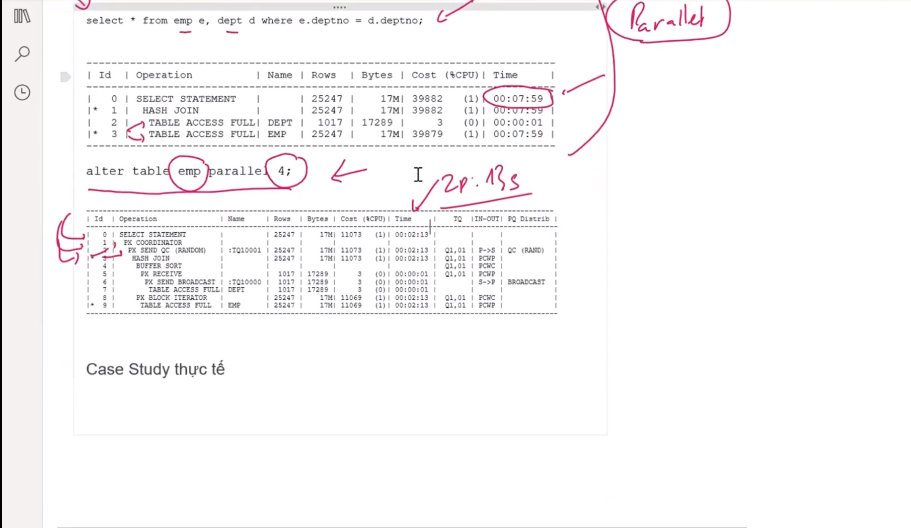

[Video](https://wecommit.com.vn/courses/chuong-trinh-dao-tao-toi-uu-co-so-du-lieu-cao-cap/lesson/sai-lam-05/)

## PARALLEL

- Mặc định chạy câu lệnh thì DB sử dụng 1 core CPU.
- PARALLEL: Thiết lập số core sử dụng để thực thi câu lệnh.

- Vấn đề là bất kỳ khi nào chạy câu lệnh liên quan đến Object đó thì đều sử dụng PARALELL, nếu quá nhiều tiến trình sử dụng  => toang luôn cả hệ thống.

## Case study

- Rebuild index với dữ liệu lớn sẽ rất chậm. Cấu hình PARALELL thêm core chạy cho nhanh

``` SQL
ALTER INDEX IDX_SALARY  REBUILD PARALLEL 4;
```

- Vấn đề là sau khi rebuild thì cấu hình PARALELL vẫn ăn vào index. Index lại được sử dụng rất nhiều => toang.
- Quy trình chuẩn

``` SQL
ALTER INDEX IDX_SALARY  REBUILD PARALLEL 4;
ALTER INDEX IDX_SALARY NOPARALLEL;
```

## Kết luận

- Khi kiểm tra 1 hệ thống cần xem xét các thông số: Cách đánh index, các index có parallel không, gather statistics... chứ không chỉ nhìn 1 khía cạnh là index.
- Cân nhắc kỹ khi sử dụng PARALELL
  - PARALELL sẽ có tác dụng trên mọi tiến trình sử dụng Object.
  - Nên dùng parallel trên các tiến trình quan trọng hoặc xảy ra vào thời điểm ít tran (chạy ban đêm), hoặc tiến trình đó ít tran sử dụng .
  - Có thể thiết lập parallel cho câu lệnh chứ không nhất thiết phải thiết lập cho bảng, index.
