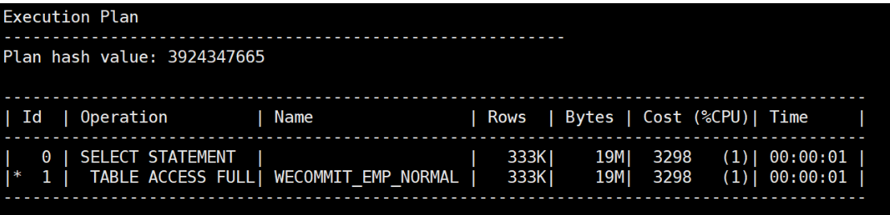
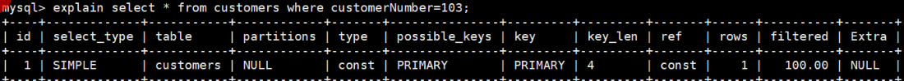
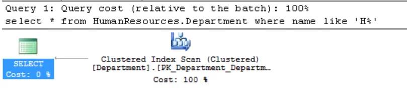
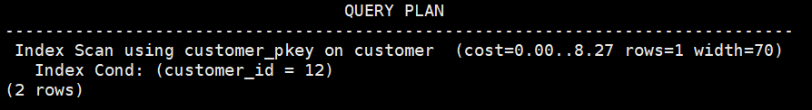
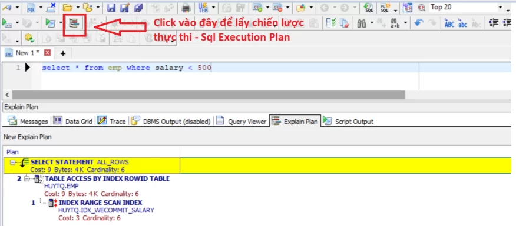
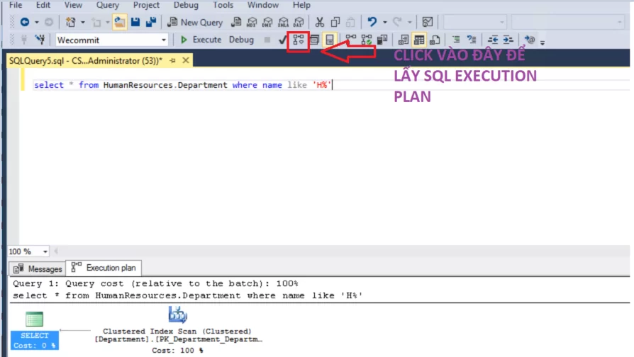
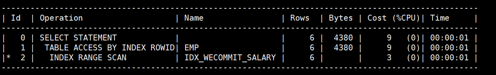
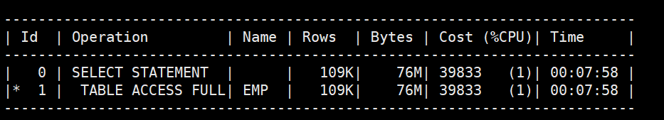
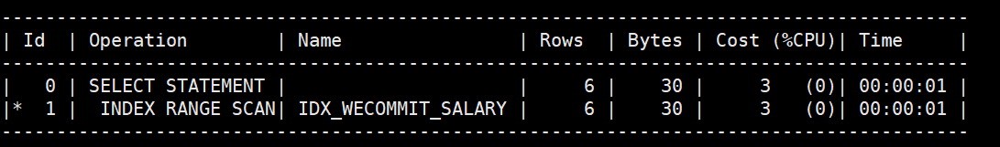

[Bài viết](https://wecommit.com.vn/courses/chuong-trinh-dao-tao-toi-uu-co-so-du-lieu-cao-cap/lesson/kien-thuc-can-biet-truoc-khi-toi-uu-sql-exeuction-plan-la-gi/)

# 1. SQL Execution Plan là gì?

Để bất kỳ một hệ quản trị CSDL nào thực thi được câu lệnh SQL của bạn, nó đều cần biết “cụ thể sẽ cần làm các bước gì, sẽ phải lấy dữ liệu theo cách nào, join nhứ thế nào, làm bước nào trước, làm bước nào sau”. Tất cả bước ấy gom lại thành một thứ: **chiến lược thực thi** của câu lệnh SQL, hoặc thuật ngữ chuyên ngành gọi là Sql Exeuction Plan.

Dưới đây là hình ảnh Sql Execution Plan trong một số loại cơ sở dữ liệu phổ biến.

## 1.1. Sql Execution Plan trong Oracle

``` SQL
select * from huytq.wecommit_emp_normal where salary > 5000;
```



## 1.2. Sql Execution Plan trong MySQL

``` SQL
 explain select * from customers where customerNumber=103;
 ```



## 1.3. Sql Execution Plan trong SQL Server

``` SQL
select * from HumanResources.Department where name like ‘H%’
```



## 1.4. Sql Execution Plan trong cơ sở dữ liệu PostgreSQL

``` SQL
postgres=# explain select * from customer where customer_id=12;
```



# 2. Làm thế nào để lấy được thông tin Sql Execution Plan?

Anh em có  một số cách thức “kinh điển” để lấy SQL Execution Plan:

- Cách 1: Dùng công cụ đồ họa (tool).
- **Cách 2**: Sử dụng lệnh. Cách này sẽ trả ra text.

## 2.1. Sử dụng TOOL để lấy Sql Execution Plan

Nếu anh em đang sử dụng công cụ nào thì có thể search cụm từ khóa “Show Sql Execution Plan + “tên Tool”

### 2.1.1. Cách sử dụng Toad Oracle



### 2.1.1. Cách sử dụng Toad SQL Server



## 2.2. Lấy trực tiếp Sql Execution Plan trên database server

- Oracle: Bật autotrace khi đăng nhập vào sqlplus

``` SQL
set autotrace traceonly
```

- PostgreSQL: Bạn thêm từ khóa Explain ở trước câu lệnh SQL

``` SQL
 explain select *from customer where id=12;
 ```

- MySQL: Bạn thêm từ khóa Explain ở trước câu lệnh SQL

``` SQL
explain select* from customers where customerNumber=103;
```

# 3. Tại sao Sql Execution Plan lại đặc biệt quan trọng khi chúng ta thực hiện tối ưu SQL?

Tại phần 1 tôi đã dẫn chứng cho các anh em thấy một điều: Tất cả các cơ sở dữ liệu đều phải phân tích Sql Execution Plan.
Bây giờ tôi sẽ giúp mọi người hiểu sâu hơn: Lý do gì chúng ta phải biết về SQL Execution Plan thì mới thực hiện tối ưu được.

Bây giờ tôi sẽ xét một ví dụ như sau. Chúng ta có 03 câu lệnh:

- Câu lệnh thứ nhất:

``` SQL
select * from emp where salary < 500
```

- Câu lệnh thứ hai:

``` SQL
select * from emp where salary < 5000
```

- Câu lệnh thứ ba:

``` SQL
 select salary from emp where salary < 500
```

Ba câu lệnh bên trên về mặt cách thức thì không có gì khác nhau cả:

- Đều làm việc với bảng EMP
- Lọc dữ liệu đều lọc qua cột SALARY
Tuy nhiên, ba câu lệnh này có hiệu năng KHÁC NHAU rất nhiều.

Để có thể trả lời được các câu hỏi như:

- Mỗi câu lệnh khi thực hiện sẽ tiêu tốn tài nguyên ra sao?
- Câu lệnh đang bị chậm vì NGUYÊN NHÂN GỐC nào?
- Tôi nên tập trung vào tối ưu objects nào trong câu lệnh SQL?
Lúc này nếu chỉ nhìn vào thuần túy (dạng TEXT) của câu lệnh, chúng ta rất khó để trả lời các câu hỏi bên trên.

Tuy nhiên khi sử dụng SQL EXECUTION PLAN thì mọi việc lại rất đơn giản và rõ ràng.

## 3.1. Chiến lược thực thi – Sql Exectuion Plan của câu lệnh thứ nhất

``` sql
 select * from emp where salary < 500;
```



## 3.2. Chiến lược thực thi – Sql Exeuction Plan của câu lệnh thứ hai

``` sql
select * from emp where salary < 5000;
```



## 3.3. Chiến lược thực thi – Sql Exeuction Plan của câu lệnh thứ ba

``` sql
select salary from emp where salary < 500;
```



## 3.4. Nhận xét và phân tích chiến lược thực thi của 3 câu lệnh bên trên

- Về chi phí thực hiện của câu lệnh (anh em xem ở cột COST):

  - Câu lệnh thứ 3 chiếm ít tài nguyên nhất: Cost =3
  - Chi phí của câu lệnh thứ 2 là nhiều nhất: Cost = 39883 (gấp hơn 13.000 lần so với câu số 3!!!0
  - Chi phí của câu lênh thứ nhất cũng nhỏ, nhưng vẫn gáp 3 lần so với câu lệnh thứ 3.

- Về thời gian thực hiện ƯỚC TÍNH: đúng là một trời một vực giữa các câu lệnh:
  - Câu lệnh thứ nhất và thứ 3 ước tính thời gian thực hiện rất nhanh ~ 01s
  - Câu lệnh thứ hai ước tính thời gian thực hiện gần 8 phút !!!!
  - Việc này cũng rất logic với số lượng tài nguyên (COST) của câu lệnh đã thống kê bên trên.

- Một số điều thú vị mà Sql Execution Plan cho thấy:
  - Câu lệnh thứ nhất và thứ ba: cùng sử dụng Index (IDX_WECOMMIT_SALARY), tuy nhiên chi phí hai câu lệnh này lệch nhau 3 lần. Việc này chứng to khi phân tích câu lệnh, **không phải cứ CHĂM CHĂM nhìn vào cái INDEX** là xong việc.
  - Câu lệnh thứ hai cho ta thấy: rõ ràng **bảng có INDEX nhưng câu lệnh vẫn có thể không sử dụng INDEX**, mà chuyển sang TABLE ACCESS FULL (quét toàn bộ block dữ liệu của bảng).
