[Bài viết](https://wecommit.com.vn/courses/chuong-trinh-dao-tao-toi-uu-co-so-du-lieu-cao-cap/lesson/bai-doc-bo-tro-2/)

# Ví dụ về cách sử dụng HINT hay dùng trong thực tế

## 1. Sử dụng HINT quét FULL TABLE SCAN

Sử dụng HINT yêu cầu hệ thống quét FULL bảng emp

``` SQL
select /*+FULL(emp)*/ * from emp where id=100
Sử dung HINT Full Table Scan
```

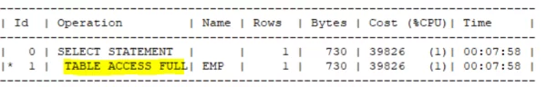

Bảng EMP hiện tại đã có Index trên cột ID, tuy nhiên khi sử dụng /*+FULL(emp)*/, hệ thống sẽ thực hiện TABLE ACCESS FULL đối với bảng EMP.

## 2. Sử dụng HINT bắt buộc câu lệnh phải sử dụng INDEX

``` SQL
select /*+INDEX(emp)*/ * from emp where last_name='HUYTQ'
```

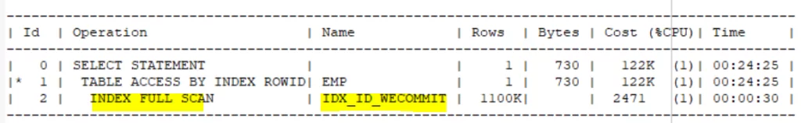

HINT /*+INDEX(emp)*/ sẽ khiến câu lệnh ưu tiên chọn 1 Index của bảng EMP để thực hiện câu lệnh.

Hiện tại bảng EMP đang chỉ có INDEX trên cột ID, không liên quan gì đến cột đang tìm kiếm LAST_NAME cả.

Sử dụng HINT Index

Do Index không chứa thông tin của cột cần tìm kiếm, nên việc bắt hệ thống quét INDEX trong trường hợp này là một phương án tồi. Thời gian thực hiện của câu lệnh ước tính hơn 24 phút.

Với trường hợp này, nếu chúng ta bỏ HINT đi, hệ thống sẽ lựa chọn chiến lược thực thi như sau:

``` SQL
select * from emp where last_name=’HUYTQ’
```

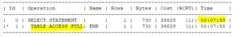

Bạn có thể thấy rằng:
– Nếu thực hiện TABLE ACCESS FULL thì thời gian thực hiện chỉ cần 7 phút 58s là hoàn thành (giảm hơn 3 lần so với việc dùng INDEX).

## 3. Sử dụng HINT yêu cầu câu lệnh sử dụng đúng một INDEX nào đó

Thực hiện tạo thêm Index trên cột Salary của bảng EMP

``` SQL
create index idx_salary_wecommit on emp(salary);
```

Sau khi tạo Index này, bảng EMP chúng ta có 2 Index như sau:

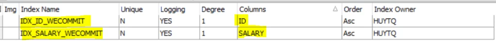

Chúng ta cùng xem xét chiến lược thực thi:

Khi không sử dụng HINT, hệ thống tự nhận chiến lược thực thi như sau:

``` SQL
select * from emp where salary=5000
```

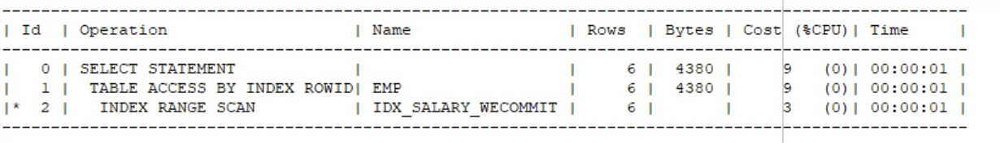

Sử dụng HINT chỉ định hệ thống sử dụng INDEX IDX_ID_WECOMMIT (Index đánh trên cột ID)

``` SQL
select /*+ INDEX(emp IDX_ID_WECOMMIT) */* from emp where salary=5000
```

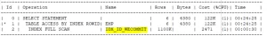

Khi sử dụng HINT mà không chỉ rõ tên INDEX nào, thì hệ thống sẽ cho kết quả như sau:

``` SQL
select /*+ INDEX(emp) */* from emp where salary=5000
```

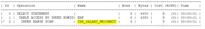

## 4. Sử dụng HINT để thay đổi thứ tự Join

HINT ORDERED chỉ định thứ tự Join Table sẽ thực hiện đúng theo thứ tự ĐƯỢC VIẾT trong câu lệnh SQL. Ví dụ như sau

``` SQL
SELECT /*+ ORDERED*/
e.LAST_NAME, d.LOC
FROM huytq.emp e, huytq.dept d
WHERE e.deptno = d.deptno AND e.salary < 500
```

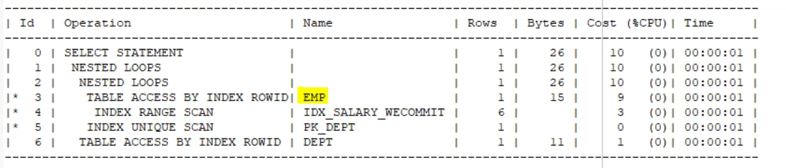

Trong câu lệnh trên, trong mệnh đề FROM, hai bảng của phép JOIN đang viết theo thứ tự:

Bảng EMP đứng trước, sau đó là bảng DEPT
Khi sử dụng HINT ORDERED, hệ thống sẽ thực hiện JOIN với bảng EMP được thực hiện trước.
Bây giờ chúng ta thực hiện viết lại câu lệnh SQL, trong mệnh đề FROM sẽ đưa bảng DEPT lên trước. Câu lệnh như sau

``` SQL
SELECT /*+ ORDERED*/
e.LAST_NAME, d.LOC
FROM huytq.dept d, huytq.emp e
WHERE e.deptno = d.deptno AND e.salary < 500
```

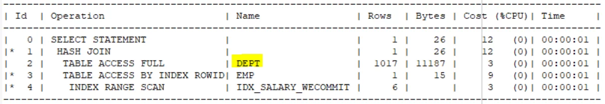

Trong chiến lược thực thi, hệ thống lúc này đã lựa chọn thực hiện truy cập vào bảng DEPT trước.
Một điều đáng chú ý ở đây là:
– Nếu để ý kỹ, bạn sẽ thấy giải thuật được lựa chọn ở 2 tình huống là khác nhau hoàn toàn:

Tại trường hợp đầu tiên, hệ thống sử dụng giải thuật NESTED LOOP JOIN
Tại trường hợp thứ hai, hệ thống sử dụng giải thuật HASH JOIN

## 5. Sử dụng HINT để lựa chọn giải thuật JOIN

Sử dụng HINT USE_NL để hệ thống sử dụng giải thuật Nested Loop Join giữa các bảng

``` SQL
SELECT /*+ USE_NL(e,d)*/
e.LAST_NAME, d.LOC
FROM huytq.dept d, huytq.emp e
WHERE e.deptno = d.deptno AND e.salary < 500
```

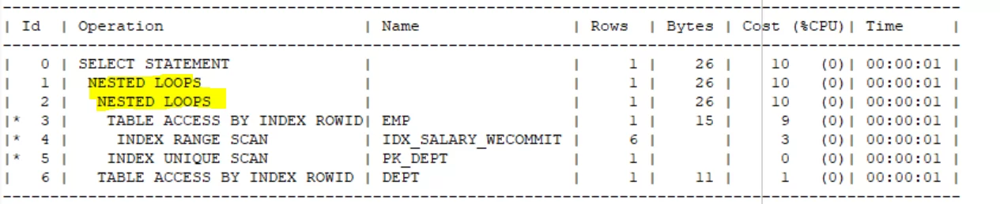

Sử dụng HINT USE_HASH để hệ thống sử dụng giải thuật HASH JOIN

``` SQL
SELECT /*+ USE_HASH(e,d)*/
e.LAST_NAME, d.LOC
FROM huytq.dept d, huytq.emp e
WHERE e.deptno = d.deptno AND e.salary < 500
```

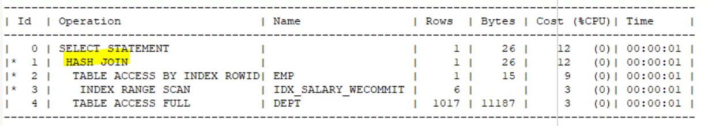

Sử dụng HINT USE_MERGE để hệ thống sử dụng giải thuật SORT MERGE JOIN

``` SQL
SELECT /*+ USE_MERGE(e,d)*/
e.LAST_NAME, d.LOC
FROM huytq.dept d, huytq.emp e
WHERE e.deptno = d.deptno AND e.salary < 500
```


