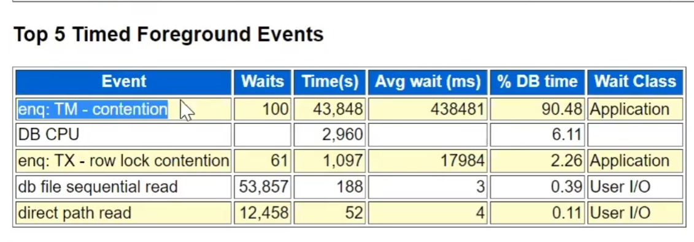

[Video](https://wecommit.com.vn/courses/chuong-trinh-dao-tao-toi-uu-co-so-du-lieu-cao-cap/lesson/dung-dung-lai-o-viec-chi-toi-uu-hieu-nang-cau-lenh-sql-case-study/)

# LOCK (Bước đầu tiên để kiểm tra DB)

- Lock là 1 cơ chế của DB để bảo đảm tính toàn vẹ dữ liệu
- Lock là do DB tự động.
- Hệ thống chậm thì việc đầu tiên cần kiểm tra là Lock.

## 1. Các trường hợp xảy ra Lock

- Lock Conflicti: Nhiều tran cùng sửa 1 bản ghi (Rơ lock).
- Dead Lock: ví dụ có 2 tran A và B cùng lúc
| A      | B      | Hiện tượng                                        |
|:------:|:------:|:-------------------------------------------------:|
| Id=1oo | Id=101 |                                                   |
| Id=103 | Id=100 | B lock do chờ A                                   |
| Id=101 |        | Deadlock vì A chờ B trong khi đó B cũng đang Lock |

- Sequence lock: Cache quá nhỏ.
- Chỉnh sửa Object, Procedure, Function, Package trong khi hệ thống đang hoạt động. **Không được DDL trong khi hệ thống runtime**.
- Quá tran slot/block **bảng ít bản ghi vẫn lock dù không có 2 tran đồng thời sửa 1 bản ghi**:
  - Bản chất
    - DB làm việc chính với data block nên bản chất vấn đề không phải bảng có bao nhiêu bản ghi mà là bản ghi được lưu trên bao nhiêu block.
    - Data block quản lý cả hiện tại có bao nhiêu tran truy cập vào block.
    - Data block có giới hạn số lượng tran slot - transaction list (mặc định 8k). Dẫn đến có thể hết dung lượng để quản lý tran.
  - Cách xử lý lock
    - Tách dữ liệu ra nhiều block hơn.
    - Cấu hình tăng số lượng transaction slot được chứa trong 1 block.
- Constrain FK không đánh Index trên cột FK thì khi **chỉnh sửa bảng Cha thì Lock toàn bộ bảng con trong thời gian thực hiện câu lệnh** gây leo thang lock do toàn bộ bảng con bị lock =? lock toàn bộ tran đang làm việc với bảng con. Check AWR có wait TM Contention

- Update quá nhiều trên cột đánh Bitmap Index. Không nên sử dụng Bitmap Index trong hệ thống OLTP.
- Direct Pain Inserts (Insert Append) vì nó thêm bản ghi trực tiếp bằng data file sẽ lock cả bảng.

## 2. Script kiểm tra Lock

[vIDEO](https://wecommit.com.vn/courses/chuong-trinh-dao-tao-toi-uu-co-so-du-lieu-cao-cap/lesson/bo-tro-demo-scripts-kiem-tra-csdl-thuc-te/)

### 2.1. Tổng quan Blocking Session

- Chơi được hết trên các hệ thông Oracle StanAlone hay Rac
- PROCESS_ID: id process ở OS. Nếu DB treo quá thì Kill process mức OS.
- Có thể kill các Session bằng SID.

``` SQL
SELECT
    'alter system kill session ''' || SID || ',' || s.serial # || ',@'||inst_id||''';' as "Kill Scripts" ,sid,username,serial#,process,NVL (sql_id, 0),
    blocking_session,
    wait_class,
    event,
    seconds_in_wait
FROM
    gv$session s
WHERE
    blocking_session_status = 'VALID'
    OR sid IN (
        SELECT
            blocking_session
        FROM
            gv $ session
        WHERE
            blocking_session_status = 'VALID'
    );

```

### 2.2. Check Blocking Session Tree

``` SQL
SELECT level,
       LPAD(' ', (level-1)*2, ' ') || NVL(s.username, '(oracle)') AS username,
       s.osuser,
       s.sid,
       s.serial#,
       s.lockwait,
       s.status,
       s.module,
       s.machine,
       s.program,
       TO_CHAR(s.logon_Time,'DD-MON-YYYY HH24:MI:SS') AS logon_time
FROM   v$session s
WHERE  level > 1
OR     EXISTS (SELECT 1
               FROM   v$session
               WHERE  blocking_session = s.sid)
CONNECT BY PRIOR s.sid = s.blocking_session
START WITH s.blocking_session IS NULL;
```
