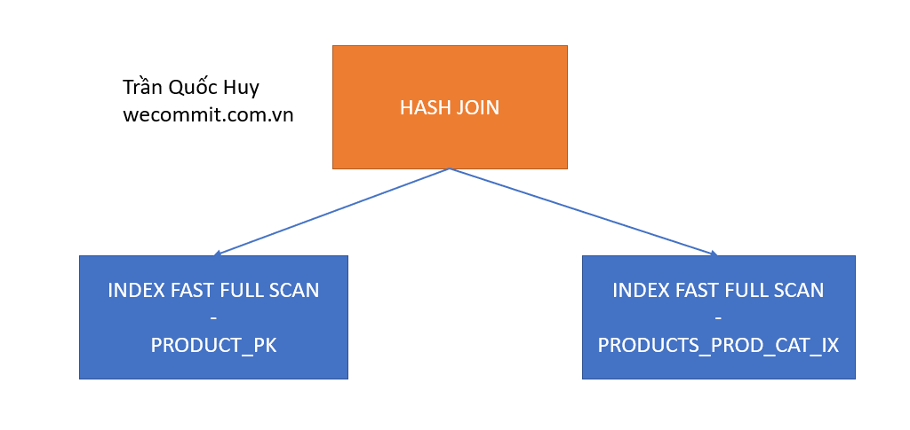
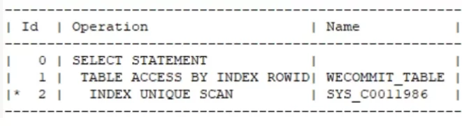
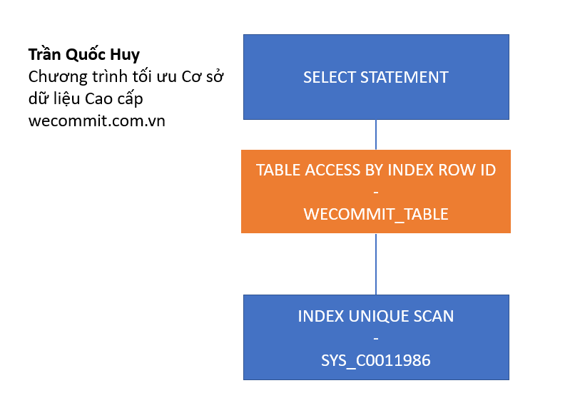
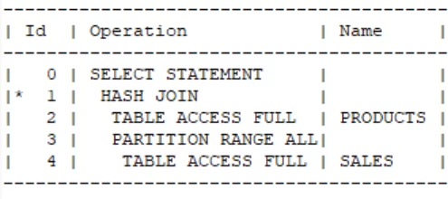
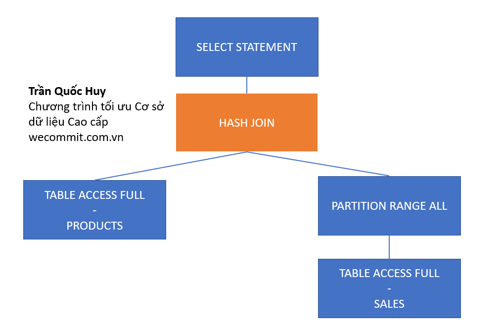
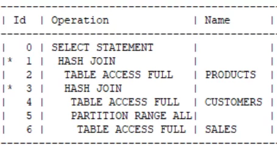
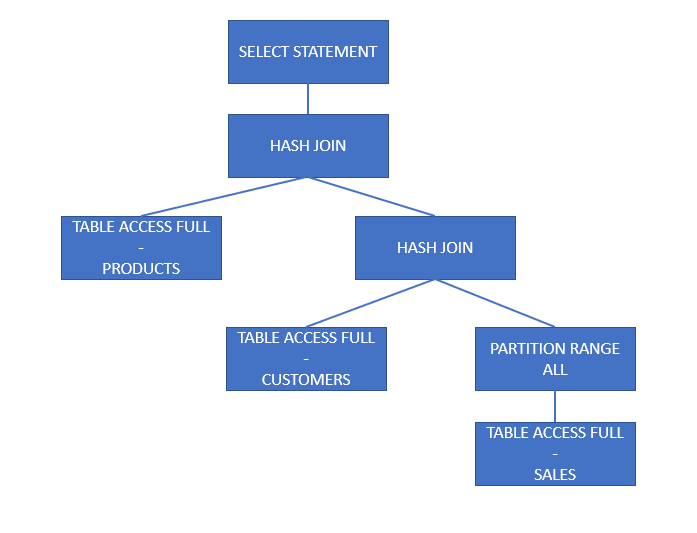
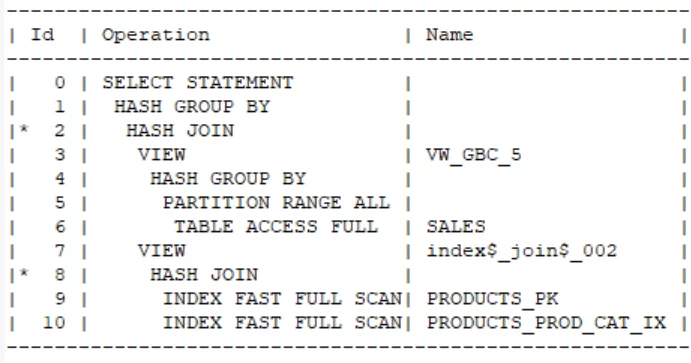

[Bài viết](https://wecommit.com.vn/courses/chuong-trinh-dao-tao-toi-uu-co-so-du-lieu-cao-cap/lesson/kien-thuc-can-biet-truoc-khi-toi-uu-lam-sao-de-doc-sql-exeuction-plan-trong-oracle/)

# 1. Cách đọc chiến lược thực thi của câu lệnh – SQL Execution Plans như thế nào cho đúng?

## 1.1. Nguyên lý đọc SQL Execution Plans

Đây là chiến lược thực thi của câu lệnh

``` SQL
SELECT prod_category, AVG (amount_sold)
FROM wecommit.sales s, wecommit.products p
WHERE p.prod_id = s.prod_id
GROUP BY prod_category
```


Mỗi một dòng trong biểu đồ SQL Execution Plans tương ứng với một hành động nào đó (Operation). Các hành động này có liên kết với nhau theo cấp bậc CHA – CON. Về bản chất chiến lược thực thi có hình dạng là một CÂY CHA – CON.

Cột bên tay phải với tên Name cho chúng ta biết các hành động tương ứng được thực hiện trên đối tượng nào (Table tên là gì hoặc Index tên là gì). Ví dụ:

- Ở hành động có ID=6, hệ thống thực hiện công việc là TABLE ACCESS FULL, công việc này thực hiện trên đối tượng là SALES (bảng SALES trong Cơ sở dữ liệu)
- Ở hành động có ID=9, hệ thống thực hiện công việc là INDEX FAST FULL SCAN trên đối tượng tên là PRODUCTS_PK (đây chính là Index Primary Key của bảng Products, tên Index là PRODUCTS_PK).

Nếu để ý thì anh em sẽ thấy trong biểu đồ SQL Execution Plans bên trên có những sự “THÒ THỤT ở LỀ TRÁI” một cách rất đẹp, đều, phần này không phải được bố trí một cách ngẫu nhiên, mà sự THÒ THỤT LỀ này có ý nghĩa rất quan trọng trong quá trình chúng ta phân tích.

- Tất cả những hành động nào cùng cấp bậc thì sẽ có mức độ CĂN LỀ TRÁI giống nhau. Trong ví dụ trên, chúng ta xét cụm các hành động số 8,9,10


- Hành động số 9 và số 10 được tính là cùng cấp bậc (do có độ CĂN LỀ TRÁI giống nhau)
- Hành động số 8 là CHA của hành động số 9 và số 10: vì trong SQL Execution Plans, bước số 8 ở gần bên trái hơn và ở ngay bên trên của bước con số 9.

Có thể hình dung nếu ở dạng cây thì cụm hành động số 8, 9, 10 sẽ có hình dáng như sau



NGUYÊN LÝ của việc đọc hiểu chiến lược thự thi đó là: biết cách xây dựng lên SQL Execution Plans Tree như tôi vừa miêu tả bên trên.
Sau khi đã có được mô hình dạng cây rồi, chúng ta sẽ biết được thứ tự thực hiện bằng cách: Bắt đầu từ NODE CON bến TRÁI và lần lượt dò qua toàn bộ cây.

# 2. Ví dụ phân tích SQL Execution Plans trên một số câu lệnh

## 2.1. Demo với câu lệnh đơn giản nhất

``` SQL
select * from WECOMMIT_TABLE where ID=356
```



Ta tiến hành xác định các NODE CHA - CON để có thể xây EXECUTION PLAN TREE như sau:

- Bắt đầu từ bước đầu tiên – ID = 0 (SELECT STATEMENT), NODE CHA này chỉ có 1 NODE CON đó là ID=1 (TABLE ACCES BY INDEX ROWID).
- NODE ID=1 cũng chỉ có 1 NODE CON, đó là hành đông tại ID=2 (INDEX UNIQUE SCAN).
Do đó, hình ảnh của EXECUTION PLAN dưới sạng TREE sẽ như sau



Như vậy thứ tự thực hiện sẽ như sau: (sắp xếp theo cột ID) : 2 -> 1 -> 0

Thứ tự thực hiện của câu lệnh trên được diễn giải bằng lời:

- Bước thứ nhất: Thực hiện hành động “INDEX UNIQUE SCAN” đối với đối tượng tên là SYS_C0011986. Đây chính là Index được tạo tự động của hệ thống trên cột Primary key, vì vậy tên hệ thống đặt nhìn hơi khó hiểu anh em nhé.
- Bước thứ hai:Do không có bất kỳ hành động nào cùng cấp bậc (cách dễ nhìn là không có ông nào có “THỤT LỀ TRÁI”  bằng nhau), hệ thống sẽ thực hiện bước CHA – được xác định là hành động có ID=1 (TABLE ACCESS BY INDEX ROWID trên đối tượng WECOMMIT_TABLE).
- Bước thứ ba: Thông tin kết quả của bước trên được trả ra cho hành động ID=0 (SELECT STATEMENT).

## 2.2. Demo với câu lệnh Join 2 Table

``` SQL
SELECT *
FROM wecommit.sales s, wecommit.products p
WHERE p.prod_id = s.prod_id
```



Chúng ta hình dung hình ảnh của cây chiến lược thực thi này như sau:

- Đầu tiên chúng ta bắt đầu từ TOP của câu lệnh (bước số 0 – SELECT STATEMENT) và đi tìm Node CON đầu tiên. Logic như sau:
  - NODE SELECT STATMENT có 1 con là bước HASH JOIN
  - NODE “HASH JOIN” có 2 NODE CON là:
    - NODE con đầu tiên là TABLE ACCESS FULL (bước số 2).
    - NODE con thứ hai là PARTITION RANGE ALL, Node này có 1 Node con đó là bước ID = 4 (TABLE ACCESS FULL).

Theo logic trên, thì cây sẽ có hình dạng dưới đây:



Thứ tự thực hiện của SQL Exeuction Plans trên như sau:

Sắp xếp theo Operation ID: 2 -> 4 -> 3 -> 1 -> 0

- Đầu tiên hệ thống cần thực hiện hành động TABLE ACCESS FULL, hành động này thực hiện trên bảng PRODUCTS.
- Các dữ liệu lấy được của bước bên trên sẽ được gửi đến NODE cha (chính là hành động HASH JOIN) tại Operation ID= 1.
- Tiếp đó, hệ thống sẽ cần thực hiện TABLE ACCESS FULL trên bảng SALES (đây là hành động Operation ID= 4).
- Bảng Sales này là một bảng được thiết kế Partition, hệ thống sẽ cần phải biết sẽ truy xuất trên bao nhiêu PARTITION, hành động Operation ID= 3 (PARTITION RANGE ALL) chỉ cho hệ thống biết phải quét qua TẤT CẢ các Partition.
- Dữ liệu sau khi quét qua toàn bộ Partition (bước Operation =3) sẽ được gửi lên NODE cha (chính là hành động HASH JOIN) tại Operation=1.
- Lúc này Giải thuật HASH JOIN đã đủ 2 đầu vào, hệ thống thực hiện việc so khớp dữ liệu.
- Kết quả được trả ra cho bước CHA (chính là câu lệnh SELECT STATEMENT).

## 2.3  Demo phân tích SQL Execution Plans của câu lệnh JOIN 3 Table

``` SQL
SELECT *
FROM wecommit.sales s, wecommit.products p, wecommit.customers c
WHERE p.prod_id = s.prod_id and s.CUST_ID=c.cust_id
```



Thực hiện xây dựng SQL Execution Plans Tree ta được cây như sau:



Thứ tự thực hiện trong SQL Execution Plans trên như sau: 2 -> 4 -> 6 -> 5 -> 3 -> 1 -> 0

- Đầu tiên hệ thống cần thực hiện bước ID=2 (TABLE ACCESS FULL đối với bảng PRODUCTS). Các dữ liệu này sẽ được gửi tới bước ID=1 (HASH JOIN).
- Thứ hai: hệ thống thực hiện NODE lá bên trái tiếp theo (đó là bước TABLE ACCESS FULL trên bảng CUSTOMERS tương ứng với ID=4). Kết quả thu được của lần thực hiện này được gửi lên NODE CHA của nó (chính là bước HASH JOIN – nhưng nhớ là đây là HASH JOIN của bước ID=3 nhé anh em) (P/S: Tại chiến lược thực thi này có 2 hành động đều là HASH JOIN).
- Thứ ba: chúng ta tìm tới NODE lá tiếp theo, chính là bước TABLE ACCESS FULL trên bảng SALES (tương ứng với ID=6).
- Thứ tư: Hành động TABLE ACCESS FULL – Sales sẽ được gửi lên NODE CHA đó là PARTITION RANGE ALL. Điều này nghĩa là hệ thống quyết định quét toàn bộ PARTITION của bảng SALES anh em nhé. Các kết quả có được từ phần này sẽ gửi lên NODE CHA của nó, đó chính là bước ID=3 (HAS JOIN)
- Thứ năm: Thực hiện bước ID=3 (thực hiện giải thuật HASH JOIN).
- Thứ sáu: Kết quả thu được của bước thứ năm sẽ gửi lên bước thứ 1 (HASH JOIN).
- Thứ bảy: Thực hiện HASH JOIN tại ID=1 và trả ra cho câu lệnh SELECT.

**Ghi chú:**

- PARTITION RANGE ALL là một khái niệm được áp dụng trong kỹ thuật tối ưu sử dụng PARTITION. Đây là một kỹ thuật tôi thường xuyên thực hiện trên những hệ thống lớn.
- HASH JOIN là một trong những giải thuật JOIN mà hệ thống sẽ tự quyết định.
- TABLE ACCESS FULL là quét toàn bộ BLOCK chứ không phải là quét TOÀN BỘ BẢN GHI. Hai kiểu hiểu này sẽ dẫn tới những bài toán tối ưu rất khác nhau.

# 2.4. Thực hện phân tích SQL Execution Plans phức tạp hơn nữa

Bây giờ tôi sẽ hướng dẫn anh em cùng phân tích SQL Execution Plans có ở ví dụ đầu tiên nhé.

``` sql
SELECT prod_category, AVG (amount_sold)
FROM wecommit.sales s, wecommit.products p
WHERE p.prod_id = s.prod_id
GROUP BY prod_category
```



Bắt đầu phân tích và xây dựng SQL Execution Plans Tree với luồng tư duy như sau:

- Bắt đầu từ bước ID=0 (SELECT STATEMENT), bước này có 1 NODE CON đó là:

- NODE CON có ID=1 (HASH GROUP BY). Node này có 1 NODE con duy nhất:
  - NODE CON là ID=2 (HASH JOIN). NODE này có 2 NODE con:
    - NODE con bên trái là ID=3 (VIEW). Node này có 01 NODE con duy nhất:
      - NODE con là ID=4 (HASH GROUP BY). Node này có 1 Node con duy nhất:
        - NODE con là ID=5 (PARTITION RANGE ALL). NODE này có 01 NODE con duy nhất:
          - NODE con là ID=6 (TABLE ACCESS FULL)
    - NODE con bên phải là ID=7 (VIEW). NODE này chỉ có 01 NODE con duy nhất:
    - NODE con ID=8 (HASH JOIN). NODE này có 2 NODE con:
      - NODE con bên trái là ID=9 (INDEX FAST FULL SCAN trên PRODUCTS_PK).
      - NODE con bên phải là ID=10 trên INDEX FAST FULL SCAN trên PRODUCTS_PROD_CAT_IX.\

Kết quả thứ tự thực hiện của câu lệnh này như sau: 6 -> 5 -> 4 -> 3 -> 9 -> 10 -> 8 -> 7 -> 2 -> 1 -> 0
