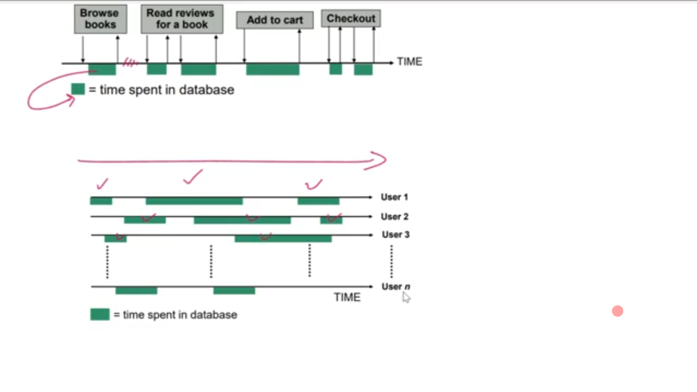

[Video](https://wecommit.com.vn/courses/chuong-trinh-dao-tao-toi-uu-co-so-du-lieu-cao-cap/lesson/case-study-dbtime-la-gi-va-phan-tich-bao-cao-awr-mot-ngan-hang-nuoc-ngoai/)

# Phân tích AWR

- Quy trình:
  - DB Time.
  - Wait

# 1. Thông tin cơ bản

- Phiên bản Oracle.
- Hệ điều hành.
- Cấu hình máy chủ.
- **Khoảng thời gian** lấy báo cáo.

# 2. DBTime

- Công thức
- Là thời gian hệ thống cần để xử lý yêu cầu.
**DB Time = Cpu Time + IO Time + Non-Idle Wait Time**

- CPU Time: Thời gian CPU thực hiện câu lệnh
- IO Time: Thời gian đọc/ghi để thực hiện câu lệnh
- Non-Idle Wait Tim: Thời gian chờ trong lúc thực hiện câu lệnh. Có thể chờ CPU, IO, Lock... Không tính thời gian hệ thống không làm gì.

- Báo cáo sẽ luôn được lấy trong khoảng thời gian từ t0 đến t1 gọi là Elapsed Time.

**Active Sessions OverTime = DB Time / Elapsed Time**

- Active Sessions OverTime < 1 : Hệ thống tải thấp.
- Active Sessions OverTime = 1 : Tải TB.
- Active Sessions OverTime > 1 : Tải cao.

- Từ DB Time ta có thể suy luận nhiều thứ:
  - User tăng.
  - CPU chậm.
  - IO chậm.
  - Thời gian Session tăng: App lởm.

# 3. Report Summary

## 3.1. Cache Size

- Dung lượng Cache

## 3.2 Load Profile

- Hệ thống ngon trong DB Time thì CPU chiếm 80-90%. Nếu CPU chiếm dưới 50% là có vấn đề.
- Physical Read: Cao tức là hệ thống không ổn do ít đọc ở Memory mầ đọc ở Disk nhiều => Chậm.
- Hard Parses: Cho biết Shared Pool có ổn không, hệ thống phải giảm thiểu tối đa Hash Parses.

## 3.3. instance Efficiency Percentage (Target 100%)

- Đa phần các chỉ số phần này phải gần 100%
- 100% thì không chắc ngon nhưng dưới 98% chắc chắn tệ.

## 3.4. Top 5 Timed Foreground Events

- Top các Wait trong hệ thống.
- direct path read: Đọc trực tiếp từ Disk bỏ qua bufer cache => => Physical Read sẽ cao nêu direct path read cao
. Có thể kiểm tra ở phần  **IO Stats**.
- Nguyên nhân gây direct path read cao:
  - Lạm dụng Paralell.
  - Load Segments.
- Log file switch (checkpoint incomplete): Khuyến cáo 4 - 10 lần/giời.
  - Tất cả các câu lệnh DML, DDL đều cần ghi log vào Redo Log. Và log đó được lưu theo group.
  - Switch quá nhiều có thể do cấu hình Redo Log Size quá bé.
  - Gốc rễ vấn đề là DML, DDL quá nhiều cần tìm hiểu nguyên nhân và xử lý.

# 4. IO Stats

- Kiểm tra phần trăm hệ thống dùng IO so với dùng Buffer.
- Direct Reads: Dung lượng đọc từ Disk dùng chỉ số này so sánh với Buffer Reads để đánh giá hệ thống. Hệ thống ngon khi đa phần đọc dữ liệu ở Bufer.

>NOTE: Khi đa phần hệ thống đọc từ Disk thì cần kiểm tra độ phản hồi của Disk trong phần **File IO Stats** xem nếu phản hồi mà chậm thì hệ thống sẽ siêu tệ.

# 5. File IO Stats

- Để ý cột **AV Rd(ms)** giá trị > 20ms là không ổn, hệ thống ngon chỉ 0.x ms.

# 6. Top SQL order by Elapsed Time

- Top câu lệnh chạy lâu nhất trong khoảng thời gian lấy báo cáo.
- Ưu tiên xử lý các câu lệnh Top theo nguyên lý 80/20
- Click vào SQL ID để xem chi tiết câu lệnh. từ đó vào hệ thống để xem Execution Plan.
- Kiểm tra xem object trong câu lệnh có nằm trong Top**Segment** không?

# 7. tablespace IO Stats

- Kiểm tra xem có mắc sai lầm tất cả dữ liệu lưu hết vào Tablespace mặc định USSERS không?
- Nhìn cột **Bufer waits** > 1000 thì cân nhắc tách Tablespace.

# 8. Segments Statistics

## 8.1 Segments by Logical Read

- Tyoe: thể hiện xem object có Partition không?
- từ Top các Segment có thể Search để biết object đó trong câu lệnh SQL nào.
