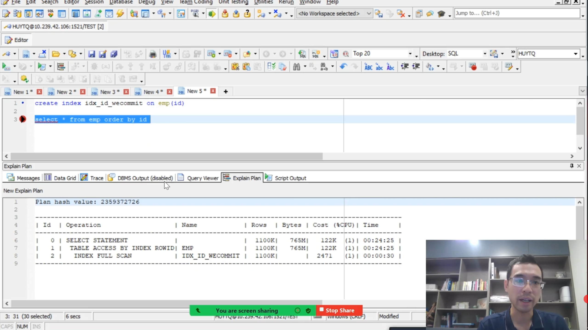

# Index

[Video](https://wecommit.com.vn/courses/chuong-trinh-dao-tao-toi-uu-co-so-du-lieu-cao-cap/lesson/kien-thuc-nen-tang-phai-biet-01-dac-biet-quan-trong/)

## Tác dụng

- Tăng tốc độ cho điều kiện lọc WHERE
- Tăng tốc sắp xếp Order By

>NOTE: Index không chỉ tăng tốc trong lệnh SELECT mà còn tăng cho INSERT, UPDATE, DELETE khi chúng có WHERE.
>**Quan trọng** khi query quét index thì sau đó sẽ join lại vào bảng chính qua RowId để lấy thêm thông tin. Bước join này **rất tốn cost** để loại bỏ nó thì phải thêm thông tin cần thiết vào index.

## Loại Index

### 1. BTree Index (mặc định); Cây cân bằng

- Khi CREATE INDEX mà không có tham số gì thì index được tạo sẽ là Btree Index.
- Cấu tạo từ 1 node gốc là root, các nhánh sau đó sẽ được sắp xếp tăng dần từ trái qua phải. Hệ thống sẽ phân bố sao cho cây cân bằng. Các nút là được phân bố theo dung lượng.

#### Index Range Scan

- So sánh bằng vẫn quét Index bình thường
- So sánh />, /<, between:
  - FNếu khoảng giá trị nhỏ thì sẽ quét Index bằng cách tìm node = giá trị so sánh sau đó sẽ quét các gí trị lớn hơn khi so sánh />, nhỏ hơn với /<, tương tự với between.
  - Nếu khoảng giá trị cần quét lớn thì sẽ không quét Index.
  - Việc quyết định khoảng cần quét lớn hay nhỏ do CBS (Cost Base Optimizer).

>NOTE việc sử dụng Index là để giảm dung lượng dữ liệu cần quét. Nhưng nếu OBSS thấy khoảng cần quét có % dung lượng quá lớn thì việc dùng Index không còn ý nghĩa.

#### Sắp xếp

- Việc Order By trong câu lệnh là **rất tốn tài nguyên**
- Nếu Order By theo các cột Index sẽ giảm hẳn cost vì bản thân Btree Index đã được sắp xếp sẵn. Nếu là ESC thì chỉ dùng index là xong, DESC sẽ thêm 1 bước DESENDING ĐẢO NGƯỢC DỮ LIỆU KHÔNG TỐN QUÁ NHIỀU COST.

#### Composite Index

- Nên cân nhắc sử dụng.
- Cân nhắc thứ tự các cột đặc biệt là cột đầu tiên (Keading Column) vì khi chỉ query thì Leading Col thì vẫn ăn Index.
- Làm sao để chọn Leading Column:
  - Phải làm rõ tiêu chí lọc của người dùng. Thống kê xem % lọc theo cột nào.
  - Nếu không thống kê được? Giả sử người dùng thường query theo Salary và LastName thì sẽ chọn Leading Col theo cột nào có nhiều giá trị khác nhau nhất.

#### Join

- Index vẫn rất ok khi Join
- Bản chất điều kiện Join vấn là điều kiện

#### Sử dụng hàm (Function Base Index)

- Vú dụ WHERE UPPER(KAST_NAME) sẽ không sử dụng index trên cột last_name mà phải sử dụng index trên cả hàm UPPER(KAST_NAME).

#### Skip Scan

- Khi query các cột mà sử dụng cột không phải là Leading Column trong Composite Index sẽ gặp giải thuật Sip Scan Index.
- Skip Scan: Chia index ban đầu thành các SubIndex
- Ví dụ có idx_salary_name, nếu chỉ query name='Hai' thì DB bỏ qua salary trong index. Ví dụ salary có 3 giá trị là 100, 1000, 3000 thì sẽ chia 3 ra 3 subindex và vào chúng tìm name.
- Giải thuật này tệ khi có quá nhiều SubIndex (Leading Column có nhiều giá trị khác nhau).

>NOTE: Thống kê tất cả index sử dụng Skip Scan sau đó cân nhắc lại Leading Column.

#### Fast Full Scan (FFS)

- Tương tự như Table Full Scan thì FFS quét toàn bộ block của index.
- Có thể quét đa lường (Multi Block Read). Trong DB có tham số cấu hình xem mỗi lần đọc Multi thì sẽ đọc bao nhiêu block. **Việc sửa đổi tham gố này cần DBA vì sẽ ảnh hưởng toàn bộ hệt thống**.
- **Chỉ có giải thuật FFS mới đọc Multi Block còn các giải thuật index khác đều đọc single**.
- Hiệu năng của FFS sẽ hơn nhiều Full Table Scan.

``` SQL
CREATE INDEX IDX_LASTNAME_SALARY ON EMP (LAST_NAME, SALARY);
SELECT LAST_NAME, SALARY FROM EMP WHERE SALARY > 100000;
```

>NOTE: Cần loại bỏ việc truy cập vào bảng để lấy thêm thông tin (TABLE ACCESS BY RƠID) vì bước này đôi khi có chi phí còn cao hơn Full Table Scan. Do đó không chỉ quản tâm đến trường trong điều kiện Where mà còn phải quan tâm đến các trường trong SELECT.

#### Index Full Scan



- Dùng để loại bỏ việc sắp xếp trong bảng. Việc sắp xếp là vô cùng tốn tài nguyên.
- Index Full Scan khác Fasst Full Scan ở chỗ Index Full Scan chỉ chảy **Single Block**.

#### Group By

- Để gom nhóm thì DB sẽ Order ngầm.
- Clastering factor
- Group By theo Id thì dùng Index nhưng theo Salary thì không vì dữ liệu Id đã được sắp xếp trong khi Salary lộn xộn.

#### Redundant Index

- Nhiều index tương tự nhau: Cùng leading column.

## Các trường hợp cân nhắc tạo Index

- Primary Key: thường DB mặc định đánh Index Unique.
- Cột có giá trị khác nhau không trùng lặp (xác định bằng nghiệp vụ): Index Unique.
- **Forgen Key** nắt nuộc: Index. Không có thì khi insert, update, delete trong bảng cha sẽ gây rất nhiều lock.
- Select Distinct: Cân nhắc Index.
- Covering Index: Không chỉ chú ý điều kiện Where mà còn cần cân nhắc các cột trong Select.
- **Order by**.
- Group by

## Các trường hợp Index không ăn

- Số lượng bản ghi trong kết quả trả về lớn (> 10% tổng số bản ghi). Tốt nhất là < 2%.
- Sử dụng điều kiện NOT IN hệ thống sẽ hiểu câu lệnh này rất phức tạp và không ăn Index.
- Sử dụng quá nhiều Sub Query.
- Sử dụng tìm kiếm chuỗi LIKE có chứa '%' hoặc '-'.
- Tìm kiếm giá trị NULL. Do BTree Index không chứa được giá trị NULL.Giải pháp là đánh Composite Index gắn thêm cột khác NULL hoặc với thếm 1 giá trị.

``` SQL
CREATE INDEX ĩn_lastname_1 on emp (last_name, 1);
```

- Sử dụng hàm trong điều kiện. VD UPPER(last_name) sẽ không ắn vào Index idx_lastname. Giải pháp:
  - Function base Index.
  - Chuẩn hóa dữ liệu đầu vào ví dụ NOMALIZED_EMAIL (viết hoa email luôn).

>BITE: Không tính toán bên vế chứa cột sẽ không ắn Index ví dụ: salary + 1 >= 100 thì sẽ toi idx_salary. Nhưng chỉ cần thay đổi một chút là salary >= 100 - 1 (chuyển hết tính toán sang về không chứa cột) là ok.

- Leading Column trong Composite Index không có trong điều kiện.
- Kiểu dữ liệu của Column, Index và trong điều kiện không giống nhau.
- Unusable Index.
  - Điều này xảy ra khi nếu bảng có Partition mà index lại non partition. Khi thao tác với Partition thì cần kiểm tra lại Index, nếu index hỏng thì rebuild lại.
  - Có thể đặt cảnh báo kiểu nếu có Index Unusable thì eamil cho tôi.

``` Sql
select  satatus form dba_indexes;
```

- Invisible Index.

``` Sql
select  víible form dba_indexes;
```

## Index Clustering Factor

- Là trường hợp các trường trong select, hoặc trong order by không có trong Index thì DB sẽ làm 2 việc
  - Tìm giá trị trong Index.
  - Từ các giá trị tìm được quay trở lại bảng chính để lấy giá trị cần tìm qua RowID. Bước này cực tốn tài nguyên.
- bản chất lưu trữ:
  - Trong bảng sẽ lưu trữ theo Insert tức là thêm trước đứng trước không quan tâm giá trị.
  - Index dữ liệu được sắp xếp theo giá trị tăng dần hoặc giảm dần nếu index DESC (đã được sắp xếp).
- Cách xử lý sắp xếp:
  - tạo ra bảng clone dữ liệu bảng gốc nhưng được sắp xếp. Việc này chỉ hiểu quả khi nghiệp vụ chỉ sắp xếp đúng thứ tự bảng mới tạo ra.
- Cách xem Index Clasterung Factor: Trong phần mềm Toad ấn F4 để mở Statistic. Hoặc dùng query

``` SQL
SELECT ^ FROM dba_indexé;
```
