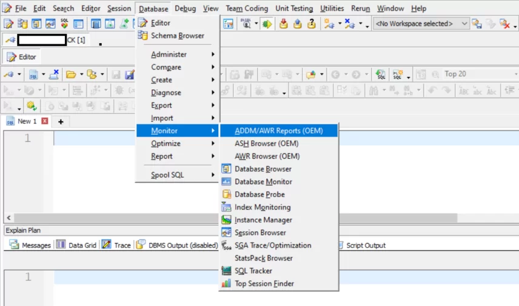
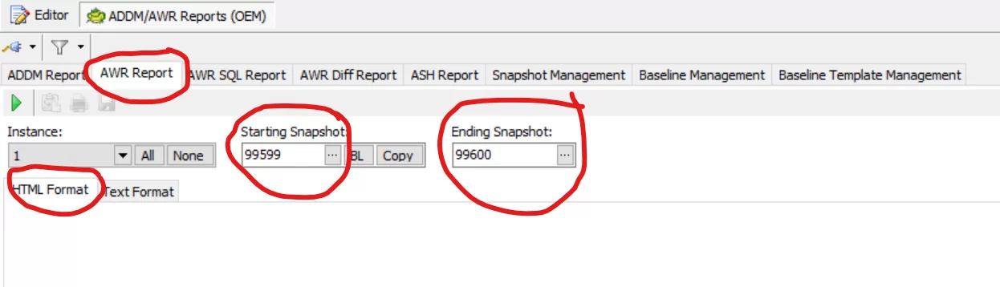
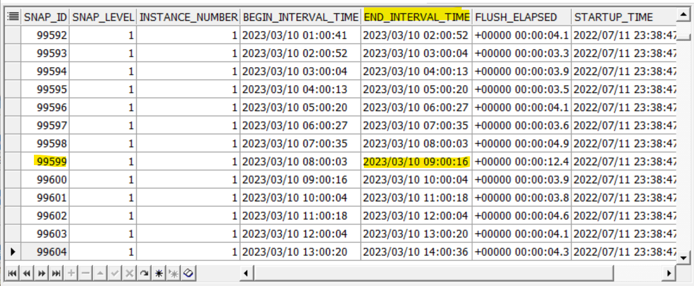
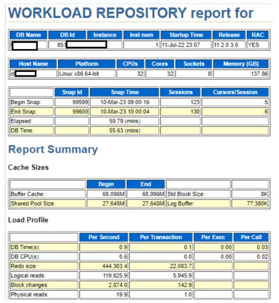
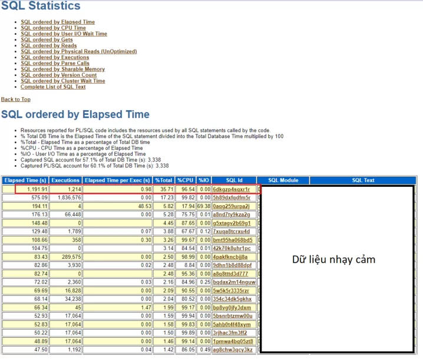

# Làm cách nào để tối ưu câu lệnh SQL mà tốn ít công sức nhất, có phương án một cách nhanh nhất?

Các dự án tối ưu thông thường sẽ gặp 2 tình huống

- Tình huống thứ nhất: Chúng ta có 1 câu lệnh và biết chắc chắn cần tối ưu câu lệnh đó
- Tình huống thứ hai: Hệ thống bị chậm, tại thời điểm bị chậm, chúng ta chưa biết câu lệnh nào gây ra vấn đề trên.
Quy trình này sẽ hướng dẫn các học viên của Wecommit có thể thực hiện xử lý được cả 2 tình huống.

>Ghi chú: Đây là cách bạn có thể tận dụng Oracle để ra khuyến cáo về tối ưu cho một câu lệnh SQL đang bị chậm trong hệ thống. Cách thức này có thể áp dụng với các phiên bản Oracle đang sử dụng hiện nay trên thị trường.

## 1. Tình huống chúng ta đã biết chính xác câu lệnh SQL cần thực hiện tối ưu

**Bước 1: Thực hiện tạo Tuning Task**

``` SQL
DECLARE
    l_sql_tune_task_id   VARCHAR2 (100);
BEGIN
    l_sql_tune_task_id :=
        DBMS_SQLTUNE.create_tuning_task (
            sql_id        => '68nc0f95a4wsg',
            scope         => DBMS_SQLTUNE.scope_comprehensive,
            time_limit    => 500,
            task_name     => 'Tuning 68nc0f95a4wsg',
            description   => 'Tuning 68nc0f95a4wsg');
    DBMS_OUTPUT.put_line ('l_sql_tune_task_id: ' || l_sql_tune_task_id);
END;
/
```

Ghi chú:

- Điền thông tin SQL_ID của câu lệnh đang muốn tối ưu
- Chọn tên của Tuning Task, thông thường chúng ta nên chọn tên + SQL_ID, để dễ dàng cho việc quản lý.

**Bước 2: Bắt đầu thực hiện Tuning Task vừa tạo bên trên**

``` SQL
EXEC DBMS_SQLTUNE.execute_tuning_task(task_name => 'Tuning 68nc0f95a4wsg');
```

Ghi chú:

- Bước này khi thực thi sẽ mất thời gian, bản chất hệ thống sẽ cần thực hiện câu lệnh SQL. Đối với những hệ thống trọng yếu, chúng ta nên chạy Tuning Task này vào thời gian thấp tải.
- Kết thúc bước này, Oracle sẽ có một số các khuyến cáo để tối ưu, chúng ta có thể xem các khuyến cáo này tại bước 3.

**Bước 3: Xem các khuyến cáo để tối ưu do Oracle đề xuất**

``` SQL
select dbms_sqltune.report_tuning_task('Tuning 68nc0f95a4wsg') from dual;
```

Các khuyến cáo có dạng như sau:

Trong kết quả ví dụ dưới đây, chúng ta thấy có thể tạo thêm Index trên HOST.BUF_OD_ACCOUNT(“TLID”,”TXDATE”,”ODTIMESTAMP”)  và dự kiến sẽ cải thiện 99.93% cho câu lệnh

FINDINGS SECTION (1 finding)

1- Index Finding (see explain plans section below)

The execution plan of this statement can be improved by creating one or more
  indices.
  Recommendation (estimated benefit: 99.93%)
  ------------------------------------------

- Consider running the Access Advisor to improve the physical schema design
or creating the recommended index.
create index HOST.IDX$$_53AC00001 on HOST.BUF_OD_ACCOUNT("TLID","TXDATE","ODTIMESTAMP");
  Rationale

Creating the recommended indices significantly improves the execution plan
of this statement. However, it might be preferable to run "Access Advisor"
using a representative SQL workload as opposed to a single statement. This
will allow to get comprehensive index recommendations which takes into
account index maintenance overhead and additional space consumption.

EXPLAIN PLANS SECTION

1- Original

Plan hash value: 4094737728

| Id | Operation         | Name           | Rows | Bytes | Cost (%CPU)| Time     |
|:--:|:-----------------:|:--------------:|:----:|:-----:|:---------------------:|
|  0 | SELECT STATEMENT  | -              |  1   |   185 |  1638   (1)| 00:00:20 |
|  1 | TABLE ACCESS FULL | BUF_OD_ACCOUNT |  1   |   185 |  1638   (1)| 00:00:20 |

Predicate Information (identified by operation id)

   1 - filter("TLID"=:B3 AND "TXDATE"=:B2 AND "ORSTATUSVALUE"<>'P' AND
              "ORSTATUSVALUE"<>'R' AND "ODTIMESTAMP">TO_TIMESTAMP(:B1,'RRRR/MM/DD
           hh24:mi:ss.ff9'))

2- Using New Indices

Plan hash value: 286002525

| Id | Operation                   | Name            | Rows | Bytes | Cost (%CPU)| Time  |
|:--:|:---------------------------:|:---------------:|:----"|"-----:|:------------------:|
| 0  | SELECT STATEMENT            | -               |  1   |   185 |  1   (0)| 00:00:01 |
| 1  | TABLE ACCESS BY INDEX ROWID | BUF_OD_ACCOUNT  |  1   |   185 |  1   (0)| 00:00:01 |
| 2  | INDEX RANGE SCAN            | IDX$$_53AC00001 |  1   |       |  1   (0)| 00:00:01 |

Predicate Information (identified by operation id)

   1 - filter("ORSTATUSVALUE"<>'P' AND "ORSTATUSVALUE"<>'R')
   2 - access("TLID"=:B3 AND "TXDATE"=:B2 AND
              "ODTIMESTAMP">TO_TIMESTAMP(:B1,'RRRR/MM/DD hh24:mi:ss.ff9') AND "ODTIMESTAMP" IS NOT
           NULL)

## 2. Tình huống hệ thống bị chậm, chúng ta chỉ biết khoảng thời gian hệ thống chậm, chứ không biết chính xác do câu lệnh SQL nào

Trong trường hợp này, chúng ta có 2 bước chính cần phải thực hiện

- Bước 1: Cần phải khoanh vùng câu lệnh SQL đang gây ảnh hưởng hiệu năng của hệ thống.
- Bước 2: Thực hiện tối ưu câu lệnh SQL.
Chúng ta sẽ đi vào cách thức chi tiết ngay bên dưới đây.

### 2.1: Khoanh vùng câu lệnh ảnh hưởng hiệu năng hệ thống sử dụng AWR

#### 2.1.1. Một số điều học viên cần biết

- Định kỳ Oracle cứ mỗi 60 phút (mặc định) sẽ có các báo cáo phân tích về hiện trạng hoạt động bên trong cơ sở dữ liệu. Báo cáo này được gọi là AWR.
- Chúng ta có thể thay đổi khoảng thời gian mặc định 60 phút này, đối với các hệ thống trọng yếu, cần giám sát một cách “mịn” nhất, tôi thường thiết lập 15 phút hoặc 30 phút.
- Trong các dự án mà Wecommit trực tiếp tối ưu, chúng tôi luôn sử dụng AWR để phân tích và ra quyết định tối ưu. Có thể nói AWR giống như một bản kết quả xét nghiệm máu của bệnh nhân. tất cả các bác sĩ sẽ cần thông tin này trong việc ra quyết định.
- AWR có thể tạo ra dưới dạng file text hoặc html. Tuy nhiên, tôi khuyến cáo các học viên nên sử dụng báo cáo dạng html để thuận tiện cho việc theo dõi.

#### 2.1.2. Làm thế nào để tạo được báo cáo AWR

Các học viên có thể tạo một báo cáo AWR bằng command line (nếu được truy cập trực tiếp vào database server) hoặc sử dụng tool. Dưới đây là cách thức sử dụng bằng Tool
Tool sử dụng: Toad

- Đăng nhập vào Database
- Chọn Database -> Monitor -> ADDM/AWR Reports (OEM) như hình dưới đây



Tiếp đó chọn Tab AWR Report và chọn 2 tham số, đây là 2 tham số ứng với khung giờ mà Database đang bị chậm. Ví dụ: Database đang bị chậm lúc 09 đến 10h ngày 23/05/2023

- Starting Snapshot : chọn thời điểm tương ứng với 09h ngày 23/05/2023
- Ending Snapshot: chọn thời điểm tương ứng với 10h ngày 23/05/2023
Lưu ý về định dạng báo cáo: ta lựa chọn HTML Format để có báo cáo dễ nhìn.



Lưu ý về lựa chọn Starting/Ending Snapshot

- Khi ta lựa chọn Snapshot ID, sẽ có một bảng lựa chọn dạng như sau



Cột chúng ta cần chú ý là : ENDING_INTERVAL_TIME. Nếu muốn lấy thời điểm 9h ngày 10/03/2023 thì lựa chọn cột ENDING_INTERVAL_TIME có thời gian đó. sau đó tìm snap_id tương ứng như trong hình trên.

Báo cáo AWR sau khi lấy được có định dạng kiểu như sau:



Trong báo cáo AWR này, chúng ta có thể xem nhanh chóng được TOP các câu lệnh SQL chiếm nhiều tài nguyên nhất.



Trong ví dụ trên, chúng ta có thể xác định được câu lệnh sql_id=6dkgzp4sqxr1r đang là câu lệnh ảnh hưởng lớn nhất đến hiệu năng của hệ thống.

#### 2.1.3. Thực hiện phân tích và tạo khuyến cáo tối ưu cho câu lệnh trong đúng khoảng thời gian bị chậm

Trong ví dụ trên, ta đã xác định được các thông tin

- Câu lệnh SQL_ID=6dkgzp4sqxr1r đang chiếm nhiều tài nguyên nhất trong khoảng thười gian 9h đến 10h ngày 23/05/2023 (tương ứng với begin_snapshot=99599 và end_snaphsot=99600).
- Tiếp theo chúng ta sẽ sử dụng quy trình để tạo khuyến nghị tối ưu cho câu lệnh trên.

**Bước 1: Tạo Tuning Task với SQL_ID và đúng khoảng thời gian trong AWR**

``` SQL
ECLARE
  l_sql_tune_task_id  VARCHAR2(100);
BEGIN
  l_sql_tune_task_id := DBMS_SQLTUNE.create_tuning_task (
                       begin_snap  => 99599,
                       end_snap    => 99600,
                       sql_id      => '6dkgzp4sqxr1r',
                       scope    => DBMS_SQLTUNE.scope_comprehensive,
                       time_limit  => 60,
                       task_name   => 'Tuning 6dkgzp4sqxr1r',
                       description => 'Tuning 6dkgzp4sqxr1r AWR');
  DBMS_OUTPUT.put_line('l_sql_tune_task_id: ' || l_sql_tune_task_id);
END;
```

**Bước 2: Thực hiện Tuning Task**

``` SQL
EXEC DBMS_SQLTUNE.execute_tuning_task(task_name => 'Tuning 6dkgzp4sqxr1r');
```

**Bước 3: Xem các khuyến cáo để tối ưu do Oracle đề xuất**

``` SQL
SELECT DBMS_SQLTUNE.report_tuning_task('Tuning 6dkgzp4sqxr1r') AS recommendations FROM dual;
```
