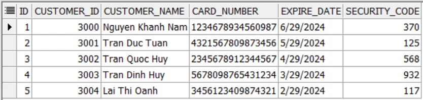
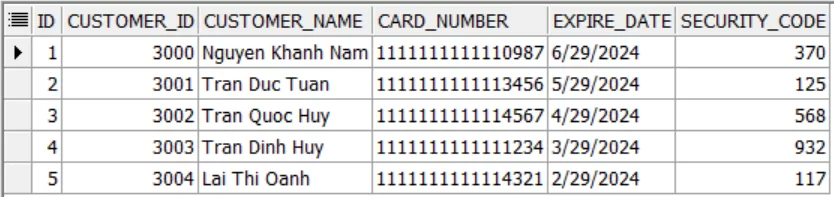
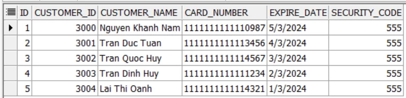
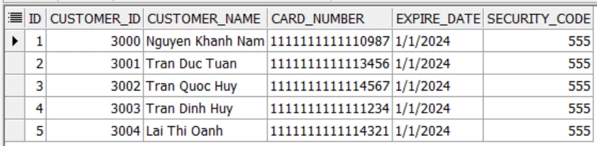
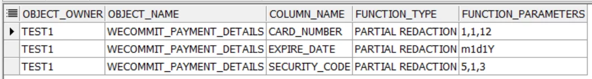
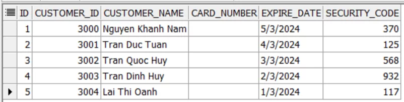
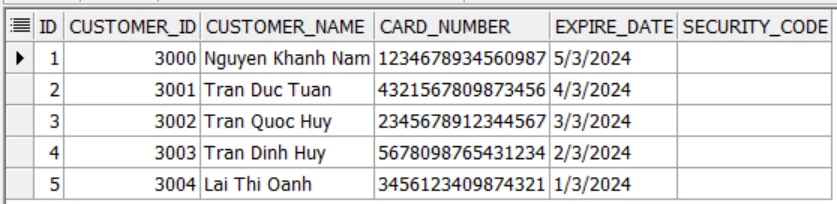
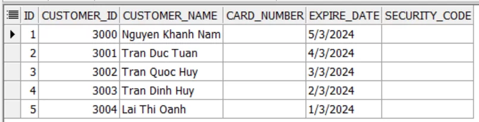

[Bài viết](https://wecommit.com.vn/courses/chuong-trinh-dao-tao-toi-uu-co-so-du-lieu-cao-cap/lesson/vip-giai-phap-bao-mat-co-so-du-lieu-oracle-19c-masking-data/)

Quy trình chi tiết triển khai bảo mật dữ liệu trong Cơ sở dữ liệu bằng cách ẩn đi các thông tin nhạy cảm trong bảng mà các user được chỉ định sẽ không được phép xem – giải pháp Masking Data.

# 1. Giải pháp bảo mật cơ sở dữ liệu – Data Masking này là gì?

- Kỹ thuật này được gọi là Masking Data hay Mặt nạ dữ liệu dùng để bảo mật các thông tin nhạy cảm mà vẫn đảm bảo các thông tin đó vẫn có thể được sử dụng bình thường với người dùng hay ứng dụng chỉ là không chính xác với những gì được lưu trên cơ sở dữ liệu thôi.
- Ví dụ nếu người dùng đăng nhập vào là lập trình viên thì không được phép biết chính xác các thông tin thanh toán của khách hàng như số thẻ hay mã bảo mật trên thẻ.
- Trong Oracle Database có tồn tại một Package gọi là **DBMS_REDACT** dùng để Masking Data trong Cơ sở dữ liệu. Sau đây chúng ta sẽ thực hiện demo Masking Data trong sơ sở dữ liệu với DBMS_REDACT.

# 2. Chi tiết Demo giải pháp bảo mật Cơ sở dữ liệu Oracle Masking Data

- Tạo user mới trên cơ sở dữ liệu  bao gồm chủ sở hữu bảng cần bảo mật (TEST1) và các user khác có quyền truy vấn bảng đó là (TEST2, TEST3).

``` SQL
-- login SYS
create user TEST1 identified by oracle quota unlimited on users;
grant create session, create table, create procedure to TEST1;
create user TEST2 identified by oracle quota unlimited on users;
grant create session to TEST2;
create user TEST3 identified by oracle quota unlimited on users;
grant create session to TEST3;
```

- Tạo bảng và thêm các bản ghi.

``` SQL
-- login TEST1
drop table WECOMMIT_PAYMENT_DETAILS purge;
create table WECOMMIT_PAYMENT_DETAILS (
   ID            number       not null,
   CUSTOMER_ID   number       not null,
   CUSTOMER_NAME varchar2(19) not null,
   CARD_NUMBER   number       not null,
   EXPIRE_DATE   date         not null,
   SECURITY_CODE number       not null,
   constraint WECOMMIT_PAYMENT_DETAILS_PK primary key (ID)
);
insert into WECOMMIT_PAYMENT_DETAILS values (1, 3000, 'Nguyen Khanh Nam', 1234678934560987, trunc(add_months(sysdate,9)), 370);
insert into WECOMMIT_PAYMENT_DETAILS values (2, 3001, 'Tran Duc Tuan',    4321567809873456, trunc(add_months(sysdate,8)), 125);
insert into WECOMMIT_PAYMENT_DETAILS values (3, 3002, 'Tran Quoc Huy',    2345678912344567, trunc(add_months(sysdate,7)), 568);
insert into WECOMMIT_PAYMENT_DETAILS values (4, 3003, 'Tran Dinh Huy',    5678098765431234, trunc(add_months(sysdate,6)), 932);
insert into WECOMMIT_PAYMENT_DETAILS values (5, 3004, 'Lai Thi Oanh',     3456123409874321, trunc(add_months(sysdate,5)), 117);
commit;
grant select on TEST1.WECOMMIT_PAYMENT_DETAILS to TEST2, TEST3;
```

- Truy vấn dữ liệu trong bảng của TEST1 với TEST2 và TEST3.

``` SQL
-- login TEST2, TEST3
select * from TEST1.WECOMMIT_PAYMENT_DETAILS;
```



- Ta thấy lúc này user TEST2 và TEST3 vẫn có thể xem các thông tin trong bảng như TEST1. Sau đây chúng ta sẽ tiến hành Masking Data với DBMS_REDACT để che các đi các cột chứa thông tin nhạy cảm trong bảng như số thẻ (CARD_NUMBER) và mã bảo mật (SECURITY_CODE).

- Cấp quyền sử dụng package DBMS_REDACT cho TEST1.

``` sq;
-- login SYS
grant execute on SYS.DBMS_REDACT to TEST1;
```

- Tạo role mới để gán cho TEST2 và TEST3.

``` sqk
-- login SYS
create role SENSITIVE;
grant SENSITIVE to TEST2, TEST3;
```

- Tạo Policy mới cho bảng với DBMS_REDACT để cho thông tin cột CARD_NUMBER nếu user thực hiện truy vấn có role là SENSITIVE.

``` sql
-- login TEST1
begin
dbms_redact.add_policy(
   object_schema => 'TEST1', -- tên chủ sở hữu bảng
   object_name => 'WECOMMIT_PAYMENT_DETAILS', -- tên bảng
   column_name => 'CARD_NUMBER', -- tên cột cần che thông tin
   policy_name => 'MASKING_CARD_INFO', -- tên policy
   expression => 'sys_context(''SYS_SESSION_ROLES'',''SENSITIVE'') = ''TRUE''', -- kiểm tra role
   function_type => dbms_redact.partial, -- che một phần dữ liệu
   function_parameters => '1,1,12' -- hiển thị là 1 cho các số từ 1 đến 12 trên toàn bộ giá trị cột
);
end;
/
```

- Truy vấn lại bảng với user TEST2 và TEST3 ta thấy cột CARD_NUMBER đã hiển thị thông tin khác với lúc ban đầu insert. 12 số đầu tiên của thẻ được hiển thị là 1 đúng như trong policy đã mô tả.

``` sql
-- login TEST2, TEST3
select * from TEST1.WECOMMIT_PAYMENT_DETAILS;
```



- Ta cũng có thể che thêm một cột nữa trong bảng bằng cách thay đổi policy đã tạo trước đó như sau.

``` sqk
-- login TEST1
begin
dbms_redact.alter_policy(
   object_schema => 'TEST1',
   object_name => 'WECOMMIT_PAYMENT_DETAILS',
   column_name => 'SECURITY_CODE', -- cột cần thêm cho policy
   policy_name => 'MASKING_CARD_INFO', -- policy cần chỉnh sửa
   expression => 'sys_context(''SYS_SESSION_ROLES'',''SENSITIVE'') = ''TRUE''',
   function_type => dbms_redact.partial,
   function_parameters => '5,1,3' -- hiển thị là 5 cho các số từ 1 đến 3 trên toàn bộ giá trị cột
);
end;
/
```

- Truy vấn lại bảng với user TEST2 và TEST3.

``` sql
-- login TEST2, TEST3
select * from TEST1.WECOMMIT_PAYMENT_DETAILS;
```



- Với cột có kiểu dữ liệu dạng DATE, ta cũng có thể che dữ liệu trong đó như các cột khác. Ví dụ ẩn thông tin ngày hết hạn của tất cả thẻ thành mùng 1 tháng 1 cùng năm với giá trị ban đầu.

``` sql
-- login TEST1
begin
dbms_redact.alter_policy(
   object_schema => 'TEST1',
   object_name => 'WECOMMIT_PAYMENT_DETAILS',
   column_name => 'EXPIRE_DATE',
   policy_name => 'MASKING_CARD_INFO',
   expression => 'sys_context(''SYS_SESSION_ROLES'',''SENSITIVE'') = ''TRUE''',
   function_type => dbms_redact.partial,
   function_parameters => 'm1d1Y'
);
end;
/
```

- Truy vấn lại bảng với user TEST2 và TEST3.

``` sql
-- login TEST2, TEST3
select * from TEST1.WECOMMIT_PAYMENT_DETAILS;
```



- Ta có thể xem thông tin bảng đã được cấu hình policy che thông tin dữ liệu bằng cách truy vấn bảng REDACT_COLUMNS với user SYS như sau.

``` sql
-- login SYS
select
   object_owner, object_name, column_name,
   function_type, function_parameters
from redaction_columns
where object_owner = 'TEST1'
   and object_name = 'WECOMMIT_PAYMENT_DETAILS'
order by 1, 2, 3;
```



- Nếu muốn loại bỏ 1 column ra khỏi policy ta sẽ thực hiện.

``` sql
-- login TEST1
begin
   dbms_redact.alter_policy(
   object_schema => 'TEST1',
   object_name => 'WECOMMIT_PAYMENT_DETAILS',
   policy_name => 'MASKING_CARD_INFO',
   action => dbms_redact.drop_column,
   column_name => 'EXPIRE_DATE'
);
end;
/
```

- Ta cũng có thể thay đổi cách policy nhận biết người dùng bằng cách chỉnh sửa điều kiện trong policy như sau. Ví dụ áp dụng policy với tất cả các user truy vấn bảng ngoại trừ user TEST1.

``` sql
-- login TEST1
begin
   dbms_redact.alter_policy(
   object_schema => 'TEST1',
   object_name => 'WECOMMIT_PAYMENT_DETAILS',
   policy_name => 'MASKING_CARD_INFO',
   action => dbms_redact.modify_expression,
   expression => 'sys_context(''USERENV'',''SESSOIN_USER'') != ''TEST1'''
);
end;
/
```

- Nếu không muốn sử dụng policy để che dữ liệu nữa ta có thể dễ dàng vô hiệu hóa hoặc xóa bỏ luôn policy như dưới đây.

``` sql
-- login TEST1
begin
dbms_redact.disable_policy(
   object_schema => 'TEST1',
   object_name => 'WECOMMIT_PAYMENT_DETAILS',
   policy_name => 'MASKING_CARD_INFO'
);
end;
/
```

``` sqk
-- login TEST1
begin
dbms_redact.drop_policy(
   object_schema => 'TEST1',
   object_name => 'WECOMMIT_PAYMENT_DETAILS',
   policy_name => 'MASKING_CARD_INFO'
);
end;
/
```

# 3. Masking Data với DBMS_RLS

- Trong Oracle Database còn có một package nữa tên là DBMS_RLS có thể được sử dụng để Masking dữ liệu. Không giống như DBMS_REDACT, DBMS_RLS chỉ có thể trả về dữ liệu NULL cho các cột bị giới hạn trong policy. Vì mục đích của DBMS_RLS là để giới hạn truy cập mức hàng và cột trong bảng, gọi là Virtual Private Database (VPD) trong Oracle Database.
- Nhưng bù lại thì DBMS_RLS linh hoạt hơn ở chỗ cho phép thêm nhiều policy cho một bảng thay vì chỉ một như DBMS_REDACT Tạm thời chúng ta sẽ không đi sâu và khái niệm VPD mà chỉ tập trung vào cách sử dụng DBMS_RLS để ẩn thông tin cột trên bảng. Ta vẫn sử dụng bảng của các user và bảng đã tạo bên trên để thực hiện.
- Trước hết tạo một Function sao cho khi phát hiện user đang thực hiện truy vấn bảng là TEST2 thì sẽ giả định là FALSE (1=2) và trả về NULL cho tất cả giá trị cột được chỉ định trong Policy.

``` sql
-- login TEST1
create or replace function F_HIDE_CARD_NUMBER (
   p_schema varchar2,
   p_object varchar2
) return varchar2 as
   l_user varchar2(20);
   l_predicate varchar2(100);
   begin
      select user into l_user from dual; -- truy vấn tên user của session hiện tại
      if l_user in ('TEST2') then l_predicate:='1=2'; -- giả định 1=2 hay FALSE
      end if;
      return l_predicate; -- trả về kết quả giả định
   end F_HIDE_CARD_NUMBER;
/
```

- Tạo Policy sử dụng Function trên để áp dụng ẩn thông cho toàn bộ giá trị trên cột CARD_NUMBER của bảng với user TEST2.

``` sql
-- login TEST1
begin
dbms_rls.add_policy(
   object_schema => 'TEST1', -- tên chủ sở hữu bảng
   object_name => 'WECOMMIT_PAYMENT_DETAILS', -- tên bảng
   policy_name => 'P_HIDE_CARD_NUMBER', -- tên policy
   function_schema => 'TEST1', -- tên chủ sở hữu function
   policy_function => 'F_HIDE_CARD_NUMBER', -- tên function
   statement_types => 'SELECT', -- loại câu lệnh sẽ được áp dụng policy
   sec_relevant_cols => 'CARD_NUMBER', -- tên cột
   sec_relevant_cols_opt => dbms_rls.all_rows -- áp dụng với tất cả bản ghi trong cột
);
end;
/
```

- Truy vấn lại bảng ta thấy user TEST2 không còn thấy giá trị trên cột CARD_NUMBER nữa.

``` sql
-- login TEST2
select * from TEST1.WECOMMIT_PAYMENT_DETAILS;
```



- Tiếp theo ta sẽ cấu hình thêm Policy thực hiện tương tự với user TEST3 nhưng sẽ đổi thành ẩn giá trị trên cột SECURITY_CODE thay vì CARD_NUMBER.

``` sql
-- login TEST1
create or replace function F_HIDE_SECURITY_CODE (
   p_schema varchar2,
   p_object varchar2
) return varchar2 as
   l_user varchar2(20);
   l_predicate varchar2(100);
   begin
      select user into l_user from dual;
      if l_user in ('TEST3') then l_predicate:='1=2';
      end if;
      return l_predicate;
   end F_HIDE_SECURITY_CODE;
/
```

- Tạo policy sử dụng function trên áp dụng cho toàn bộ giá trị trên cột của bảng.

``` sql
-- login TEST1
begin
dbms_rls.add_policy(
   object_schema => 'TEST1',
   object_name => 'WECOMMIT_PAYMENT_DETAILS',
   policy_name => 'P_HIDE_SECURITY_CODE',
   function_schema => 'TEST1',
   policy_function => 'F_HIDE_SECURITY_CODE',
   statement_types => 'SELECT',
   sec_relevant_cols => 'SECURITY_CODE',
   sec_relevant_cols_opt => dbms_rls.all_rows  
);
end;
/
```

-Truy vấn lại bảng ta thấy user TEST3 không còn thấy giá trị trên cột SECURITY_CODE nữa.

``` sql
-- login TEST3
select * from TEST1.WECOMMIT_PAYMENT_DETAILS;
```



- Ta cũng có thể cấu hình Function cho Policy để ẩn thông tin với các user có role là SENSITIVE giống đã là bên trên với DBMS_REDACT như sau.

``` sql
-- login TEST1
create or replace function F_HIDE_CARD_INFO (
   p_schema varchar2,
   p_object varchar2
) return varchar2 is
   l_predicate varchar2(100);
begin
   l_predicate := '1=2';
   if (sys_context('SYS_SESSION_ROLES','SENSITIVE') = 'TRUE') THEN
      l_predicate := NULL;
   else
      l_predicate := '1=2';
   end if;
return l_predicate;
end F_HIDE_CARD_INFO;
/
```

- Policy của DBMS_RLS có thể được áp dụng cho nhiều cột cùng lúc trên bảng như sau.

``` sql
begin
dbms_rls.add_policy(
   object_schema => 'TEST1',
   object_name => 'WECOMMIT_PAYMENT_DETAILS',
   policy_name => 'P_HIDE_CARD_INFO',
   function_schema => 'TEST1',
   policy_function => 'F_HIDE_CARD_INFO',
   statement_Types => 'SELECT',
   sec_relevant_cols => 'CARD_NUMBER,SECURITY_CODE',
   sec_relevant_cols_opt => dbms_rls.all_rows
);
end;
/
```

- Truy vấn lại bảng ta thấy user TEST2 và TEST3 không còn thấy giá trị trên cột cả 2 cột CARD_NUMBER và SECURITY_CODE nữa.

``` sql
-- login TEST2, TEST3
select * from TEST1.WECOMMIT_PAYMENT_DETAILS;
```



- Để disable policy của DBMS_RLS, ta thực hiện như sau.

``` sqk
begin
dbms_rls.enable_policy(
   object_schema => 'TEST1',
   object_name => 'WECOMMIT_PAYMENT_DETAILS',
   policy_name => 'P_HIDE_CARD_INFO',
   enable      => FALSE --> đặt là TRUE để enable và ngược lại
);
end;
/
```

- Để xóa Policy ta thực hiện

``` sqk
begin
dbms_rls.drop_policy(
   object_schema => 'TEST1',
   object_name => 'WECOMMIT_PAYMENT_DETAILS',
   policy_name => 'P_HIDE_CARD_INFO'
);
end;
/
```
