[Bài viết](https://wecommit.com.vn/courses/chuong-trinh-dao-tao-toi-uu-co-so-du-lieu-cao-cap/lesson/vip-quy-trinh-giam-sat-index-tren-oracle-database-index-monitoring/)

Bài viết sau đây là quy trình thực hiện giám sát Index – Index Monitoring trong cơ sở dữ liệu Oracle, giúp loại bỏ toàn bộ các Index không sử dụng khi thiết kế cơ sở dữ liệu.

# 1. Tổng quan quy trình giám sát Index trên Oracle Database

Quy trình giám sát Index trên Oracle Database áp dụng cho 2 phiên bản Oracle Database:

- Oracle Database phiên bản 12.1 và từ 11g trở về.
- Oracle Databse các phiên bản từ sau 12.2 trở đi.
Với các phiên bản từ sau 12.2, tính năng Index Monitoring trên Oracle Database được thay thế bằng Index Usage Tracking. Chức năng chính vẫn là để giám sát Index nhưng sẽ đầy đủ hơn vì Oracle sẽ theo dõi toàn bộ Index trên Database bất kể Monitoring Usage có được bật hay không. Thông tin chi tiết sẽ được mô tả trong quy trình.

# 2. Chi tiết quy trình thực hiện giám sát Index

## 2.1. Oracle Database phiên bản 12.1 và từ 11g trở về

Để giám sát Index trên Database, Oracle cung cấp một tính năng gọi là Index Monitoring cho phép người dùng kiểm tra xem Index nào có được sử dụng trên hệ thống hay không. Để thực hiện giám sát Index, ta sẽ bật Monitoring Usage của nó lên.

- Sử dụng câu lệnh sau để bật Index Monitoring:

``` sql
ALTER INDEX <index_name> MONITORING USAGE;
```

- Để tắt Index Monitoring sử dụng lệnh sau để alter lại Index:

``` sql
ALTER INDEX <index_name> NOMONITORING USAGE;
```

- Nếu muốn bật Index Monitoring của một User bạn có thể tham khảo sử dụng câu lệnh sau đây để tạo các câu lệnh alter toàn bộ Index của User đó.

``` sql
SELECT 'ALTER INDEX '||OWNER||'.'||INDEX_NAME||' MONITORING USAGE;'
FROM DBA_INDEXES
WHERE OWNER IN (UPPER('&USER_NAME'))
AND GENERATED = 'N' -- not system-generated indexes
ORDER BY 1;
```

- Với phiên bản Oracle Database 12.1, thông tin về các Index đã được bật Monitoring Usage được lưu ở trong view DBA_OBJECT_USAGE. Dùng câu lệnh truy vấn sau để xem thông tin các Index đó.

``` sql
SELECT
       OWNER, INDEX_NAME, TABLE_NAME,
       MONITORING, USED,
       START_MONITORING, END_MONITORING
FROM   DBA_OBJECT_USAGE
WHERE  OWNER = UPPER('&USER_NAME');
```

- View DBA_OBJECT_USAGE có các trường thông tin như sau:
  - OWNER tên User sở hữu Index.
  - INDEX_NAME tên Index
  - TABLE_NAME tên bảng
  - MONITORING có 2 giá trị là YES hoặc NO chỉ định Index đang được bật Monitoring Usage hay không
  - USED có 2 giá trị là YES hoặc NO chỉ định Index đã được sử dụng hay chưa
  - START_MONITORING thời điểm bật Monitoring Usage
  - END_MONITORING thời điểm tắt Monitoring Usage

- Với các phiên bản Oracle Database từ 11g trở về, thông tin Index Monitoring sẽ ở trong view V$OBJECT_USAGE do phiên bản trước đó chưa có view DBA_OBJECT_USAGE. 2 view này chỉ khác nhau ở chỗ V$OBJECT_USAGE không có thông tin tên User (OWNER) nên ta sẽ phải thay bằng tên Index trong câu lệnh truy vấn bên trên như sau.

``` sql
SELECT
       INDEX_NAME, TABLE_NAME,
       MONITORING, USED,
       START_MONITORING, END_MONITORING
FROM   V$OBJECT_USAGE
WHERE  INDEX_NAME IN ('<index_name>');
```

- Thông tin chi tiết của các view xem lại đường link sau:
  - V$OBJECT_USAGE
  - DBA_OBJECT_USAGE

## 2.2. Oracle Databse các phiên bản từ sau 12.2 trở đi

-Kể từ các phiên bản **12.2 trở đi**, Oracle đã **thay thế tính năng Index Monitoring**, cho phép Database luôn lưu lại thông tin của Index bất kể có bật Monitoring Usage hay không, gọi là **Index Usage Tracking**. **Nhược điểm rõ ràng nhất của Index Monitoring** trên các phiên bản trước là thông tin Index **chỉ được hiển thị là đã dùng hay không (USED = YES/NO)** chứ không đếm được Index được sử dụng, truy cập bao nhiêu lần hay lần cuối được sử dụng là khi nào.

- Nhược điểm trên đã được khắc phục với Index Usage Tracking. Thông tin giám sát của Index sẽ được lưu trong 2 view là **V$INDEX_USAGE_INFO** và **DBA_INDEX_USAGE**. Chi tiết cách đọc và sử dụng 2 view này sẽ được mô tả sau đây trong quy trình.

>NOTE: Index Monitoring vẫn có thể được bật để giám sát Index và có thể truy vấn trong view DBA_OBJECT_USAGE như phiên bản 12.1 bình thường)

### a. V$INDEX_USAGE_INFO

- Oracle sẽ luôn lưu lại thông tin sử dụng của Index trên Database bất kể có bật Monitoring Usage hay không. Các thông tin này sẽ **lưu trên Memory và được ghi xuống đĩa (flush) sau mỗi 15 phút**. Sử dụng câu lệnh dưới đây để kiểm tra thông tin flush Index trong view V$INDEX_USAGE_INFO:

``` SQL
SELECT
      INDEX_STATS_ENABLED,
      INDEX_STATS_COLLECTION_TYPE,
      ACTIVE_ELEM_COUNT,
      LAST_FLUSH_TIME
FROM  V$INDEX_USAGE_INFO;
```

- View V$INDEX_USAGE_INFO có các trường thông tin đáng chú ý như sau:

  - INDEX_STATS_ENABLED Mặc định 1 nghĩa là thông tin Statistic Usage của Index được bật, 0 là tắt.
  - INDEX_STATS_COLLECTION_TYPE Mặc định 1 nghĩa thông tin Statistic của Index được “sampled” (mục 3 sẽ demo chi tiết hơn về khái niệm này). 0 nghĩa là tất cả các lần sử dụng Index đều được giám sát và ghi lại.
  - ACTIVE_ELEM_COUNT Số lượng Active Index kể từ lần được flush xuống đĩa gần nhất.
  - LAST_FLUSH_TIME: Thời gian Statisic Index được flush xuống đĩa gần nhất, cập nhật sau mỗi 15 phút.

- Thông tin chi tiết của view xem lại đường link sau: [V$INDEX_USAGE_INFO](https://docs.oracle.com/en/database/oracle/oracle-database/19/refrn/V-INDEX_USAGE_INFO.html#GUID-247622FE-A377-4DD3-BD93-067407D68AE0)

### b. DBA_INDEX_USAGE

- Để xem thông tin giám sát của Index ở mức object hơn ta sử dụng view DBA_INDEX_USAGE, dữ liệu của view cũng sẽ được **flush xuống đĩa sau mỗi 15 phút**. Dùng câu lệnh sau để xem thông tin Index trong view:

``` sql
SELECT
      OWNER, NAME,
      TOTAL_ACCESS_COUNT,
      TOTAL_EXEC_COUNT,
      TOTAL_ROWS_RETURNED,
      LAST_USED
FROM  DBA_INDEX_USAGE WHERE OWNER = UPPER('&USER_NAME')
ORDER BY 1, 2;
```

- OWNER tên User sở hữu Index
- NAME tên Index.
- TOTAL_ACCESS_COUNT tổng số lần Index được truy cập.
- TOTAL_EXEC_COUNT: tổng số lần thực thi mà Index tham gia.
- LAST_USED: thời gian lần cuối cùng Index được sử dụng, cũng chính là thời gian thông tin Index được flush xuống đĩa. Nếu Index được sử dụng thì thông tin đó sẽ được tracking trên memory và flush sau 15 phút. Ngược lại nếu Index không được sử dụng thì giá trị của LAST_USED sẽ không đổi.

Thông tin chi tiết của view xem lại đường link sau: [DBA_INDEX_USAGE](https://docs.oracle.com/en/database/oracle/oracle-database/19/refrn/DBA_INDEX_USAGE.html#GUID-53AC8395-16CF-4950-B139-1B7582957780)

# 3. Demo thực hiện giám sát Index – Index Monitoring – Index Usage Tracking

Demo được thực hiện trên phiên bản Oracle Database 19c

## 3.1. Chuẩn bị

### a. Tạo bảng và Index thực hiện demo

Tạo - một User và bảng mới, sau đó Insert dữ liệu vào bảng.

``` sql
CREATE USER TEST IDENTIFIED BY oracle QUOTA UNLIMITED ON USERS;
GRANT CREATE SESSION, CREATE TABLE, CREATE PROCEDURE TO TEST;

-- CONN TEST/oracle
CREATE TABLE TABLE1 (
id NUMBER,
name VARCHAR2(50),
created_date DATE,
CONSTRAINT TABLE1_pk PRIMARY KEY (id)
);

CREATE TABLE TABLE2 (
id NUMBER,
Name VARCHAR2(50),
created_date DATE,
CONSTRAINT TABLE2_pk PRIMARY KEY (id)
);
Insert dữ liệu vào bảng và tạo Index:
INSERT INTO TABLE1
SELECT level,
   'Name ' || level,
   TRUNC(SYSDATE)
FROM DUAL
CONNECT BY level <= 30;

CREATE INDEX TABLE1_NAME_IDX ON TABLE1(NAME);
CREATE INDEX TABLE1_CREATED_DATE_IDX ON TABLE1(CREATED_DATE);

INSERT INTO TABLE2
SELECT level,
   'Name ' || level,
   TRUNC(SYSDATE)
FROM DUAL
CONNECT BY level <= 20;

CREATE INDEX TABLE2_NAME_IDX ON TABLE2(NAME);
CREATE INDEX TABLE2_CREATED_DATE_IDX ON TABLE2(CREATED_DATE);
```

### b.  Lựa chọn SAMPLED hoặc ALL

- Trước khi truy vấn dữ liệu bảng và xem thông tin giám sát Index, ta cần thực hiện thêm một số công việc như sau trong quá trình Demo với hệ thống Lab. Như đã đề cập trước đó, thông tin thống kê việc giám sát Index có thể được tổng hợp theo một trong 2 cách là **SAMPLED hoặc ALL, tương ứng với giá trị 1 hoặc 0 tại cột INDEX_STATS_COLLECTION_TYPE trong view DBA_INDEX_USAGE.**
- Cách thức tổng hợp Index Usage Statistic được quyết định bởi tham số ẩn trong Oracle Database tên là **_IUT_STAT_COLLECTION_TYPE**. **Mặc định giá trị của tham số là SAMPLED**, tức là Database sẽ không thu thập thông tin của toàn bộ Index được sử dụng khi thực thi câu lệnh trên hệ thống. Để quá trình Demo trên hệ thống Lab diễn ra trực quan hơn ta sẽ đặt lại giá trị cho tham số là ALL trên session sẽ thực hiện các lệnh truy vấn có sử dụng Index.

``` sql
ALTER SESSION SET "_IUT_STAT_COLLECTION_TYPE"=ALL;
```

>NOTE: Ta chỉ thay đổi giá trị tham số ở mức SESSION thay vì SYSTEM để tránh gây ảnh hưởng đến Database nhất có thể. Việc thay đổi giá trị _iut_stat_collection_type thành ALL cũng **KHÔNG khuyến nghị** thực hiện trên các hệ thống Production vì nó sẽ gây ảnh hưởng đến hiệu năng, do tất cả Index trên hệ thống đều được giám sát và ghi lại thông tin sau mỗi 15 phút flush xuống đĩa.

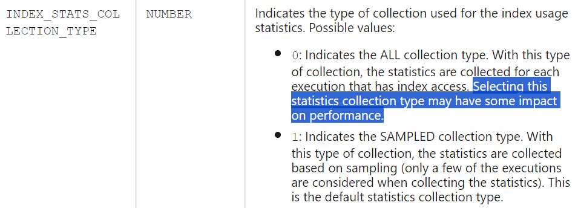

### c. Flush thủ công thông tin giám sát của Index

- Mặc định thông tin giám sát Index sẽ được ghi xuống đĩa và cập nhật trong view V$INDEX_USAGE_INFO và sau mỗi 15 phút. Thay vì chờ 15 phút ta có thể flush thủ công các thông tin này để quá trình Demo trên hệ thống Lab Test diễn ra nhanh chóng hơn.

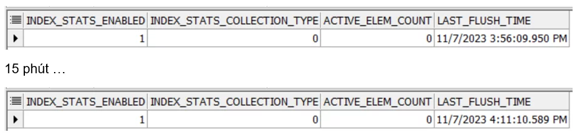

- Trước hết thực hiện câu lệnh truy vấn sau trên Oracle Database để tìm các **tiến trình MMON**đang chạy trên hệ thống.

``` sql
SELECT S.PROGRAM, S.MODULE, S.ACTION, S.SID, P.PID, P.SPID
FROM V$SESSION S, V$PROCESS P
WHERE S.PADDR=P.ADDR AND S.PROGRAM LIKE '%(M0%'
ORDER BY S.PROGRAM;
```

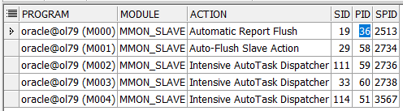

- Chọn 1 tiến trình bất kỳ trong số các kết quả trả về ở trên, ví dụ tiến trình có PID là 36. Mở thêm một session và login vào hệ thống với quyền SYSDBA. Sau đó gắn tiện ích ORADEBUG lên tiến trình đó với câu lệnh sau.

``` sql
oradebug setorapid 36
```

- Cuối cùng chạy câu lệnh sau để flush xuống đĩa và cập nhật thông tin Index view V$INDEX_USAGE_INFO.

``` sql
oradebug call keiut_flush_all
```

- Như vậy thông tin Index đã được flush ngay lập tức trên Database thay vì chờ 15 phút như ban đầu. Sau này với mỗi lần thực hiện truy vấn với Index ta sẽ flush để xem thông tin Index được ghi xuống ra sao.

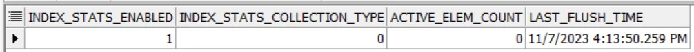

- Nếu sau đấy bạn thực hiên flush mà gặp lỗi như dưới đây thì tức là tiến trình MMON cũ đã không còn active trên hệ thống nữa. Lúc này ta chỉ cần tìm một tiến trình MMON khác và thực hiện lại lệnh gắn ORADEBUG, sau đó là có thể flush thông tin Index như bình thường.

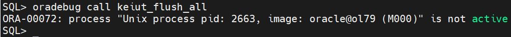

### b.  Demo thực hiện giám sát Index

- Thực hiện lần lượt các câu lệnh truy vấn sau đây, ta thấy mỗi khi Index được sử dụng trên Database, hệ thống sẽ cập nhật thông tin của Index xuống đĩa sau mỗi lần flush.

``` sql
SELECT * FROM TABLE1 WHERE id = 10;
```

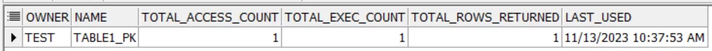

- Giá trị của cột LAST_USED là thời gian lần cuối Index được sử dụng, cũng chính là thời gian Index được flush xuống đĩa. Nếu Index được sử dụng thì thông tin đó sẽ được tracking trên memory và flush sau 15 phút. Ngược lại nếu Index không được sử dụng thì giá trị của LAST_USED sẽ không đổi.

``` sql
SELECT * FROM TABLE1 WHERE name = 'Name 10';
```

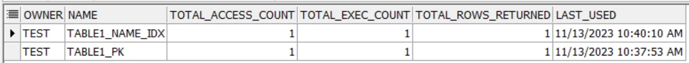

- Trong trường hợp Index được sử dụng trong câu lệnh truy vấn và truy cập nhưng không có bản ghi nào thỏa mãn điều kiện thì cột TOTAL_ROWS_RETURNED sẽ bằng 0.

``` sql
SELECT * FROM TABLE1 WHERE created_date = TRUNC(SYSDATE-1);
```

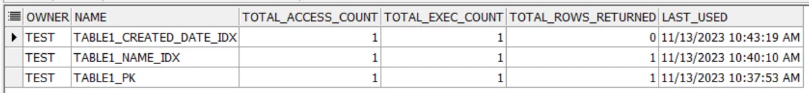

``` sql
SELECT * FROM TABLE1 WHERE created_date = TRUNC(SYSDATE);
```


- Ví dụ sau đây thực hiện Join 2 bảng, Index vẫn được tham gia khi thực thi câu lệnh nhưng không được truy cập và cũng không trả về bản ghi nào. Để giám sát Index 1 cách hiệu quả nhất ta cần theo dõi thêm cả giá trị ở cột TOTAL_EXEC_COUNT nữa trước khi đưa ra quyết định có nên xóa Index, chứ không chỉ theo dõi mỗi thời gian ở cột LAST_USED để đánh giá. Ví dụ sau 3 tháng bạn theo dõi thấy giá trị TOTAL_EXEC_COUNT tăng chậm chứng tỏ Index ít được sử dụng và ngược lại.

``` sql
SELECT b.ID
FROM TABLE1 a JOIN TABLE2 b ON a.name = b.name 
WHERE a.created_date = TRUNC(SYSDATE-1);
```

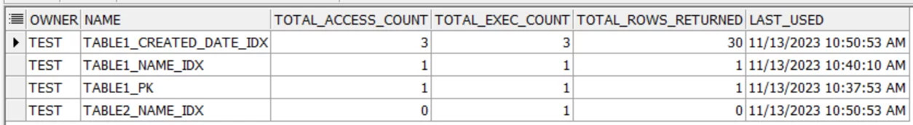

- Khi hệ thống thực hiện G**ather Statistic** cho Index, Index cũng được **tính là sử dụng** và cập nhật vào cột LAST_USED trong view. Như vậy ta càng rõ hơn để giám sát được Index trên hệ thống ta cần theo dõi thêm cả 2 cột là và thì mới đánh giá được Index có được sử dụng hay không

``` sql
EXEC DBMS_STATS.GATHER_TABLE_STATS('TEST', 'TABLE1', CASCADE => TRUE);
```

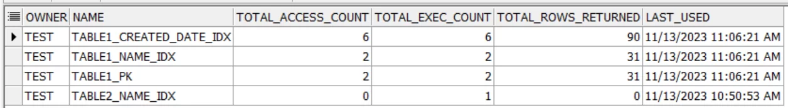

``` sql
EXEC DBMS_STATS.GATHER_INDEX_STATS('TEST', 'TABLE2_CREATED_DATE_IDX');
```

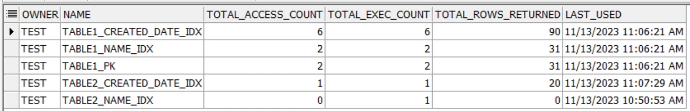

- Trong trường hợp Index bị Invisible trên hệ thống, thông tin giám sát của Index sẽ được bỏ qua do với Invisible Index do chiến lược thực thi sẽ không sử dụng Invisible Index.

``` sql
ALTER INDEX TABLE1_NAME_IDX INVISIBLE;
SELECT * FROM TABLE1 WHERE name = 'Name 10';
```

- Ngược lại nếu sử dụng Hint cho Index bị Invisible, chiến lược thực thi sẽ sử dụng Index nên thông tin giám sát của Index vẫn sẽ được cập nhật xuống đĩa.

``` sql
SELECT /*+ USE_INVISIBLE_INDEXES)*/ * FROM TABLE1 WHERE NAME = 'NAME 10';
```

- Như đã nói trước đó với Index Monitoring của phiên bản 12.1 trở về, việc bật Monitoring Usage chỉ phát hiện được Index có sử dụng hay không chứ không thông kê được số lần sử dụng, truy cập hay lần cuối sử dụng là khi nào.

``` sql
ALTER INDEX TABLE2_NAME_IDX MONITORING USAGE;
```

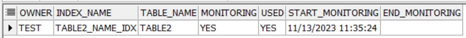

- Nếu drop Index trên hệ thống, các bản ghi về Index cũng sẽ được xóa khỏi các view.

``` sql
DROP INDEX TABLE1_Name_idx;
DROP INDEX TABLE1_created_date_idx;
DROP INDEX TABLE2_Name_idx;
DROP INDEX TABLE2_created_date_idx;
```

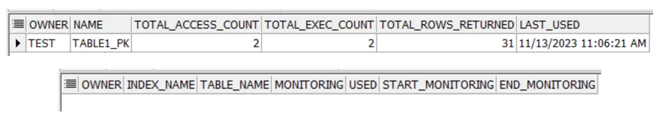
