[Bài viết 1](https://wecommit.com.vn/courses/chuong-trinh-dao-tao-toi-uu-co-so-du-lieu-cao-cap/lesson/giam-sat-hieu-nang-database-voi-query-store-tren-sql-server-2016-phan-1/)

[Bài viết 2](https://wecommit.com.vn/courses/chuong-trinh-dao-tao-toi-uu-co-so-du-lieu-cao-cap/lesson/giam-sat-hieu-nang-database-voi-query-store-tren-sql-server-2016-phan-2/)

# 1. Tính năng Query Store trên SQL Server

## 1.1. Giới Thiệu

Query Store là một tính năng mới được giới thiệu trên SQL Server phiên bản 2016 (13.x) trở lên, giúp người dùng đơn giản hóa việc giám sát hiệu năng Database bằng cách ghi lại thông tin lịch sử, chiến lược thực thi và các thông tin thống kê khác của câu lệnh trên SQL Server. Cách hoạt động của Query Store đóng vai trò như một hộp đen trên Database, dựa vào các thông tin trong hộp đen mà người dùng có thể tối ưu hoặc xử lý sự cố liên quan đến hiệu năng Database trên SQL Server.

## 1.2. Cách thức hoạt động

Query Store chỉ thu thập thông tin về các câu lệnh DML mà không theo dõi các câu lệnh DDL trên hệ thống. Có 3 loại thông tin sau của câu lệnh được lưu trữ là.

- Query và Plan: bản thân thông tin của chính câu lệnh (ví dụ như query text) và chiến lược thực thi của nó (Execution Plan)
- Query Runtime Statistic – thông tin thống kê về hiệu năng và tài nguyên sử dụng của câu lệnh trong quá trình thực thi (thời gian chạy, số lần gọi, thời gian CPU, v.v…)
- Query Wait Statistic: thông tin về tình trạng chậm treo trên hệ thống (Wait) trong quá trình thực thi của câu lệnh.

Khi một câu lệnh được người dùng thực thi trên SQL Server, nó sẽ trải qua một loạt các công đoạn xử lý như phân tích cú pháp, ngữ nghĩa, phân tích chiến lược thực thi, v.v… . Sau đó thông tin phân tích của các công đoạn này sẽ được lưu lại trong Query Store.
>NOTE: bản thân Query Store không can thiệp vào các quá trình này mà chỉ lưu lại kết quả của chúng. Sau khi có thông tin câu lệnh và chiến lược thực thi, Query Store sẽ tiếp tục theo dõi và lưu lại Runtime Statistic và Wait Statistic trong quá trình câu lệnh được thực thi trên hệ thống.

## 1.3. Kích hoạt trên SQL Server

Vì đây là tính năng ở mức Database của SQL Server nên ta có thể bật Query Store trên từng Database một cách riêng biệt. Sử dụng công cụ SQL Server Management Studio (SSMS) để bật Query Store theo các bước dưới đây.

**Cách 1: Dùng giao diện SSMS**

- Click chuột trái vào Properties của Database muốn bật Query Store trong Object Explorer.

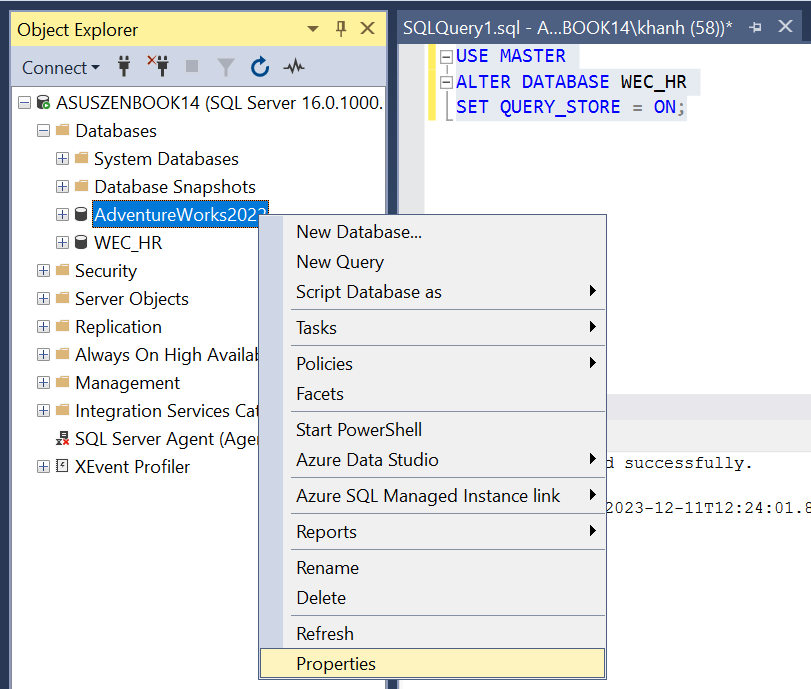

- Sau khi cửa sổ Properties hiện lên, ấn vào trang Query Store.

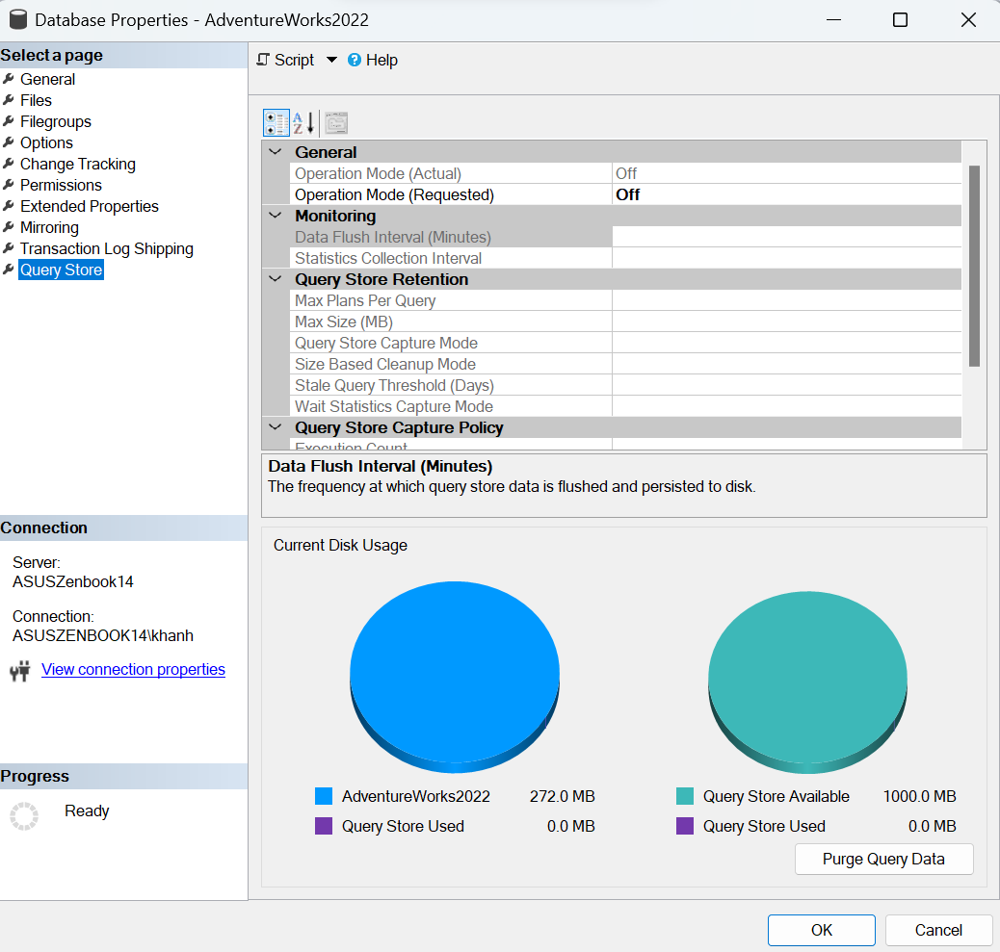

- Trong mục Operation Mode (Requested) chọn Read Write, sau đó ấn OK để lưu.

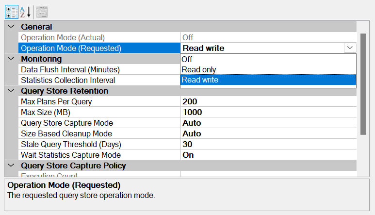

**Cách 2 sử dụng câu lệnh T-SQL**

``` sql
USE MASTER;
ALTER DATABASE <database_name> 
SET QUERY_STORE = ON;
ALTER DATABASE <database_name> 
SET QUERY_STORE (OPERATION_MODE = READ_WRITE);
```

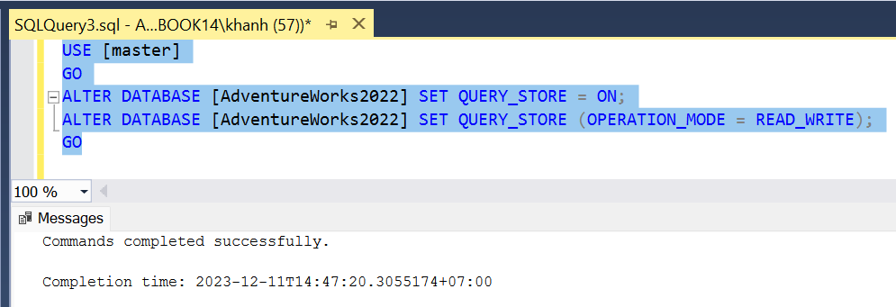

- Xác nhận lại với câu lệnh truy vấn dưới đây. Giá trị bằng 1 ở cột IS_QUERY_STORE_ON tức là đã bật thành công.

``` sql
USE MASTER;
SELECT name, is_query_store_on
FROM sys.databases; 
```

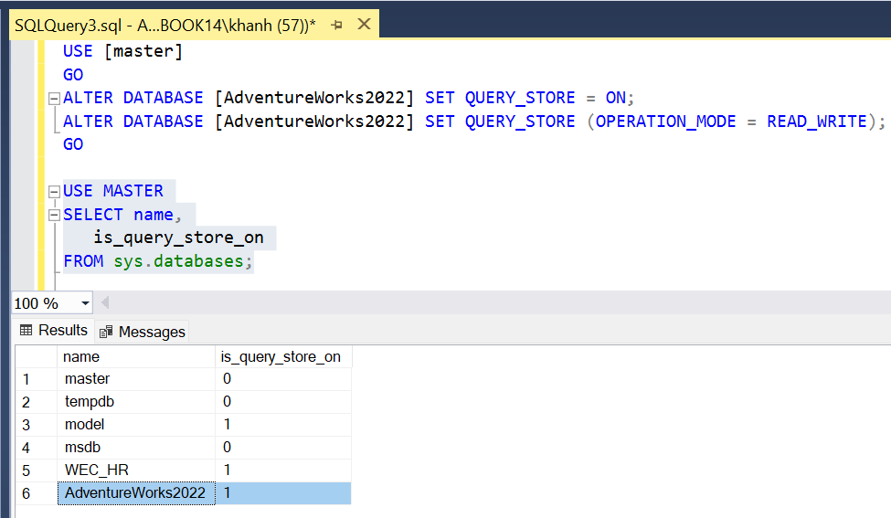

# 2. Cấu hình Query Store trên SQL Server

## 2.1. Operation Mode

- Query Store có 2 trạng thái là ON hoặc OFF tương ứng với đang bật hoặc tắt.

``` sql
ALTER DATABASE <database_name>
SET QUERY_STORE = { ON | OFF };
```

- Sau khi bật, Query Store sẽ có 2 Operation Mode là READ_ONLY và READ_WRITE.

- READ_WRITE:  là giá trị mặc định của Operation Mode, thông tin các câu lệnh sẽ được theo dõi và lưu trữ bởi Query Store.
- READ_ONLY: Query Store vẫn đang bật, nhưng thông tin các câu lệnh mới sẽ không được thu thập để theo dõi (các thông tin cũ nếu có vẫn được lưu và lấy ra sử dụng bình thường).

Trên SSMS, Operation Mode (Actual) là mode thực tế của Database, còn Operation Mode (Resquested) là mode do người dùng yêu cầu. Hai giá trị này trong một vài trường hợp có thể khác nhau, ví dụ khi Database đang ở trạng thái Read-only thì Operation Mode (Actual) sẽ là READ_ONLY còn Operation Mode (Resquested) có thể là READ_WRITE do người dùng yêu cầu đặt.

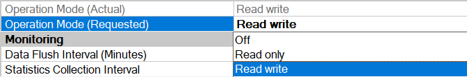

- Dưới đây là câu lệnh T-SQL tương ứng để thay đổi giá trị của Operation Mode.

``` sql
ALTER DATABASE <database_name> 
SET QUERY_STORE (OPERATION_MODE = { READ_WRITE | READ_ONLY });
```

## 2.2. Data Flush Interval

- Data Flush Interval chỉ định tần suất thông tin các câu lệnh lưu trong Query Store sẽ được SQL Server ghi từ memory xuống đĩa (gọi là flush), giá trị mặc định là 900 giây (15 phút ghi một lần).

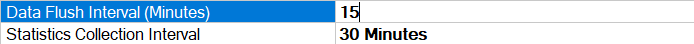

- Trên SSMS, giá trị của Data Flush Interval được hiển thị theo phút, còn trong câu lệnh sau ta sẽ thay đổi giá trị của nó theo giây với option DATA_FLUSH_INTERVAL_SECONDS như sau.

``` sql
ALTER DATABASE <database_name>  
SET QUERY_STORE (DATA_FLUSH_INTERVAL_SECONDS = 900);
```

## 2.3. Statistics Collection Interval

- Statistic Collection Interval chỉ định khoảng thời gian mà Query Store thu thập và sử dụng thông tin của câu lệnh, mặc định là 60 phút (1 tiếng). Giá trị Statistic Collection Interval càng thấp thì độ chi tiết của thông tin câu lệnh càng cao nhưng sẽ yêu cầu nhiều dung lượng hơn trên hệ thống để lưu trữ.

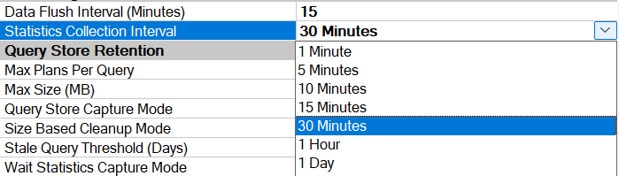

- Giá trị của Statistic Collection Interval được thiết lập bằng INTERVAL_LENGTH_MINUTES trong câu lệnh T-SQL như sau.

``` sqk
ALTER DATABASE <database_name>  
SET QUERY_STORE (INTERVAL_LENGTH_MINUTES = 60);
```

## 2.4. Max Plans Per Query

- Max Plans Per Query thể hiện số lượng chiến lược thực thi tối đa cho mỗi câu lệnh được lưu bởi Query Store, mặc định là 200.

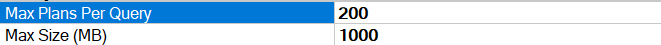

- Thay đổi giá trị Max Plans Per Query sử dụng câu lệnh sau với MAX_PLANS_PER_QUERY.

``` sql
ALTER DATABASE <database_name>  
SET QUERY_STORE (MAX_PLANS_PER_QUERY = 200);
```

## 2.5. Max Size (MB)

- Max Size thể hiện dung lượng tối đa được hệ thống cấp cho Query Store, mặc định là 100MB. Khi đầy dung lượng Max Size được cấp, SQL Server sẽ tự động chuyển Operation Mode sang READ_ONLY để Query Store không thu thập thêm thông tin các câu lệnh mới.

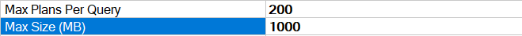

- Thay đổi giá trị Max Size sử dụng câu lệnh sau với MAX_STORAGE_SIZE_MB.

``` sql
ALTER DATABASE <database_name>  
SET QUERY_STORE (MAX_STORAGE_SIZE_MB = 100);
```

## 2.6. Query Store Capture Mode

Query Store Capture Mode chỉ định loại câu lệnh nào sẽ được Query Store theo dõi và lưu lại. Các tất cả 4 mode như sau:

- ALL: theo dõi tất cả các câu lệnh bất kể số lần thực thi hay chi phí của câu lệnh.
- AUTO: theo dõi các câu lệnh tự động dựa trên các tiêu chí riêng của SQL Server.
- NONE: Không theo dõi câu lệnh mới, chỉ theo dõi các câu lệnh đã được ghi lại trước đó.
- CUSTOM (mới trên SQL Server 2019):  cho phép người dùng tự định nghĩa các tiêu chí riêng của mình để theo dõi câu lệnh.

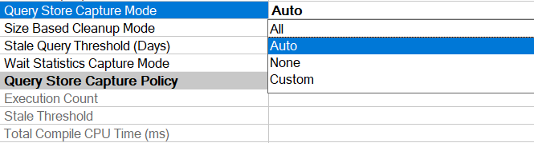

- Thay đổi giá trị Query Store Capture Mode sử dụng câu lệnh sau với QUERY_CAPTURE_MODE.

``` sql
ALTER DATABASE <database_name>  
SET QUERY_STORE (QUERY_CAPTURE_MODE = { ALL | AUTO | NONE | CUSTOM });
```

- Nếu lựa chọn Query Store Capture Mode là CUSTOM, người dùng có thể tự điều chỉnh thêm các tiêu chí với Query Store Capture Policy như sau:
  - Execution Count: số lần thực thi tối thiểu của câu lệnh, mặc định 30 lần
  - Total Compile CPU Time (ms): thời gian CPU tối thiểu để biên soạn câu lệnh, mặc định 1s (1000ms)
  - Total Execution CPU Time (ms):  thời gian CPU tối thiểu để thực thi câu lệnh, mặc định 0.1s (100ms)
  - Stale Threshold: cả 3 tham số trên sẽ được đánh giá dựa trên một khoảng thời gian nhất định của Stale Threshold, mặc định là 1 giờ.

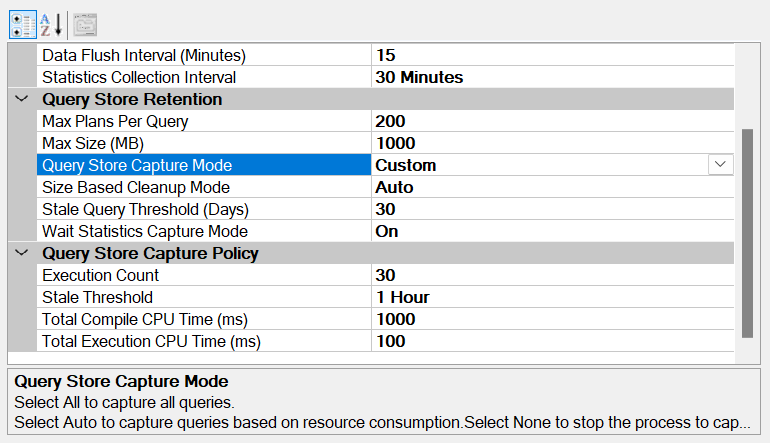

- Thay đổi giá trị Query Store Capture Policy sử dụng câu lệnh sau với QUERY_CAPTURE_POLICY.

``` sql
ALTER DATABASE <database_name>  
SET QUERY_STORE (
   QUERY_CAPTURE_MODE = CUSTOM,
   QUERY_CAPTURE_POLICY = (
      EXECUTION_COUNT = 30,
      STALE_CAPTURE_POLICY_THRESHOLD = 1 HOURS
      TOTAL_COMPILE_CPU_TIME_MS = 1000,
      TOTAL_EXECUTION_CPU_TIME_MS = 100
   )
);
```

## 2.7. Size Based Cleanup Mode

- Size Based Cleanup Mode chỉ định khi dung lượng đạt ngưỡng 90% thì Query Store có được tự động xóa hay không, tương ứng với 2 giá trị là OFF hoặc AUTO.
  - OFF:  không tự động dọn dẹp khi dung lượng đạt ngưỡng, nếu đầy Operation Mode sẽ chuyển về READ_ONLY.
  - AUTO: mặc định tự động dọn dẹp khi dung lượng đạt ngưỡng 90%, Query Store sẽ xóa bớt thông tin câu lệnh cũ xuống còn 80% thì dừng.

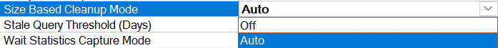

- Thay đổi giá trị Size Based Cleanup Mode sử dụng câu lệnh sau với SIZE_BASED_CLEANUP_MODE.

``` sql
ALTER DATABASE <database_name>  
SET QUERY_STORE (SIZE_BASED_CLEANUP_MODE = { OFF | AUTO });
```

## 2.8. Stale Query Threshold (Days)

- Stale Query Threshold chỉ định số ngày mà Query Store lưu giữ thông tin thống kê của câu lệnh, mặc định là 30 ngày. Thay đổi giá trị sử dụng câu lệnh sau với STALE_QUERY_THRESHOLD_DAYS.

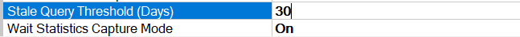

``` sql
ALTER DATABASE <database_name>  
SET QUERY_STORE (STALE_QUERY_THRESHOLD_DAYS = 30);
```

## 2.9. Wait Statistics Capture Mode

- Wait Statistics Capture Mode chỉ định xem Query Store có được theo dõi và lưu trữ cả thông tin của Wait trên hệ thống hay không, mặc định là có. Thay đổi giá trị sử dụng câu lệnh sau với WAIT_STATS_CAPTURE_MODE.

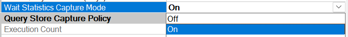

``` sql
ALTER DATABASE <database_name>  
SET QUERY_STORE (WAIT_STATS_CAPTURE_MODE = { ON | OFF });
```

#### Tổng hợp thông tin các option của Query Store

<table style="border-collapse: collapse;width: 100%;height: 294px">
<tbody>
<tr style="height: 21px">
<td style="width: 50%;height: 21px;text-align: center"><span style="font-size: 110%"><strong>Sử dụng SSMS</strong></span></td>
<td style="width: 50%;height: 21px;text-align: center"><span style="font-size: 110%"><strong>Sử dụng câu lệnh T-SQL</strong></span></td>
</tr>
<tr style="height: 21px">
<td style="width: 50%;height: 21px;text-align: center"><span style="font-size: 110%">Operation Mode</span></td>
<td style="width: 50%;height: 21px;text-align: center"><span style="font-size: 110%">OPERATION_MODE</span></td>
</tr>
<tr style="height: 21px">
<td style="width: 50%;height: 21px;text-align: center"><span style="font-size: 110%">Data Flush Interval</span></td>
<td style="width: 50%;height: 21px;text-align: center"><span style="font-size: 110%">DATA_FLUSH_INTERVAL_SECONDS</span></td>
</tr>
<tr style="height: 21px">
<td style="width: 50%;height: 21px;text-align: center"><span style="font-size: 110%">Statistics Collection Interval</span></td>
<td style="width: 50%;height: 21px;text-align: center"><span style="font-size: 110%">INTERVAL_LENGTH_MINUTES</span></td>
</tr>
<tr style="height: 21px">
<td style="width: 50%;height: 21px;text-align: center"><span style="font-size: 110%">Max Plans Per Query</span></td>
<td style="width: 50%;height: 21px;text-align: center"><span style="font-size: 110%">MAX_PLANS_PER_QUERY</span></td>
</tr>
<tr style="height: 21px">
<td style="width: 50%;height: 21px;text-align: center"><span style="font-size: 110%">Max Size (MB)</span></td>
<td style="width: 50%;height: 21px;text-align: center"><span style="font-size: 110%">MAX_STORAGE_SIZE_MB</span></td>
</tr>
<tr style="height: 21px">
<td style="width: 50%;height: 21px;text-align: center"><span style="font-size: 110%">Query Store Capture Mode</span></td>
<td style="width: 50%;height: 21px;text-align: center"><span style="font-size: 110%">QUERY_CAPTURE_MODE</span></td>
</tr>
<tr style="height: 21px">
<td style="width: 50%;height: 21px;text-align: center"><span style="font-size: 110%">Execution Count </span></td>
<td style="width: 50%;height: 21px;text-align: center"><span style="font-size: 110%">EXECUTION_COUNT</span></td>
</tr>
<tr style="height: 21px">
<td style="width: 50%;height: 21px;text-align: center"><span style="font-size: 110%">Total Compile CPU Time (ms)</span></td>
<td style="width: 50%;height: 21px;text-align: center"><span style="font-size: 110%">TOTAL_COMPILE_CPU_TIME_MS</span></td>
</tr>
<tr style="height: 21px">
<td style="width: 50%;height: 21px;text-align: center"><span style="font-size: 110%">Total Execution CPU Time (ms)</span></td>
<td style="width: 50%;height: 21px;text-align: center"><span style="font-size: 110%">TOTAL_EXECUTION_CPU_TIME_MS</span></td>
</tr>
<tr style="height: 21px">
<td style="width: 50%;text-align: center;height: 21px"><span style="font-size: 110%">Stale Threshold </span></td>
<td style="width: 50%;text-align: center;height: 21px"><span style="font-size: 110%">STALE_CAPTURE_POLICY_THRESHOLD</span></td>
</tr>
<tr style="height: 21px">
<td style="width: 50%;text-align: center;height: 21px"><span style="font-size: 110%">Size Based Cleanup Mode</span></td>
<td style="width: 50%;text-align: center;height: 21px"><span style="font-size: 110%">SIZE_BASED_CLEANUP_MODE</span></td>
</tr>
<tr style="height: 21px">
<td style="width: 50%;text-align: center;height: 21px"><span style="font-size: 110%">Stale Query Threshold (Days)</span></td>
<td style="width: 50%;text-align: center;height: 21px"><span style="font-size: 110%">STALE_QUERY_THRESHOLD_DAYS</span></td>
</tr>
<tr style="height: 21px">
<td style="width: 50%;text-align: center;height: 21px"><span style="font-size: 110%">Wait Statistics Capture Mode</span></td>
<td style="width: 50%;text-align: center;height: 21px"><span style="font-size: 110%">WAIT_STATS_CAPTURE_MODE</span></td>
</tr>
</tbody>
</table>

# 3. Giám sát Query Store

## 3.1. Desired State và Actual State

Trên SSMS Operation Mode của Query Store là được thể hiện bởi 2 thông số là Operation Mode (Resquested) và Operation Mode (Actual). Hai giá trị tương ứng với DESIRED_STATE và ACTUAL_STATE trong view SYS.DATABASE_QUERY_STORE_OPTIONS.

- Sử dụng câu lệnh T-SQL sau để kiểm tra trạng thái của Query Store trên Database mong muốn.

``` sql
USE <database_name>;
SELECT DB_NAME() database_name,
   actual_state_desc,
   desired_state_desc
FROM sys.database_query_store_options;
```

Như đã nói trước đó hai giá trị này có thể khác nhau trong một vài trường hợp ví dụ khi Database đang ở trạng thái Read-only hoặc khi dung lượng Query Store bị đầy. Bước đầu tiên khi giám sát Query Store đó là đảm bảo giá trị DESIRED_STATE và ACTUAL_STATE luôn giống nhau trên mọi Database được bật Query Store.

- Sử dụng câu lệnh T-SQL sau để kiểm tra 2 giá trị trên có đang khác nhau không trên từng Database được bật Query Store.

``` sql
DECLARE @SQL NVARCHAR(MAX) = N'';
SELECT @SQL += REPLACE(REPLACE(N'USE [{{DBName}}];
   SELECT "{{DBName}}" database_name,
      actual_state_desc, desired_state_desc
   FROM {{DBName}}.sys.database_query_store_options
   WHERE desired_state <> actual_state '
,'{{DBName}}', [name]),'"', '''')
FROM sys.databases
WHERE is_query_store_on = 1
ORDER BY [name];
EXEC (@SQL);
```

## 3.2. Kiểm tra lỗi Query Store

Trong view SYS.DATABASE_QUERY_STORE_OPTIONS. chứa tất cả thông tin cấu hình của Query Store. Nếu DESIRED_STATE_DESC là READ_WRITE trong khi ACTUAL_STATE_DESC là READ_ONLY hoặc ERROR thì READONLY_READON  trong view  sẽ trả về các giá trị sau để cho người dùng biết vì sao Query Store lại đang ở trạng thái Readonly Mode.

- 1 – Do bản thân cũng Database đang ở READ_ONLY Mode.
- 2 – Do Database đang ở Single-user Mode.
- 4 – Do Database đang ở Emergency Mode.
- 8 – Do Database đang là hệ thống dự phòng (Secondary Replica)
- 65536 – Do Query Store đạt ngưỡng dung lượng MAX_STORAGE_SIZE_MB.
- 131072, 262144  – Số lượng câu lệnh hoặc object đạt đến ngưỡng giới hạn trên bộ nhớ
- 524288 – Dung lượng Database đầy trên OS.

Nếu gặp lỗi với Query Store, ta sẽ thử tắt Query Store đi sau đó đặt lại về READ_WRITE trước.

``` sql
USE MASTER;
ALTER DATABASE <database_name> SET QUERY_STORE = OFF;
ALTER DATABASE <database_name> SET QUERY_STORE = READ_WRITE;
```

## 3.3. Kiểm tra dung lượng Query Store

Sử dụng câu lệnh sau để giám sát dung lượng có đầy hơn 80% hay không.

``` sql
SELECT DB_NAME() database_name,
   current_storage_size_mb,
   max_storage_size_mb
FROM sys.database_query_store_options
WHERE CAST(CAST(current_storage_size_mb AS
   DECIMAL(21, 2)) / CAST(max_storage_size_mb AS
   DECIMAL(21, 2)) * 100 AS DECIMAL(4, 2)) >= 80;
```

Nếu dung lượng bị đầy ta có thể dọn dẹp thủ công với các câu lệnh sau đây.

``` sql
USE MASTER;
ALTER DATABASE <database_name>
SET QUERY_STORE CLEAR ALL;
-- Hoặc
USE <database_name>;
EXEC sys.sp_query_store_flush_db;
```

## 3.4. Xóa Plan hoặc câu lệnh khỏi Query Store

Sử dụng câu lệnh sau để xóa một plan hoặc câu lệnh với ID.

``` sql
USE <database_name>;
EXECUTE sys.sp_query_store_remove_plan @plan_id = <plan_id>;
EXECUTE sys.sp_query_store_remove_query @query_id = <query_id>;
```

## 3.5. Đặt lại Plan Statistic trong Query Store

Sử dụng câu lệnh sau để đặt lại thông tin thống kê của một plan trong.

``` sql
USE <database_name>;
EXECUTE sys.sp_query_store_reset_exec_stats @plan_id = <plan_id>;
```

# 4.Các View chứa thông tin câu lệnh của Query Store

Query Store hoạt động như một hộp đen trên Database, thu thập và lưu trữ thông tin các câu lệnh được thực thi trên hệ thống. Sau đó các thông tin đó sẽ được người dùng sử dụng để tối ưu hiệu năng Database trên SQL Server.
Thông tin các câu lệnh bao gồm text, plan, runtime statistic và wait statistic sẽ được lưu trong các view sau đây của Query Store trên SQL Server.

- SYS.DATABASE_QUERY_STORE_OPTIONS: lưu thông tin cấu hình của Query Store
- SYS.QUERY_STORE_QUERY: lưu các thông tin của câu lệnh như ID, Hash Value, thời điểm câu lệnh thực thi gần nhất, v.v…
- SYS.QUERY_STORE_QUERY_TEXT: lưu thông tin chuỗi Text đầy đủ của câu lệnh
- SYS.QUERY_CONTEXT_SETTINGS:  lưu thông tin ngữ cảnh của câu lệnh như ngôn ngữ, định dạng ngày tháng, setting môi trường, v.v…
- SYS.QUERY_STORE_PLAN: lưu thông tin chiến lược thực thi của câu lệnh
- SYS.QUERY_STORE_WAIT_STATS: lưu thông tin Wait khi câu lệnh được thực thi (Wait Statistic)
- SYS.QUERY_STORE_RUNTIME_STATS: lưu thông tin thống kê về tài nguyên sử dụng của câu lệnh trong quá trình thực thi ví dụ thời gian CPU, lượng dữ liệu logical, physical đọc được, v.v…
- SYS.QUERY_STORE_RUNTIME_STATS_INTERVAL: lưu thông tin khoảng thời gian các thông tin thống kê được thu thập trên SQL Server

Bạn có thể tham khảo thêm mô tả các loại View mà Query Store sử dụng để lưu thông tin câu lệnh trên SQL Server Database tại đường link: [Query Store Catalog Views](https://learn.microsoft.com/en-us/sql/relational-databases/system-catalog-views/query-store-catalog-views-transact-sql?view=sql-server-ver16#in-this-section)

# 5. Giám sát và tối ưu hiệu năng câu lệnh SQL Server Database với Query Store

## 5.1. Xem thông tin cấu hình Query Store

Như ta đã biết từ phần một đó là View SYS.DATABASE_QUERY_STORE_OPTIONS dùng để để lưu các thông tin của chính Query Store. Tất cả các option có thể dùng để cấu hình Query Store đều được lưu trong view này.

- Để xem thông tin cấu hình của tất cả Database được kích hoạt Query Store trên SQL Server sử dụng câu lệnh dưới đây

``` sql
DECLARE @SQL NVARCHAR(MAX) = N'';
SELECT @SQL += REPLACE(REPLACE(
   N'USE [{{DBName}}];
   SELECT "{{DBName}}" database_name, *
   FROM {{DBName}}.sys.database_query_store_options;',
   '{{DBName}}', [name]),'"', '''')
FROM sys.databases
WHERE is_query_store_on = 1
ORDER BY [name];
EXEC (@SQL);
```


Xem lại bài viết phần 1 để hiểu rõ ý nghĩa các trường thông tin cấu hình Query Store trả về từ câu lệnh.

## 5.2. Tìm các câu lệnh tiêu tốn tài nguyên hệ thống

Câu lệnh sau đây sẽ tìm ra top 20 các câu lệnh được thực thi trên Database có mức sử dụng CPU lớn nhất trong 1 tiếng vừa qua trên Database sử dụng các View của Query Store.

``` sql
SELECT TOP 20 -- lấy 20 câu lệnh đầu tiên trả về
   -- thông tin câu lệnh
   q.query_id,
   qt.query_sql_text,
   p.plan_id,
   -- thời điểm câu lệnh thực thi lần đầu tiên và cuối cùng
   rs.first_execution_time,
   rs.last_execution_time,
   -- tổng số lần câu lệnh thực thi
   rs.count_executions,
   -- thời gian câu lệnh thực thi (giây), trung bình các lần và lần gần đây nhất
   rs.avg_duration/1000000 AS avg_duration_seconds,
   rs.last_duration/1000000 AS last_duration_seconds,
   -- thời gian CPU sử dụng của câu lệnh, trung bình các lần và lần gần đây nhất
   rs.avg_cpu_time/1000000 AS avg_cpu_time_seconds,
   rs.last_cpu_time/1000000 AS last_cpu_time_seconds,
   -- lượng Logical IO câu lệnh đọc, trung bình các lần và lần gần đây nhất
   rs.avg_logical_io_reads,
   rs.last_logical_io_reads,
   -- lượng Physical IO câu lệnh đọc, trung bình các lần và lần gần đây nhất
   rs.avg_physical_io_reads,
   rs.last_physical_io_reads,
   -- số bản ghi trả về lần gần đây nhất
   rs.last_rowcount
FROM sys.query_store_query q
   LEFT JOIN sys.query_store_query_text qt ON q.query_text_id = qt.query_text_id
   LEFT JOIN sys.query_store_plan p ON q.query_id = p.query_id
   LEFT JOIN sys.query_store_runtime_stats rs ON p.plan_id = rs.plan_id
   LEFT JOIN sys.query_store_runtime_stats_interval i ON rs.runtime_stats_interval_id = i.runtime_stats_interval_id
WHERE -- khoảng thời gian cần tìm
   i.start_time > DATEADD(MINUTE, -60, GETUTCDATE())
-- i.start_time > DATEADD(HOUR, -6, GETUTCDATE())
-- i.start_time BETWEEN '12/18/2023 15:00:00' AND '12/18/2023 16:30:00'
ORDER BY -- sắp xếp theo một trong các thông số trên thứ tự giảm dần
   rs.avg_cpu_time DESC;
-- rs.avg_duration DESC;
-- rs.count_executions DESC;
-- rs.avg_logical_io_reads DESC;
-- rs.avg_physical_io_reads DESC;
-- rs.last_rowcount DESC;
```

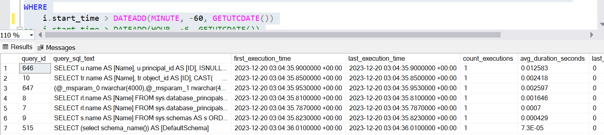

- Thông tin câu lệnh trả về có ID, Text, PlanID của câu lệnh và mức sử dụng tài nguyên bao gồm tổng thời gian CPU, lượng đọc Logical/Physical, tổng số lần thực thi và số lượng bản ghi trả về. Chi tiết các trường thông tin đã có trong phần comment của câu lệnh. Để thay đổi khoảng thời gian lấy thông tin từ Query Store, chỉnh sửa số phút sau mệnh đề WHERE.

- Ví dụ lấy thông tin từ Query Store trong khoảng 30 phút.

``` sql
WHERE i.start_time > DATEADD(MINUTE, -30, GETUTCDATE())
```

- Hoặc lấy trong khoảng 6 tiếng.

``` sql
WHERE i.start_time > DATEADD(HOUR, -6, GETUTCDATE())
```

- Hoặc có thể chỉ định cụ thể khoảng thời gian cụ thể muốn lấy trong Query Store.

``` sql
WHERE i.start_time BETWEEN '12/18/2023 15:00:00' AND '12/18/2023 16:30:00'
```

Thay đổi cột trong mệnh đề ORDER BY nếu muốn thay đổi tiêu chí sắp xếp thứ tự câu lệnh.

- Ví dụ tìm câu lệnh chạy lâu nhất trên Database.

``` sql
ORDER BY rs.avg_duration DESC;
```

- Hoặc câu lệnh đọc nhiều dữ liệu từ đĩa nhất (Physical Read).

``` sql
ORDER BY rs.avg_physical_io_reads DESC;
```

## 5.3. Xác định Plan của câu lệnh tiêu tốn tài nguyên hệ thống

Sau khi tìm được các câu lệnh chiếm dụng tài nguyên hệ thống, ta có thể xem chi tiết chiến lược thực thi của chúng với câu lệnh sau đây. Lưu ý tìm kiếm trong cùng khoảng thời gian với câu lệnh.

``` sql
SELECT
   -- thông tin câu lệnh
   q.query_id,
   rs.avg_duration/1000000 AS avg_duration_seconds,
   rs.last_rowcount,
   -- chiến lược thực thi
   p.plan_id,
   p.is_forced_plan,
   CAST(p.query_plan AS XML) AS query_plan_xml
FROM sys.query_store_query q
   LEFT JOIN sys.query_store_plan p ON q.query_id = p.query_id
   LEFT JOIN sys.query_store_runtime_stats rs ON p.plan_id = rs.plan_id
   LEFT JOIN sys.query_store_runtime_stats_interval i ON rs.runtime_stats_interval_id = i.runtime_stats_interval_id
WHERE i.start_time > DATEADD(MINUTE, -60, GETUTCDATE());
-- AND q.query_id = <query_id> AND p.plan_id = <plan_id>
-- AND p.query_plan LIKE '%IX_Person_LastName_FirstName_MiddleName%';
ORDER BY 2 DESC;
```

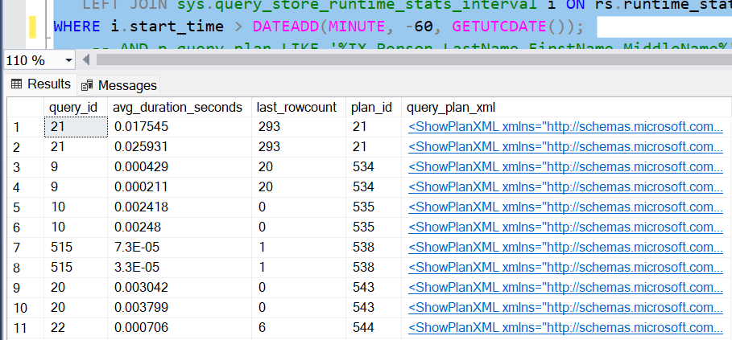

Câu lệnh trên sẽ trả về thông tin câu lệnh (ID, thời gian thực thi, số bản ghi trả về) và chiến lược thực thi bao gồm ID và sơ đồ XML trong Query Store tại thời điểm tìm kiếm sắp xếp theo.

- Click chọn sơ đồ XML xem chiến lược thực thi chi tiết của câu lệnh hiển thị như dưới đây.

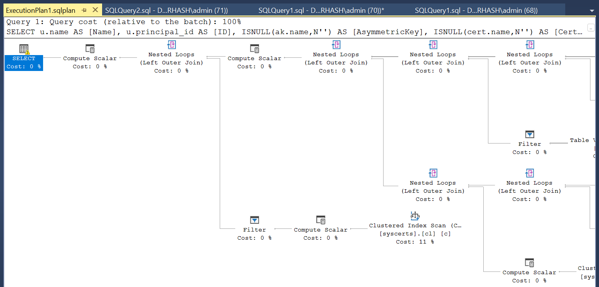

- Nếu muốn tìm kiếm riêng chiến lược thực thi chỉ một câu lệnh thì thêm ID của Query và Plan trong mệnh đề WHERE như dưới đây.

``` sql
... AND q.query_id = <query_id> AND p.plan_id = <plan_id>;
```

- Ta cũng có thể sử dụng câu lệnh trên để tìm kiếm Plan câu lệnh dựa theo tên Index mà ta nghĩ nó có thể sử dụng.

``` sql
... AND p.query_plan LIKE '%IX_Person_LastName_FirstName_MiddleName%';
```

## 5.4. Xác định Top Wait Event trên hệ thống

Bên cạnh việc tìm kiếm các câu lệnh tiêu tốn tài nguyên trên hệ thống với Query Store ta cũng có thể tìm kiếm top Wait Event diễn ra trên Database trong 1 giờ vừa qua với câu lệnh dưới đây.

``` sql
SELECT TOP 10
   -- phân loại Wait
   ws.wait_category_desc,
   -- tổng thời gian Wait của các câu lệnh
   SUM(ws.total_query_wait_time_ms/1000000) AS total_wait_time_seconds
FROM sys.query_store_query q
   JOIN sys.query_store_plan p ON q.query_id = p.query_id
   JOIN sys.query_store_runtime_stats rs ON p.plan_id = rs.plan_id
   JOIN sys.query_store_runtime_stats_interval i ON rs.runtime_stats_interval_id = i.runtime_stats_interval_id
   JOIN sys.query_store_wait_stats ws ON ws.runtime_stats_interval_id = rs.runtime_stats_interval_id
      AND ws.plan_id = p.plan_id
WHERE i.end_time > DATEADD(MINUTE, -60, GETUTCDATE())
   AND ws.execution_type = 0
GROUP BY ws.wait_category_desc -- gộp theo loại Wait
ORDER BY 2 DESC;
```

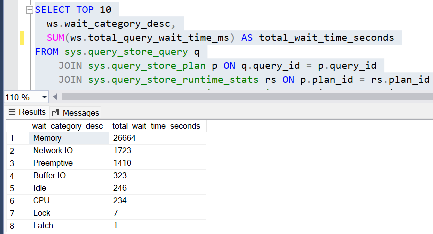

Câu lệnh sẽ trả về 10 loại Event gây Wait nhiều nhất và thời gian tương ứng trên hệ thống trong 1 giờ vừa qua. Chi tiết mô tả các loại Wait trên SQL Server xem lại đường link: [Wait Categories SQL Server](https://learn.microsoft.com/en-us/sql/relational-databases/system-catalog-views/sys-query-store-wait-stats-transact-sql?view=sql-server-ver16#wait-categories-mapping-table)

## 5.5. Tìm các câu lệnh có thời gian Wait cao trên hệ thống

Sau khi xác định loại Wait chiếm nhiều thời gian nhất trên hệ thống ta có thể tìm câu lệnh tương ứng gây ra Wait trong Query Store với câu lệnh dưới đây.

``` sql
SELECT TOP 20
   -- thông tin Wait
   ws.wait_category_desc,
   ws.total_query_wait_time_ms/1000000 as total_query_wait_time_seconds,
   -- thông tin câu lệnh
   q.query_id,
   ws.plan_id,
   qt.query_sql_text
FROM sys.query_store_query_text qt
   JOIN sys.query_store_query q ON qt.query_text_id = q.query_text_id
   JOIN sys.query_store_plan p ON q.query_id = p.query_id
   JOIN sys.query_store_runtime_stats rs ON p.plan_id = rs.plan_id
   JOIN sys.query_store_runtime_stats_interval i ON rs.runtime_stats_interval_id = i.runtime_stats_interval_id
   JOIN sys.query_store_wait_stats ws ON ws.runtime_stats_interval_id = rs.runtime_stats_interval_id
      AND ws.plan_id = p.plan_id
WHERE i.end_time > DATEADD(MINUTE, -60, GETUTCDATE())
   AND ws.execution_type = 0
ORDER BY ws.total_query_wait_time_ms DESC;
```

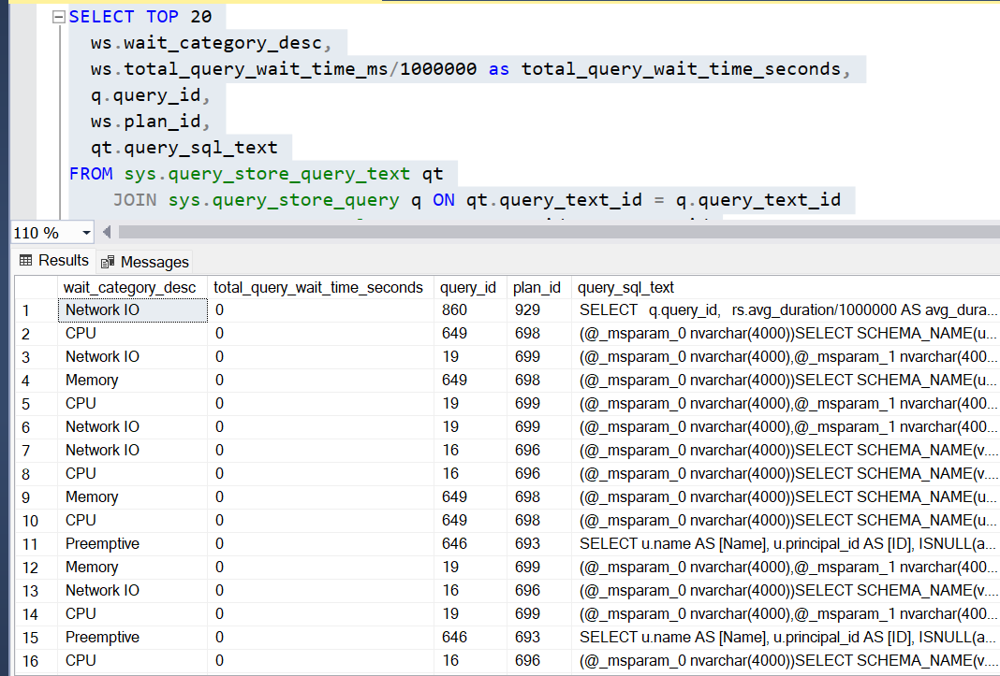

Câu lệnh sẽ trả về thông tin câu lệnh bao gồm ID, Text, Plan và thông tin Wait tương ứng với câu lệnh đó. Sử dụng câu lệnh tìm kiếm thông tin chi tiết hơn về Plan như trước đó đã sử dụng để tối ưu hiệu năng Database trên SQL Server với Query Store. 