[Bài viết](https://wecommit.com.vn/courses/chuong-trinh-dao-tao-toi-uu-co-so-du-lieu-cao-cap/lesson/partition-trong-sql-server/)

Hướng dẫn chi tiết các bước thực hiện tạo bảng Partition trong SQL Server Database

# 1. Các bước đánh Partition trong SQL Server

Cũng giống như các Hệ Quản trị CSDL khác, SQL Server cũng cho phép người dùng đánh Partition trên bảng trong Database, chia bảng thành từng phần nhỏ hơn có cùng số cột như bảng ban đầu nhưng có số lượng bản ghi khác nhau. Điều này cho phép truy vấn dữ liệu bảng nhanh hơn và cải thiện hiệu năng câu lệnh do lượng dữ liệu phải quét sẽ trở nên ít hơn. Ví dụ ta chia một bảng thông tin lưu đơn hàng theo từng năm, để sau này khi người dùng cần truy vấn dữ liệu từ năm nào thì SQL Server sẽ vào partition của năm đó lấy thông tin ra thay vì tìm kiếm trên toàn bộ bảng. Khi tạo một bảng partition mới (Partitioned Table) trên SQL Server ta sẽ thực hiện lần lượt các bước sau.

- Tạo File group và Data file mới trên SQL Server.
- Tạo Function để hướng dẫn SQL Server cách đưa các bản ghi vào từng partition.
- Tạo Scheme để chỉ định partition vào đúng File group mong muốn.
- Tạo Table mới dựa theo Scheme đã định nghĩa.

# 2. Tạo bảng Partition mới trên SQL Server Database

## 2.1 Tập dữ liệu mẫu

Ta sẽ sử dụng tập dữ liệu trong Database BikeStores mẫu dưới đây.

- Trong Database có 3 bảng thể hiện thông tin mua hàng gồm đơn hàng (ORDERS), danh sách sản phẩm mua từng đơn (ORDER_ITEMS) và thông tin sản phẩm (PRODUCTS).

``` sql
SELECT * FROM sales.orders;
SELECT* FROM sales.order_items;
SELECT * FROM production.products;
```

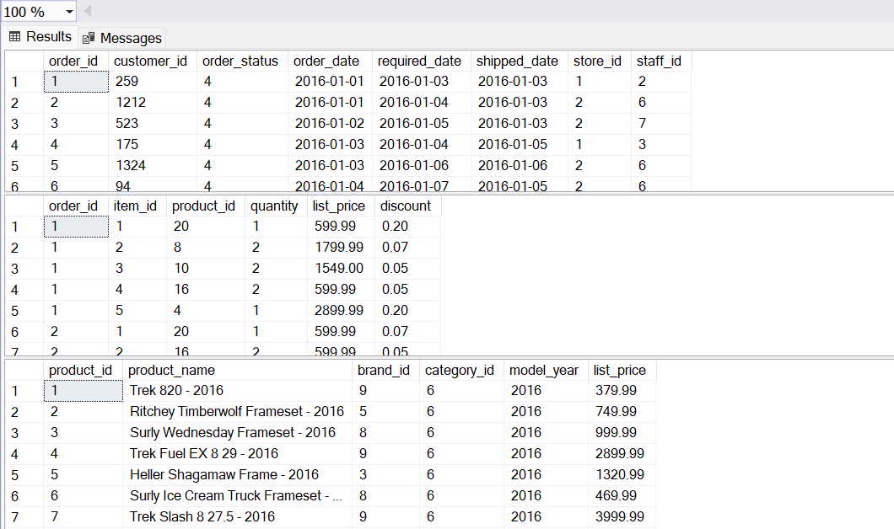

- Ta sẽ ghép thông tin 3 bảng này lại thành một bảng thông tin chi tiết đơn hàng gọi là ORDER_DETAILS. Dữ liệu bảng trông sẽ giống như sau.

``` sql
SELECT order_date, product_name,
   SUM(i.quantity *i.list_price* (1 - discount)) as amount
FROM sales.orders o
   JOIN sales.order_items i ON i.order_id = o.order_id
   JOIN production.products p ON p.product_id = i.product_id
GROUP BY order_date, product_name;
```

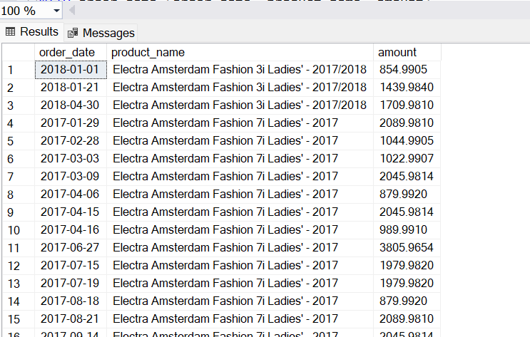

- Kết quả trả về có 4437 bản ghi, với số lượng đơn hàng từng năm là.

``` sql
SELECT YEAR(order_date) year,
   COUNT(*) AS number_of_rows
FROM (
   SELECT order_date, product_name,
      SUM(i.quantity* i.list_price * (1 - discount)) as amount
   FROM sales.orders o
      JOIN sales.order_items i ON i.order_id = o.order_id
      JOIN production.products p ON p.product_id = i.product_id
   GROUP BY order_date, product_name
) order_details GROUP BY YEAR(order_date);
```

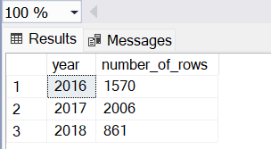

Ta sẽ tạo bảng ORDER_DETAILS là một bảng được đánh partition theo năm, sao cho số bản ghi từng năm sẽ giống như kết quả trả về bên trên.

## 2.2. Tạo File group và Data file

Database trong SQL Server sẽ có ít nhất 2 loại file là Data file và Log file. Data file để chứa dữ liệu như bảng, SQL Server cho phép lưu dữ liệu trên nhiều Data file và gộp chúng lại với nhau bằng các File group. Mặc định tất cả Data file khi được tạo mới sẽ thuộc về File group PRIMARY của Database.

- Ta sẽ tạo thêm các File group trên Database với câu lệnh dưới đây.

``` sql
ALTER DATABASE BikeStores
ADD FILEGROUP order_details_2016;

ALTER DATABASE BikeStores
ADD FILEGROUP order_details_2017;

ALTER DATABASE BikeStores
ADD FILEGROUP order_details_2018;
```

- Kiểm tra lại các File group hiện tại trên Database.

``` sql
SELECT name AS file_group_name, type_desc
FROM sys.filegroups;
```

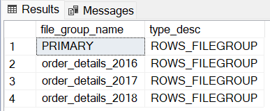

- Sau khi tạo File group ta sẽ thêm Data file cho từng group.

``` sql
ALTER DATABASE BikeStores
ADD FILE (
   NAME = order_details_2016_1,
   FILENAME = 'D:ResourceMicrosoft SQL ServerMSSQL16.MSSQLSERVERMSSQLDATAorder_details_2016_1.ndf',
   SIZE = 10 MB, MAXSIZE = UNLIMITED, FILEGROWTH = 1024 KB
) TO FILEGROUP order_details_2016;

ALTER DATABASE BikeStores
ADD FILE (
   NAME = order_details_2017_1,
   FILENAME = 'D:ResourceMicrosoft SQL ServerMSSQL16.MSSQLSERVERMSSQLDATAorder_details_2017_1.ndf',
   SIZE = 10 MB, MAXSIZE = UNLIMITED, FILEGROWTH = 1024 KB
) TO FILEGROUP order_details_2017;

ALTER DATABASE BikeStores
ADD FILE (
   NAME = order_details_2018_1,
   FILENAME = 'D:ResourceMicrosoft SQL ServerMSSQL16.MSSQLSERVERMSSQLDATAorder_details_2018_1.ndf',
   SIZE = 10 MB, MAXSIZE = UNLIMITED, FILEGROWTH = 1024 KB
) TO FILEGROUP order_details_2018;
```

- Kiểm tra lại danh sách File group và Data file hiện tại trên Database với câu lệnh sau.

``` sql
SELECT
   fg.name AS file_group_name,
   fg.type_desc,
   df.name AS data_file_name,
   physical_name AS data_file_path,
   size *8/1024 AS size_mb,
   state_desc AS file_state,
   growth
FROM sys.database_files df
   JOIN sys.filegroups fg ON df.data_space_id = fg.data_space_id
ORDER BY 1, 2;
```

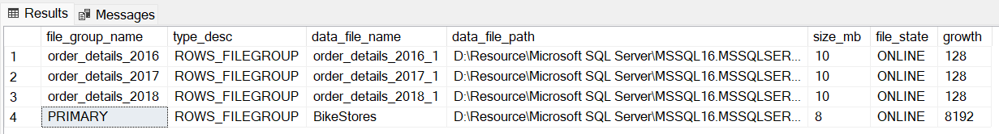

## 2.3. Tạo Function và Scheme

Function được dùng để hướng dẫn SQL Server cách map các bản ghi vào đúng với partition dựa theo quy tắc giá trị của một cột nào đó, gọi là Partitioning Column. Function sẽ định nghĩa số lượng và giá trị biên của các partition.

- Tạo Function cho bảng ORDER_DETAILS chia theo năm.

``` sql
CREATE PARTITION FUNCTION order_details_year_function(date)
AS RANGE LEFT FOR VALUES (
   '2016-12-31', '2017-12-31'
);
```

Có thể bạn sẽ thắc mắc là tại sao bảng ta cần chia 3 thành phần nhưng Function lại chỉ định chỉ 2 giá trị biên? Tưởng tượng khoảng giá trị của cột trên bảng cần chia là một đường thẳng, để chia đường thẳng này thành 3 phần ta sẽ cần đến bao nhiêu giá trị làm cột mốc? Đúng vậy ta sẽ cần 2 giá trị, và đây cũng chính là 2 giá trị biên trong Function.

- Function ORDER_DETAILS_YEAR_FUNCTION nhận vào kiểu DATE, là kiểu dữ liệu của Partitioning Column.
- RANGE LEFT chỉ định giá trị biên giữa các Partition, ý nghĩa của LEFT tức là xét giá trị nhỏ hơn biên:
  - Giá trị nào <= 2016-12-31 sẽ vào partition 1 (năm 2016 và nhỏ hơn)
  - Giá trị nào > 2016-12-31 và <= 2017-12-31 vào partition 2 (năm 2017)
  - Giá trị nào >  2017-12-31 sẽ vào partition 3 (năm 2018 và lớn hơn)
- Ngược lại với LEFT là RIGHT, ở cuối mục 2 sẽ có demo tạo Function theo RANGE RIGHT.

Sau khi tạo Function ta sẽ tạo Scheme, đây là object được SQL Server dùng để map giá trị trả về từ Function vào đúng File group được chỉ định. Lưu ý số lượng partition trong Scheme phải lớn hơn 1 so với giá trị biên đã đặt trong Function.

- Tạo Scheme vào các File group dựa theo Function bên trên như sau.

``` sql
CREATE PARTITION SCHEME order_details_year_scheme
AS PARTITION order_details_year_function TO (
   order_details_2016, order_details_2017, order_details_2018
);
```

## 2.4. Tạo Partition Table

- Tạo bảng mới, lưu ý chỉ định thêm tên Partitioning Column trong Scheme.

``` sql
CREATE TABLE sales.order_details (
   order_date date,
   product_name varchar(255),
   amount decimal(10, 2) NOT NULL DEFAULT 0
) ON order_details_year_scheme (order_date);
```

- Sử dụng câu lệnh sau để kiểm tra danh sách các bảng trên Database đang được đánh partition.

``` sql
select distinct t.type_desc, t.name
from sys.partitions p inner join sys.tables t
on p.object_id = t.object_id
where p.partition_number <> 1;
```

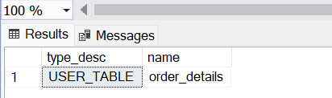

- Thêm dữ liệu vào bảng bằng câu lệnh truy vấn lúc đầu sử dụng để lấy thông tin đơn hàng.

``` sql
INSERT INTO sales.order_details (order_date, product_name, amount)
   SELECT order_date, product_name,
      SUM(i.quantity *i.list_price* (1 - discount))
   FROM sales.orders o
      JOIN sales.order_items i ON i.order_id = o.order_id
      JOIN production.products p ON p.product_id = i.product_id
   GROUP BY order_date, product_name;
```

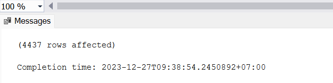

- Sau khi Insert dữ liệu vào bảng ta có thể xem số lượng bản ghi mỗi partition và thể kiểm tra thêm các thông tin khác của nó như Scheme, Function, Range Value v.v… với câu lệnh sau.

``` sql
SELECT
   SCHEMA_NAME(t.schema_id) AS SchemaName,
   t.name AS TableName,
   i.name AS IndexName,
   p.partition_number AS PartitionNumber,
   fg.name AS FileGroupName,
   ds.name AS PartitionScheme,
   p.rows AS RowsCount,
   pf.name as PartitionFunction,
   CASE pf.boundary_value_on_right WHEN 1 THEN 'RIGHT' ELSE 'LEFT' END AS PartitionFunctionRange,
   prv_left.value AS LowerBoundaryValue,
   prv_right.value AS UpperBoundaryValue
FROM sys.tables t JOIN sys.indexes i ON t.object_id = i.object_id
   JOIN sys.partitions p ON i.object_id = p.object_id AND i.index_id = p.index_id
   JOIN sys.partition_schemes ps ON i.data_space_id = ps.data_space_id
   JOIN sys.partition_functions pf ON ps.function_id = pf.function_id
   LEFT JOIN sys.partition_range_values prv_left ON ps.function_id = prv_left.function_id AND prv_left.boundary_id = p.partition_number - 1
   LEFT JOIN sys.partition_range_values prv_right ON ps.function_id = prv_right.function_id AND prv_right.boundary_id = p.partition_number
   JOIN sys.data_spaces ds ON ds.data_space_id = i.data_space_id
   JOIN sys.destination_data_spaces dds ON dds.partition_scheme_id = ps.data_space_id AND dds.destination_id = p.partition_number
   JOIN sys.filegroups fg ON fg.data_space_id = dds.data_space_id
WHERE t.name = 'order_details'
ORDER BY t.name, p.partition_number;
```

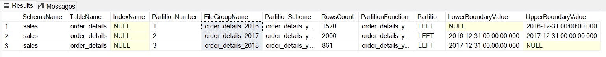

Vậy là bảng ORDER_DETAILS đã được đánh Partition theo đúng quy tắc của Scheme và Function đã định nghĩa trước đó và các bản ghi đã vào đúng năm của mình với số lượng chính xác như khi ta kiểm tra lúc đầu.

## 2.5. Thay đổi Function theo Range RIGHT

Trước đó ta đã tạo Function theo Range LEFT, bây giờ ta sẽ thay đổi lại thành RIGHT và xem kết quả có thay đổi so với ban đầu hay không.

- Tạo Function với Range RIGHT, đồng thời thay đổi lại giá trị biên.

``` sql
CREATE PARTITION FUNCTION order_details_year_function(date)
AS RANGE RIGHT FOR VALUES (
   '2017-01-01','2018-01-01'
);
```

- Range LEFT xét các giá trị nhỏ hơn biên.
  - Giá trị nào <= 2016-12-31 sẽ vào partition 1 (năm 2016 và nhỏ hơn)
  - Giá trị nào > 2016-12-31 và <= 2017-12-31 vào partition 2 (năm 2017)
  - Giá trị nào >  2017-12-31 sẽ vào partition 3 (năm 2018 và lớn hơn)
- Range RIGHT xét các giá trị lớn hơn biên.
  - Giá trị nào < 2017-01-01 sẽ vào partition 1 (năm 2016 và nhỏ hơn)
  - Giá trị nào >= 2017-01-01 và < 2018-01-01 vào partition 2 (năm 2017)
  - Giá trị nào >= 2018-01-01 sẽ vào partition 3 (năm 2018 và lớn hơn)
- Tạo lại Scheme, Table và Insert dữ liệu. Kiểm tra lại thông tin bảng và số lượng bản ghi mỗi partition.

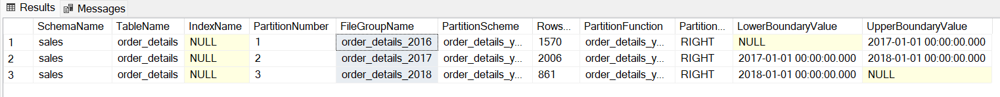

Ta thấy số lượng các bản ghi mỗi năm vẫn giữ nguyên như ban đầu, không khác gì so với Function Range LEFT. Vậy nên khi lựa chọn Range để đánh Partition trên bảng, ta cần chú ý đến cách lựa chọn giá trị biên đặt trong Function.

# 3. Chia partition đã tồn tại trên bảng trong SQL Server

## 3.1. Split Range Function

Trước đó ta đã tạo bảng ORDER_DETAILS là một bảng đánh partition theo năm 2016, 2017 và 2018. Vậy nếu muốn bảng có thêm Partition cho các năm sau này như 2019, 2020, v.v… thì ta sẽ thực hiện như nào?

- Đầu tiên thêm dữ liệu năm 2019 vào bảng (10 bản ghi).

``` sql
insert into sales.order_details
values
('2019-01-01', 'Electra Townie Original 7D EQ - 2016', 2279.96),
('2019-01-01', 'Trek Conduit+ - 2016 - 2016', 1037.98),
('2019-01-01', 'Surly Straggler - 2016', 2943.10),
('2019-01-01', 'Trek Fuel EX 8 29 - 2016', 2319.99),
('2019-01-01', 'Trek Remedy 29 Carbon Frameset - 2016', 3347.98),
('2019-01-02', 'Trek Conduit+ - 2016 - 2016', 569.99),
('2019-01-02', 'Surly Wednesday Frameset - 2016', 949.99),
('2019-01-03', 'Electra Townie Original 7D EQ - 2016', 557.99),
('2019-01-03', 'Pure Cycles Vine 8-Speed - 2016', 398.97),
('2019-01-03', 'Ritchey Timberwolf Frameset - 2016', 1349.98);
``` 

- Kiểm tra lại số lượng bản ghi mỗi partition ta thấy năm 2018 đang chứa cả dữ liệu của 2019.

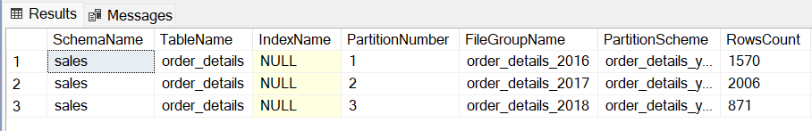

Trong SQL Server ta có thể chia đôi một Partition trên bảng bằng cách Split Range của Function như sau.

- Tạo thêm File group và Data file cho năm 2019.

``` sql
ALTER DATABASE bikestores
ADD FILEGROUP order_details_2019;

ALTER DATABASE BikeStores 
ADD FILE (
NAME = order_details_2019_1,
FILENAME = 'D:ResourceMicrosoft SQL ServerMSSQL16.MSSQLSERVERMSSQLDATAorder_details_2019_1.ndf',
SIZE = 10 MB, 
MAXSIZE = UNLIMITED, 
FILEGROWTH = 1024 KB
) TO FILEGROUP order_details_2019;
```

- Tiếp theo chuyển Scheme sang sử dụng File group mới, sau đó chia khoảng lại cho Function. SQL Server sẽ dựa vào giá trị biên trong hàm để tìm ra khoảng cần chia.

``` sql
ALTER PARTITION SCHEME order_details_year_scheme
NEXT USED order_details_2019;

ALTER PARTITION FUNCTION order_details_year_function()
SPLIT RANGE ('2019-01-01');
```

- Sau khi chia xong ta thấy Partition cho năm 2019 đã có thêm 10 bản ghi được chuyển từ năm 2018 sang.


## 3.2. Merge Range Function

Trong các bước bên trên, trước khi thực hiện Split Range ta cần phải thực hiện chuyển Scheme sang sử dụng File group mới. Nếu chẳng may chỉ định nhầm File group cũ, SQL Server vẫn sẽ tạo Partition mới nhưng vẫn dùng File group cũ như demo dưới đây.

- Sử dụng Partition 2018 nhưng lại Split Range cho 2019.

``` sql
ALTER PARTITION SCHEME order_details_year_scheme
NEXT USED order_details_2018;

ALTER PARTITION FUNCTION order_details_year_function()
SPLIT RANGE ('2019-01-01');
```

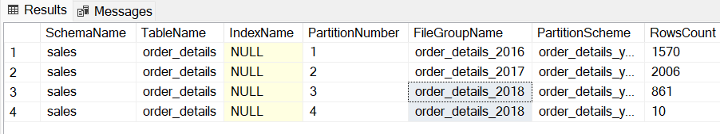

Ta thấy có hiện bảng đang 2 partition cùng sử dụng chung một File group. Để khắc phục nhầm lẫn này ta sẽ ghép 2 partition trên lại với nhau như sau.

- Ghép 2 partition dựa vào giá trị biên ngăn cách chúng.

``` sql
ALTER PARTITION FUNCTION order_details_year_function()
MERGE RANGE ('2019-01-01');
```


Vậy là 2 partition trên đã ghép lại thành một như ban đầu. Ta có thể Split Range lại để chia partition cho năm 2019 về đúng File group của nó như trước đó đã thực hiện.

## 3.3. Khuyến Nghị

Các ví dụ ta trong bài viết đều được thực hiện trên Database mẫu dùng để test, không phải hệ thống Production thật. Trên thực tế, Microsoft khuyến nghị không thực hiện Split trên Partition có dữ liệu. Khi thực hiện Split Range, SQL Server sẽ chuyển dữ liệu qua lại các File group với nhau. Điều này có thể khiến Database bị Lock do số lượng Transaction Log bị sinh ra quá nhiều (SQL Serve sẽ thêm dữ liệu vào partition mới và xóa trên partition cũ). SQL Server khuyến nghị luôn đặt dư ra một partition trống ở 2 đầu của Range và đảm bảo rằng mỗi khi cần Split thì sẽ không có bản ghi nào được chuyển qua lại giữa các File group và vẫn phải có dư một partition trống. Giống như ví dụ trên khi đang có dữ liệu năm 2016, 17, 18 thì tạo bảng phải có sẵn partition của 2019, và khi gần hết năm 2018 thì chia năm 2019 ra thêm 2020 nữa. Cứ thực hiện như vậy định kỳ để đảm bảo không gây ảnh hưởng hiệu năng Database trên SQL Server.
