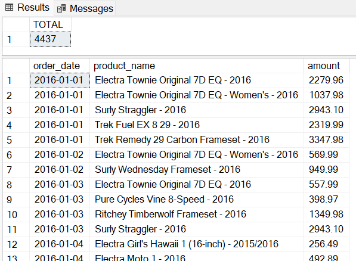
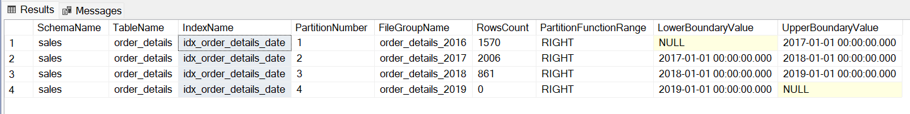
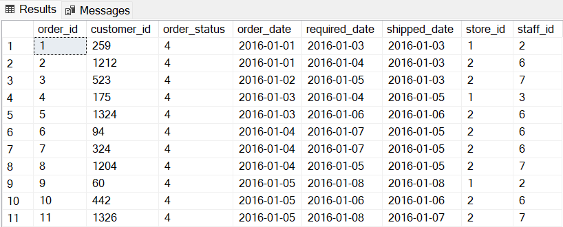
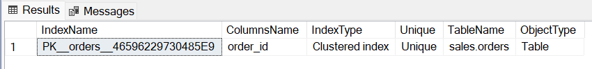
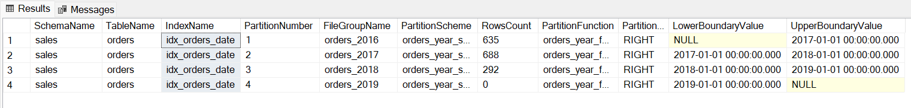

[Bài viết](https://wecommit.com.vn/courses/chuong-trinh-dao-tao-toi-uu-co-so-du-lieu-cao-cap/lesson/quy-trinh-chuyen-bang-non-partition-sang-partition-trong-sql-server/)

# 1. Các bước đánh Partition trong SQL Server

Ở bài viết trước ta đã biết cách tạo bảng partition trên SQL Server, tức là tạo một bảng mới và đồng thời chia partition trên bảng đó luôn. Vậy nếu trên Database đã tồn tại bảng và có chứa dữ liệu thì ta sẽ chia partition trên bảng đó như thế nào? Hiện tại ta có hai cách để thực hiện:

- Tạo thêm một bảng mới theo dạng partition và Insert dữ liệu từ bảng cũ vào.
- Chia partition trên bảng đã tồn tại bằng cách tạo Clustered Index.
Cách thứ nhất không khác gì các bước ta đã thực hiện ở bài viết trước. Hơn nữa với các bảng chứa nhiều dữ liệu, cách thứ nhất không thực sự hiệu quả vì Database sẽ sinh rất nhiều Transaction log và hệ thống cũng cần cấp thêm dung lượng trong quá trình chuyển.

Vậy nên chúng ta sẽ lựa chọn cách thứ hai để thực hiện đánh partition cho bảng đã tồn tại trên SQL Server. Quá trình thực hiện sẽ bao gồm các bước sau.

- Tạo File group và Datafile
- Tạo Function và Scheme.
- Xóa hết tất cả Clustered Index trên bảng hiện tại.
- Tạo lại Clustering Index với Scheme. Partitioning Column phải có mặt trong Clustering Index.

Ưu điểm của cách thực hiện thứ hai so với cách thứ nhất là tiết kiệm được dung lượng do không phải tạo thêm bảng và giảm được số lượng Transaction ghi xuống log. Tuy nhiên nhược điểm là người dùng phải xóa Clustered Index trên bảng, nếu có nhiều bảng khác liên kết đến quá trình xóa và tạo lại sẽ phức tạp hơn.

``` sql
CREATE PARTITION FUNCTION order_details_year_function(date)
AS RANGE LEFT FOR VALUES (
   '2016-12-31', '2017-12-31'
);
```

#### Clustered Index

Trong SQL Server, Clustered Index là Index sẽ sắp xếp dữ liệu thực tế trên đĩa theo thứ tự của Index, khác với Non-Clustered Index, nơi index được lưu trữ tách biệt với dữ liệu thực tế. Khi tạo một Clustered Index trên một bảng, dữ liệu trong bảng sẽ được tổ chức lại dựa trên các cột của Clustered Index.

Do đó một bảng chỉ có thể có một Clustered Index, vì nó quyết định cách dữ liệu được tổ chức trên đĩa. Trong SQL Server, Primary Key sẽ tự động tạo một Clustered index cho cột được chỉ định làm khóa chính.

# 2. Chia Partition trên bảng đã tồn tại trong SQL Server

Ta vẫn sử dụng ví dụ với bảng ORDER_DETAILS của bài viết trước nhưng sẽ tạo bảng thông thường và Insert dữ liệu vào trước khi đánh partition.

- Tạo bảng và thêm dữ liệu

``` sql
CREATE TABLE sales.order_details (
   order_date date,
   product_name varchar(255),
   amount decimal(10, 2) NOT NULL DEFAULT 0
);

INSERT INTO sales.order_details (order_date, product_name, amount)
   SELECT order_date, product_name,
      SUM(i.quantity *i.list_price* (1 - discount))
   FROM sales.orders o
      JOIN sales.order_items i ON i.order_id = o.order_id
      JOIN production.products p ON p.product_id = i.product_id
   GROUP BY order_date, product_name;

SELECT COUNT(*) AS TOTAL FROM sales.order_details;
SELECT* FROM sales.order_details;
```



- Tạo File group.

``` sql
ALTER DATABASE BikeStores
ADD FILEGROUP order_details_2016;

ALTER DATABASE BikeStores
ADD FILEGROUP order_details_2017;

ALTER DATABASE BikeStores
ADD FILEGROUP order_details_2018;

ALTER DATABASE BikeStores
ADD FILEGROUP order_details_2019;
```

- Thêm Data file.

``` sql
ALTER DATABASE BikeStores
ADD FILE (
   NAME = order_details_2016_1,
   FILENAME = 'D:ResourceMicrosoft SQL ServerMSSQL16.MSSQLSERVERMSSQLDATAorder_details_2016_1.ndf',
   SIZE = 10 MB, MAXSIZE = UNLIMITED, FILEGROWTH = 1024 KB
) TO FILEGROUP order_details_2016;

ALTER DATABASE BikeStores
ADD FILE (
   NAME = order_details_2017_1,
   FILENAME = 'D:ResourceMicrosoft SQL ServerMSSQL16.MSSQLSERVERMSSQLDATAorder_details_2017_1.ndf',
   SIZE = 10 MB, MAXSIZE = UNLIMITED, FILEGROWTH = 1024 KB
) TO FILEGROUP order_details_2017;

ALTER DATABASE BikeStores
ADD FILE (
   NAME = order_details_2018_1,
   FILENAME = 'D:ResourceMicrosoft SQL ServerMSSQL16.MSSQLSERVERMSSQLDATAorder_details_2018_1.ndf',
   SIZE = 10 MB, MAXSIZE = UNLIMITED, FILEGROWTH = 1024 KB
) TO FILEGROUP order_details_2018;

ALTER DATABASE BikeStores
ADD FILE (
   NAME = order_details_2019_1,
   FILENAME = 'D:ResourceMicrosoft SQL ServerMSSQL16.MSSQLSERVERMSSQLDATAorder_details_2019_1.ndf',
   SIZE = 10 MB, MAXSIZE = UNLIMITED, FILEGROWTH = 1024 KB
) TO FILEGROUP order_details_2019;
```

- Tạo Function và Scheme

``` sql
CREATE PARTITION FUNCTION order_details_year_function(date)
AS RANGE RIGHT FOR VALUES (
   '2017-01-01', '2018-01-01','2019-01-01'
);

CREATE PARTITION SCHEME order_details_year_scheme
AS PARTITION order_details_year_function TO (
   order_details_2016, order_details_2017, order_details_2018, order_details_2019
);
```

Vì bảng vừa tạo không có ràng buộc Primary Key hay Foreign Key gì cả nên ta có thể bỏ qua bước xóa ràng buộc mà tạo mới một Clustered Index trên cột được dùng làm Partitioning Column luôn.

- Tạo Clustered Index trên Partitioning Column dựa theo Scheme.

``` sql
CREATE CLUSTERED INDEX idx_order_details_date
   ON sales.order_details(order_date)
   ON order_details_year_scheme(order_date);
```

- Kiểm tra lại số lượng bản ghi ta thấy dữ liệu đã được chia ra các partition của bảng dựa theo Index vừa tạo.

``` sql
SELECT
   SCHEMA_NAME(t.schema_id) AS SchemaName,
   t.name AS TableName,
   i.name AS IndexName,
   p.partition_number AS PartitionNumber,
   fg.name AS FileGroupName,
   ds.name AS PartitionScheme,
   p.rows AS RowsCount,
   pf.name as PartitionFunction,
   CASE pf.boundary_value_on_right WHEN 1 THEN 'RIGHT' ELSE 'LEFT' END AS PartitionFunctionRange,
   prv_left.value AS LowerBoundaryValue,
   prv_right.value AS UpperBoundaryValue
FROM sys.tables t JOIN sys.indexes i ON t.object_id = i.object_id
   JOIN sys.partitions p ON i.object_id = p.object_id AND i.index_id = p.index_id
   JOIN sys.partition_schemes ps ON i.data_space_id = ps.data_space_id
   JOIN sys.partition_functions pf ON ps.function_id = pf.function_id
   LEFT JOIN sys.partition_range_values prv_left ON ps.function_id = prv_left.function_id AND prv_left.boundary_id = p.partition_number - 1
   LEFT JOIN sys.partition_range_values prv_right ON ps.function_id = prv_right.function_id AND prv_right.boundary_id = p.partition_number
   JOIN sys.data_spaces ds ON ds.data_space_id = i.data_space_id
   JOIN sys.destination_data_spaces dds ON dds.partition_scheme_id = ps.data_space_id AND dds.destination_id = p.partition_number
   JOIN sys.filegroups fg ON fg.data_space_id = dds.data_space_id
WHERE t.name = 'order_details'
ORDER BY t.name, p.partition_number;
```



Vậy là bảng đã được chuyển từ Non-partitioned sang Partitioned Table với thông tin partition của Function, Scheme không có gì thay đổi so với bài viết trước khi tạo mới bảng partition.

# 3. Chia Partition trên bảng có Primary Key trong SQL Server

Với bảng không có Primary Key quá trình đánh partition diễn ra khá đơn giản. Còn với những bảng có Primary Key các bước thực hiện sẽ phức tạp hơn một chút. Ta sẽ phải xóa Primary Key đi vì khi tạo bảng SQL Server sẽ mặc định tạo Clustered Index cho PK. Ta sẽ sử dụng bảng ORDERS trong Database mẫu BikeStore luôn không cần tạo bảng mới để demo nữa.

Bảng ORDERS có tất cả 1615 bản ghi.

``` sql
SELECT * FROM sales.orders;
```



Trước tiên ta vẫn tạo File group, thêm Data file và tạo Function và Scheme.

- Tạo File group.

``` sql
ALTER DATABASE BikeStores
ADD FILEGROUP orders_2016;

ALTER DATABASE BikeStores
ADD FILEGROUP orders_2017;

ALTER DATABASE BikeStores
ADD FILEGROUP orders_2018;

ALTER DATABASE BikeStores
ADD FILEGROUP orders_2019;
```

- Thêm Data file.

``` sql
ALTER DATABASE BikeStores 
ADD FILE (
NAME = orders_2016_1,
FILENAME = 'D:ResourceMicrosoft SQL ServerMSSQL16.MSSQLSERVERMSSQLDATAorders_2016_1.ndf',
SIZE = 10 MB, MAXSIZE = UNLIMITED, FILEGROWTH = 1024 KB
) TO FILEGROUP orders_2016;

ALTER DATABASE BikeStores 
ADD FILE (
NAME = orders_2017_1,
FILENAME = 'D:ResourceMicrosoft SQL ServerMSSQL16.MSSQLSERVERMSSQLDATAorders_2017_1.ndf',
SIZE = 10 MB, MAXSIZE = UNLIMITED, FILEGROWTH = 1024 KB
) TO FILEGROUP orders_2017;

ALTER DATABASE BikeStores 
ADD FILE (
NAME = orders_2018_1,
FILENAME = 'D:ResourceMicrosoft SQL ServerMSSQL16.MSSQLSERVERMSSQLDATAorders_2018_1.ndf',
SIZE = 10 MB, MAXSIZE = UNLIMITED, FILEGROWTH = 1024 KB
) TO FILEGROUP orders_2018;

ALTER DATABASE BikeStores 
ADD FILE (
NAME = orders_2019_1,
FILENAME = 'D:ResourceMicrosoft SQL ServerMSSQL16.MSSQLSERVERMSSQLDATAorders_2019_1.ndf',
SIZE = 10 MB, MAXSIZE = UNLIMITED, FILEGROWTH = 1024 KB
) TO FILEGROUP orders_2019;
```

- Tạo Function và Scheme.

``` sql
CREATE PARTITION FUNCTION orders_year_function(date)
AS RANGE RIGHT FOR VALUES (
   '2017-01-01', '2018-01-01','2019-01-01'
);

CREATE PARTITION SCHEME orders_year_scheme
AS PARTITION orders_year_function TO (
   orders_2016, orders_2017, orders_2018, orders_2019
);
```

Sau đó xóa hết Clustered Index trên bảng trong đó có Primary Key trên bảng và tạo lại Clustered Index cho Partitioning Column. Lưu ý để xóa được Primary Key ta phải xóa hết cả Foreign Key từ các bảng khác trỏ đến.

- Kiểm tra danh sách Clustered Index trên bảng.

``` sql
SELECT i.[name] as IndexName,
   SUBSTRING(column_names, 1, LEN(column_names)-1) AS [ColumnsName],
   CASE WHEN i.[type] = 1 THEN 'Clustered index'
      WHEN i.[type] = 2 THEN 'Nonclustered unique index'
      WHEN i.[type] = 3 THEN 'XML index'
      WHEN i.[type] = 4 THEN 'Spatial index'
      WHEN i.[type] = 5 THEN 'Clustered columnstore index'
      WHEN i.[type] = 6 THEN 'Nonclustered columnstore index'
      WHEN i.[type] = 7 THEN 'Nonclustered hash index'
   END AS IndexType,
   CASE WHEN i.is_unique = 1 THEN 'Unique' ELSE 'Not unique' 
   END AS [Unique],
   SCHEMA_NAME(t.schema_id) + '.' + t.[name] as TableName, 
   CASE WHEN t.[type] = 'U' THEN 'Table'
      WHEN t.[type] = 'V' THEN 'View'
   END AS [ObjectType]
FROM sys.objects t 
   join sys.indexes i on t.object_id = i.object_id
   cross apply (
      SELECT col.[name] + ', '
      FROM sys.index_columns ic 
         JOIN sys.columns col ON ic.object_id = col.object_id AND ic.column_id = col.column_id
      WHERE ic.object_id = t.object_id AND ic.index_id = i.index_id
      ORDER BY key_ordinal FOR XML PATH ('')
   ) D (column_names)
WHERE t.is_ms_shipped <> 1 AND index_id > 0 AND t.name = 'orders'
ORDER BY i.[name];
```



- Clustered Index ở trên chính là Primary của bảng ORDERS. Kiểm tra thêm danh sách Foreign Key trỏ tới bảng với câu lệnh dưới đây.

``` sql
SELECT SCHEMA_NAME(fk_tab.schema_id) + '.' + fk_tab.name AS ChildTable, '>-' AS Relation,
   SCHEMA_NAME(pk_tab.schema_id) + '.' + pk_tab.name AS ParentTable,
   SUBSTRING(column_names, 1, LEN(column_names)-1) AS [FKColumns],
   fk.name AS FKConstraintName
FROM sys.foreign_keys fk
   JOIN sys.tables fk_tab ON fk_tab.object_id = fk.parent_object_id
   JOIN sys.tables pk_tab ON pk_tab.object_id = fk.referenced_object_id
   CROSS APPLY (
      SELECT col.[name] + ', '
      FROM sys.foreign_key_columns fk_c
         JOIN sys.columns col ON fk_c.parent_object_id = col.object_id AND fk_c.parent_column_id = col.column_id
      WHERE fk_c.parent_object_id = fk_tab.object_id AND fk_c.constraint_object_id = fk.object_id
      ORDER BY col.column_id FOR XML PATH ('')
   ) D (column_names)
WHERE pk_tab.name = 'orders'
   AND SUBSTRING(column_names, 1, LEN(column_names)-1) = 'order_id'
ORDER BY SCHEMA_NAME(fk_tab.schema_id) + '.' + fk_tab.name,
   SCHEMA_NAME(pk_tab.schema_id) + '.' + pk_tab.name;
```


- Xóa lần lượt từ Foreign Key đến Primary Key vừa tìm được.

``` sql
ALTER TABLE sales.order_items
DROP CONSTRAINT [FK__order_ite__order__4D94879B];

ALTER TABLE sales.orders
DROP CONSTRAINT [PK__orders__46596229730485E9];
```

- Tạo lại Primary Key trên bảng cần đánh partition theo dạng Non-clustered Index và Foreign Key các bảng khác.

``` sql
ALTER TABLE sales.orders
ADD PRIMARY KEY NONCLUSTERED(order_id);

ALTER TABLE sales.order_items
WITH CHECK ADD FOREIGN KEY(order_id) REFERENCES sales.orders(order_id)
ON UPDATE CASCADE ON DELETE CASCADE;
```

- Cuối cùng tạo Clustered Index trên Partitioning Column của bảng bảng cần đánh parition.

``` sql
CREATE CLUSTERED INDEX idx_orders_date
   ON sales.orders(order_date)
   ON orders_year_scheme(order_date);
```

- Kiểm tra lại thông tin và số lượng bản ghi mỗi partition trên bảng.

``` sql
SELECT
   SCHEMA_NAME(t.schema_id) AS SchemaName,
   t.name AS TableName,
   i.name AS IndexName,
   p.partition_number AS PartitionNumber,
   fg.name AS FileGroupName,
   ds.name AS PartitionScheme,
   p.rows AS RowsCount,
   pf.name as PartitionFunction,
   CASE pf.boundary_value_on_right WHEN 1 THEN 'RIGHT' ELSE 'LEFT' END AS PartitionFunctionRange,
   prv_left.value AS LowerBoundaryValue,
   prv_right.value AS UpperBoundaryValue
FROM sys.tables t JOIN sys.indexes i ON t.object_id = i.object_id
   JOIN sys.partitions p ON i.object_id = p.object_id AND i.index_id = p.index_id
   JOIN sys.partition_schemes ps ON i.data_space_id = ps.data_space_id
   JOIN sys.partition_functions pf ON ps.function_id = pf.function_id
   LEFT JOIN sys.partition_range_values prv_left ON ps.function_id = prv_left.function_id AND prv_left.boundary_id = p.partition_number - 1
   LEFT JOIN sys.partition_range_values prv_right ON ps.function_id = prv_right.function_id AND prv_right.boundary_id = p.partition_number
   JOIN sys.data_spaces ds ON ds.data_space_id = i.data_space_id
   JOIN sys.destination_data_spaces dds ON dds.partition_scheme_id = ps.data_space_id AND dds.destination_id = p.partition_number
   JOIN sys.filegroups fg ON fg.data_space_id = dds.data_space_id
WHERE t.name = 'orders'
ORDER BY t.name, p.partition_number;
```



Vậy là bảng ORDERS cũng đã được chuyển từ Non-partitioned sang Partitioned Table thành công.
