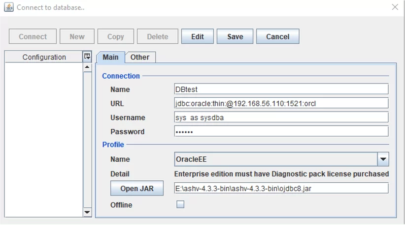
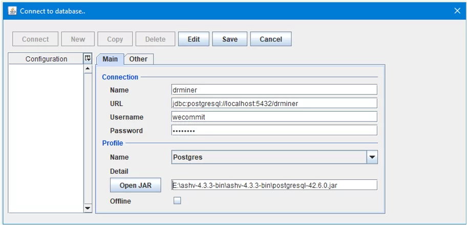

[Bài viết](https://wecommit.com.vn/quy-trinh-cai-dat-va-su-dung-cong-cu-giam-sat-hieu-nang-database-oracle-postgresql/?ppwp=1)

# Password

```
Wecommit@#$2023
```

# 1. Download và cài đặt ASH Viewer

# Bước 1: Download

- [Download ASH viewer](https://sourceforge.net/projects/ashv/files/4.3.3/ashv-4.3.3-bin.zip/download)
- [Download Postgresql-42.6.0](https://jdbc.postgresql.org/download)
- [Download OJDBC8](https://www.oracle.com/database/technologies/appdev/jdbc-downloads.html)

## Bước 2: Giải nén file ashview.zip

## Bước 3: Chạy file run.bnt ở quyền Admintrator

## Bước 4: Copy 2 file JBDC Dirver vào thư mục vừa giải nén ash viewer

## Bước 5: Khởi chạy

- Vào thư mục giải nén bật cmd

``` cmd
java -jar ASH-Viewer.jar
```

## Bước 6: tạo connection

- Oracle

- PosstgreSQL

