[Bài viết](https://wecommit.com.vn/courses/chuong-trinh-dao-tao-toi-uu-co-so-du-lieu-cao-cap/lesson/quy-trinh-cai-dat-oracle-19c-tren-he-dieu-hanh-oracle-linux-7-7-ap-dung-cho-cac-he-thong-production-wecommit/)

# 1. Khuyến nghị của hãng về cấu hình server

- Với phiên bản Oracle Database 19c Oracle đã đưa ra những khuyến nghị về phiên bản hệ điều hành cài đặt ổn định .
- Khuyến nghị cấu hình tối thiểu cho server .

# 2. Thực hiện cài đặt

## 2.1. Cấu hình thông tin trong Host file

- Thực hiện cài đặt Oracle Database  trên Oracle Linux 7.7 trước tiên ta cần thực hiện khai báo thông tin về ip và hostname của server trong file hosts tại “/etc/hosts”.

```
vi /etc/hosts
more /etc/hosts
127.0.0.1 localhost localhost.localdomain localhost4 localhost4.localdomain4
::1 localhost localhost.localdomain localhost6 localhost6.localdomain6
10.xxx.xxx.110 ol-lab19
```

## 2.2. Cài đặt các package cần thiết

``` sh
yum install -y bc*
yum install -y elfutils-libelf
yum install -y elfutils-libelf-devel
yum install -y fontconfig-devel
yum install -y glibc
yum install -y glibc-devel
yum install -y ksh
yum install -y libaio
yum install -y libaio-devel
yum install -y libdtrace-ctf-devel
yum install -y libXrender
yum install -y libXrender-devel
yum install -y libX11
yum install -y libXau
yum install -y libXi
yum install -y libXtst
yum install -y libgcc
yum install -y librdmacm-devel
yum install -y libstdc++
yum install -y libstdc++-devel
yum install -y libxcb
yum install -y make
yum install -y net-tools # Clusterware
yum install -y nfs-utils # ACFS
yum install -y python # ACFS
yum install -y python-configshell # ACFS
yum install -y python-rtslib # ACFS
yum install -y python-six # ACFS
yum install -y targetcli # ACFS
yum install -y smartmontools
yum install -y sysstatLoaded plugins: langpacks, ulninfo
yum install -y xorg*
```

## 2.3. Tạo User, Group

``` sh
groupadd -g 54321 oinstall
groupadd -g 54322 dba
groupadd -g 54323 oper
useradd -u 54321 -g oinstall -G dba,oper oracle
[root@ol-lab19 u01]# passwd oracle
```

## 2.4. Cấu hình tham số OS

### 2.4.1. Cấu  hình file “/etc/security/limits.conf”

- Trong Linux, file limits.conf dùng để giới hạn tài nguyên của hệ thống khi cấp phát cho một user nào đó.
- Thêm các giá trị sau vào file:

``` sh
vi /etc/security/limits.conf
```

Nội dung file:

```
oracle   soft   nofile    1024
oracle   hard   nofile    65536
oracle   soft   nproc    16384
oracle   hard   nproc    16384
oracle   soft   stack    10240
oracle   hard   stack    32768
oracle   hard   memlock    134217728
oracle   soft   memlock    134217728
```

- User: Người dùng muốn đặt giới hạn( ở đây ta sẽ đặt cho User oracle)
- Limit: Giới  hạn, chỉ nhận 2 giá trị soft và Hard
- Soft: Giới hạn tài nguyên hệ thống cho tiến trình, có thể thay đỏi nhưng không vượt quá giá trị Hard
- Hard: Giá trị tối đa mà Soft đạt đến, chỉ thay đổi được bằng user root.

### 2.4.2. Cấu hình file /etc/sysctl.conf

- File sysctl.cfg dùng để đặt giá trị các tham số mặc định của Kernel OS.
- Ví dụ: dung lượng shared memory tối đa của 1 tiến trình, hay sô lượng file tối đa được mở trong 1 phiên, …

``` sh
vi /etc/sysctl.conf
```

Nội dung file:

```
fs.file-max = 6815744
kernel.sem = 250 32000 100 128
kernel.shmmni = 4096
kernel.shmall = 1073741824
kernel.shmmax = 4398046511104
kernel.panic_on_oops = 1
net.core.rmem_default = 262144
net.core.rmem_max = 4194304
net.core.wmem_default = 262144
net.core.wmem_max = 1048576
net.ipv4.conf.all.rp_filter = 2
net.ipv4.conf.default.rp_filter = 2
fs.aio-max-nr = 1048576
net.ipv4.ip_local_port_range = 9000 65500
```

- Thực hiện áp dụng các tham số vừa cấu hình vào hệ thống

``` sh
/sbin/sysctl -p
```

### 2.4.3. Tắt tường lửa

``` sh
systemctl stop firewalld
systemctl status firewalld
```

### 2.5.  Tạo thư mục lưu trữ

- Các phân vùng sau được tạo sẽ dùng để lưu trữ Oracle Software, Oracle Database và các thành phần liên quan.

``` sh
mkdir -p /u01/app/oracle/product/19.0.0/dbhome_1
chown -R oracle:oinstall /u01
chmod -R 775 /u01
```

Cấp quyền cho phân vùng chứa dữ liệu database mà tôi đã tạo sẵn:

``` sh
chown -R oracle:oinstall /data /fra /backup
chmod -R 775 /data /fra
```

## 2.6. Triển khai cài đặt Oracle software 19c

- Các thao tác tại mục 2.6 đều được thực hiện trên user Oracle.
- Thực hiện download software database [tại đây](https://www.oracle.com/database/technologies/oracle19c-linux-downloads.html).
- Thực hiện giải nén file cài đặt đã tải vào thư muc cài đặt Oracle Home.

``` sh
unzip LINUX.X64_193000_db_home.zip -d /u01/app/oracle/product/19.0.0/dbhome_1
```

- Sau khi thực hiện giải nén ta vào thư mục “/u01/app/oracle/product/19.0.0/dbhome_1” chạy file “runInstaller” để bật giao diện cài đặt.

``` sh
cd /u01/app/oracle/product/19.0.0/dbhome_1
./runInstaller
```

>Chú ý: Nếu tại bước này bạn không bật được giao diện thì có thể thực hiện theo [bài viết](https://wecommit.com.vn/bat-giao-dien-cai-dat-database-100-thanh-cong-dbca-netca-runinstaller/).

### 2.6.1 Giao diện cài đặt

- Chọn Set Up Software Only sau đó ấn next

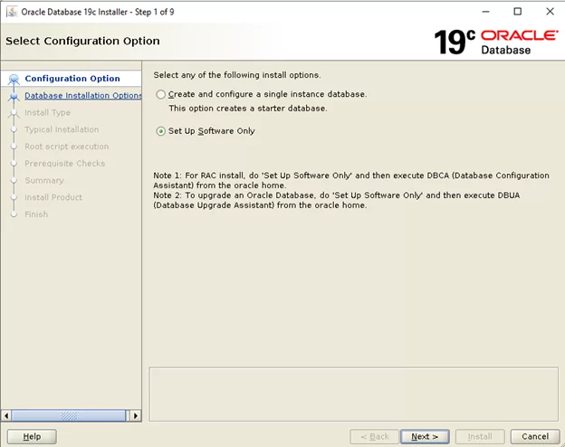

- Chọn Single instance database installation sau đó ấn next

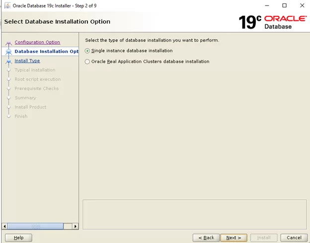

- Chọn Enterprise Edition sau đó ấn next

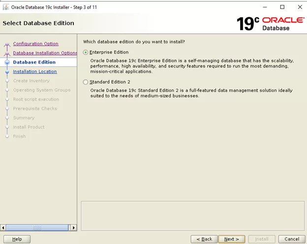

- Chọn đường dẫn cho ORACLE_BASE sau đó ấn next

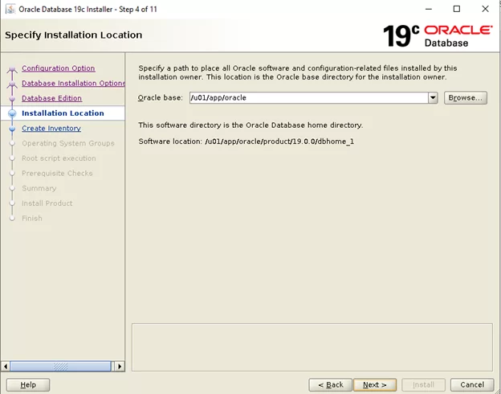

- Chọn đường dẫn lưu cho Inventory sau đó ấn next

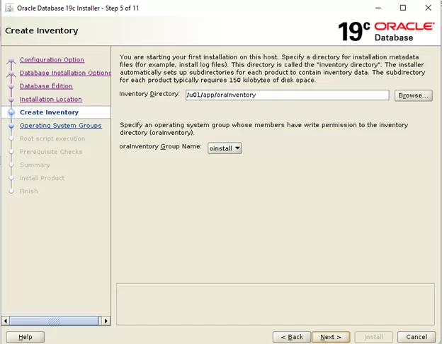

- Chọn group quản trị cho Oracle Database

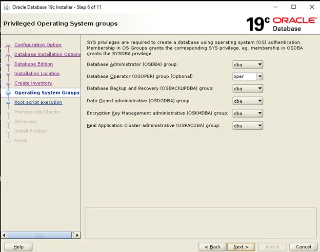

- Trong quá trình cài đặt cần chạy script với user root, tôi chọn để chạy script tự động bằng cách chọn **Automatically run configuaration scripts** và điền thông tin Password của user root.

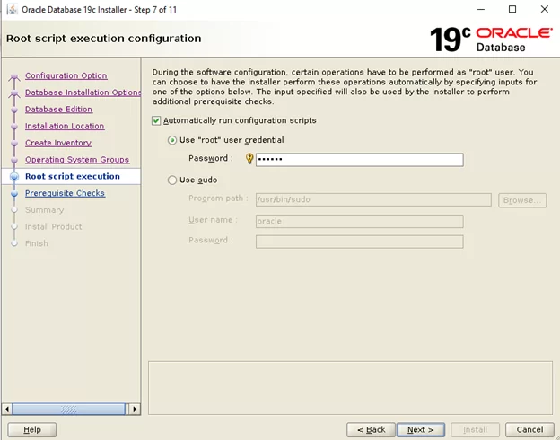

- Bước tiếp theo thực hiện kiểm tra trước khi cài đặt.

!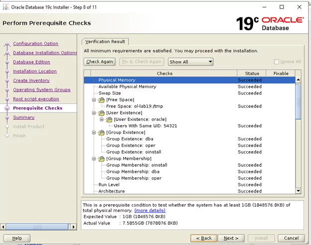

- Kiểm tra thông tin đã cấu hình.


- Thực hiện cài đặt Software

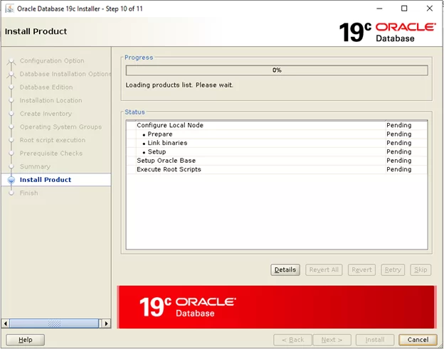

- Chọn Yes để cấp quyền chạy script cài đặt với user root.

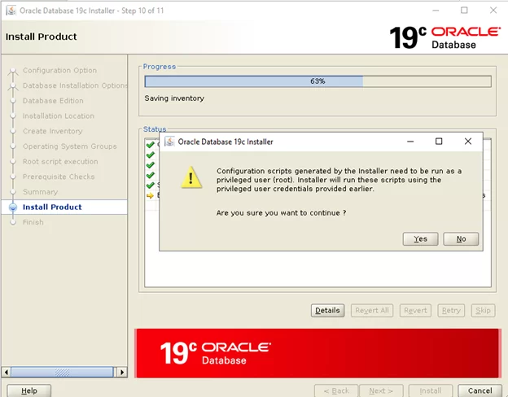

- Cài đặt Software thành công.

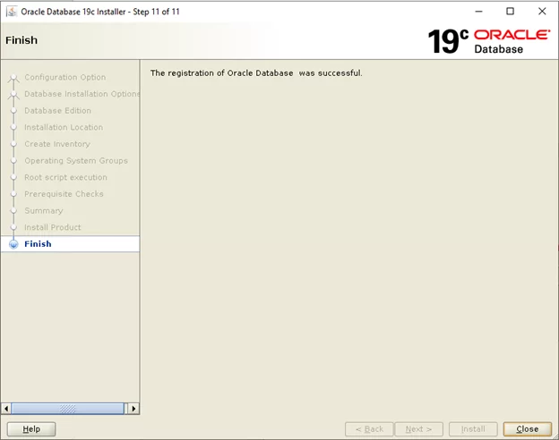

### 2.6.2. Cấu hình biến môi trường

- Thực hiện chỉnh sửa file “.bash_profile”  bằng user Oracle

``` sh
su - oracle
vi .bash_profile
```

- Nội dung cần thêm:

```
export TMP=/tmp
export TMPDIR=$TMP
export PATH
export ORACLE_HOME=/u01/app/oracle/product/19.0.0/dbhome_1
export ORACLE_BASE=/u01/app/oracle
export ORACLE_SID=oradb
export PATH=$PATH:$ORACLE_HOME/bin:$ORACLE_HOME/OPatch:$GG_HOME
export LD_LIBRARY_PATH=$ORACLE_HOME/lib:/lib:/usr/lib
export CLASSPATH=$ORACLE_HOME/JRE:$ORACLE_HOME/jlib:$ORACLE_HOME/rdbms/jlib
```

- Bạn có thể thay đổi các thông tin ORACLE_HOME, ORACLE_BASE, ORACLE_SID tùy thuộc vào hệ thống của mình.

### 2.6.3. Cài đặt Oracle Database

- Thực hiện kết nối vào user Oracle và thực hiện câu lệnh dbca để bật giao diện cài đặt Oracle database

``` sh
dbca
```

- Nếu không bật được giao diện đồ họa bạn có thể tham khảo [bài viết](https://wecommit.com.vn/bat-giao-dien-cai-dat-database-100-thanh-cong-dbca-netca-runinstaller).

- Chọn **Create a database** sau đó ấn Next


- Chọn **Advanced configuration** để thực hiện nhiều cài đặt hơn.

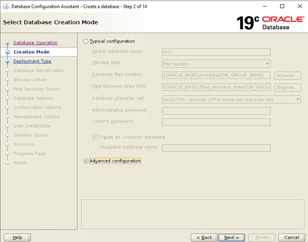

- Chọn Database type là **Oracle Single instance database**.

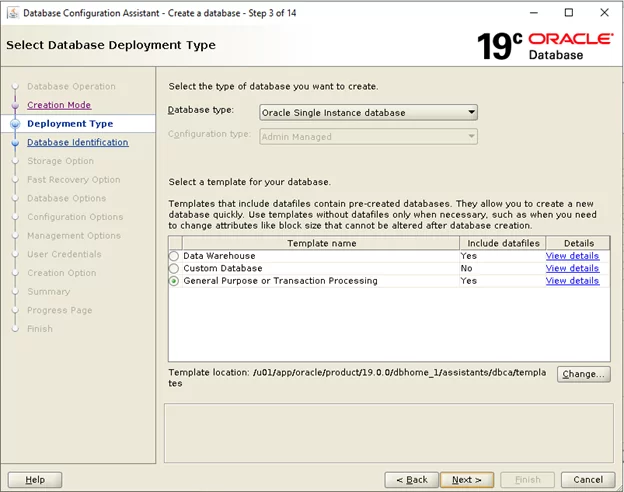

- Điền tên database và SID mà bạn muốn đặt.

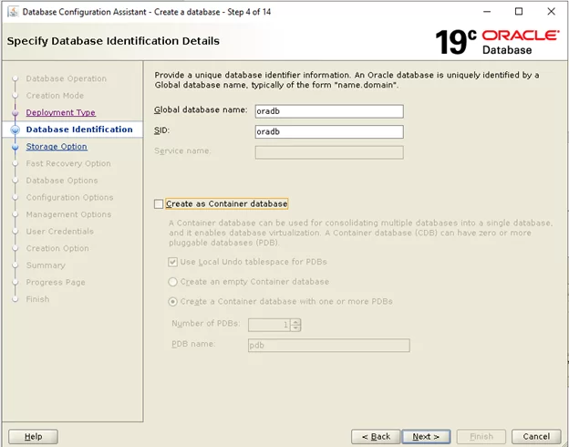

- Chọn phân vùng và loại storage mà bạn muốn cài đặt cho database.Ở đây tôi chọn thêm cơ chế quản lý **OMF** cho database của mình

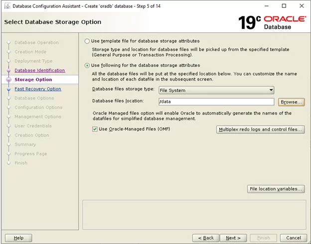

- Chọn phân vùng lưu **FRA** và bạn có thể chọn bật archive log nếu muốn ở bước này.

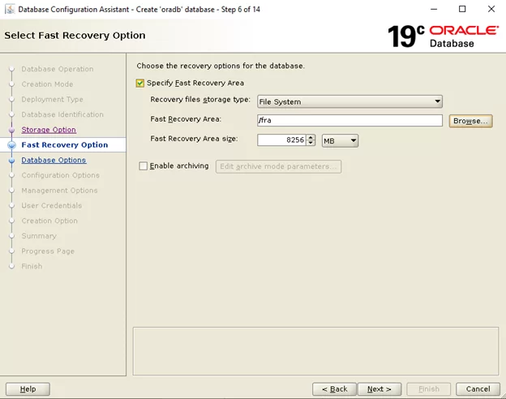

- Chọn **Listener** mà bạn muốn database đăng ký. Ở đây tôi chọn tạo mới Listener với port **1521**.

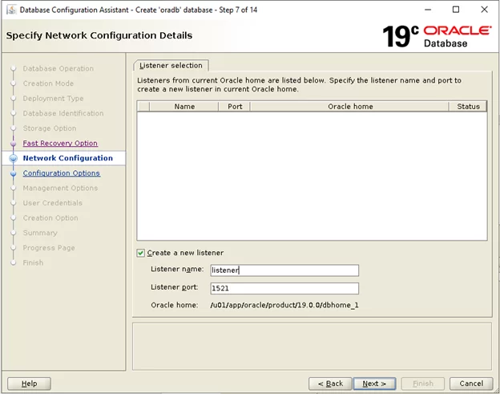

- Database của tôi không cần cài đặt **Database Vault** nên bước này bạn có thể bỏ qua và chọn Next.

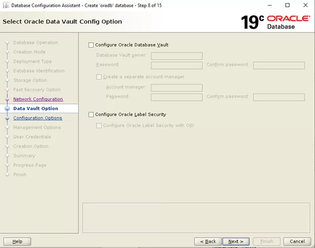

- Bước này bạn cần cấu hình bộ nhớ cho database của bạn. Thường tôi sẽ chọn tổng **SGA** và **PGA** chiếm khoảng 80% ram của server.

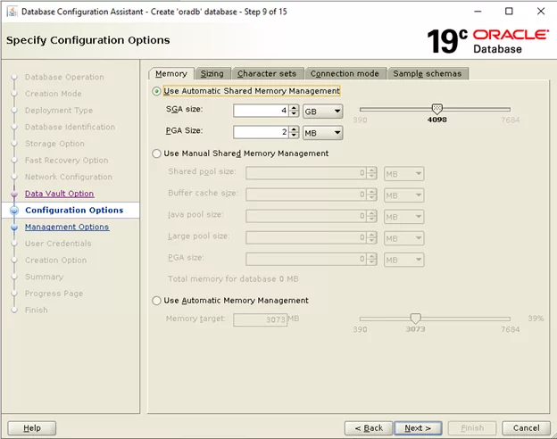

- Tôi không cấu hình **EM**  nên tôi sẽ bỏ qua bước này.

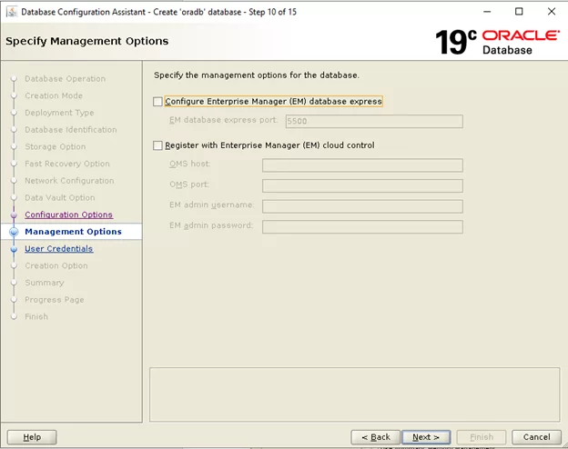

- Điền password mà bạn muốn cấu hình cho user **sys** và **system**.

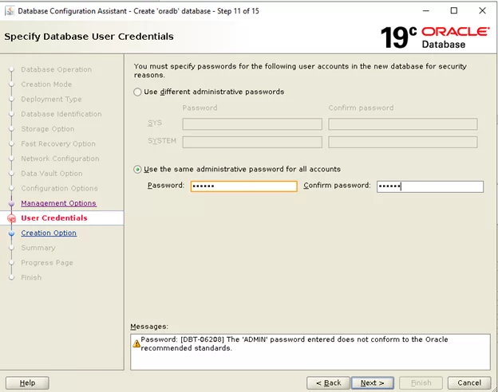

- Bước này tôi sẽ chọn Create database với những option đã chọn.

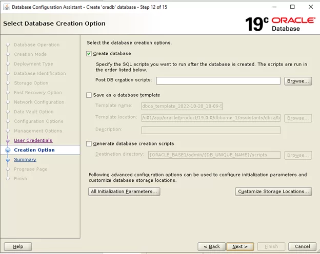

- Kiểm tra lại thông tin đã cấu hình database

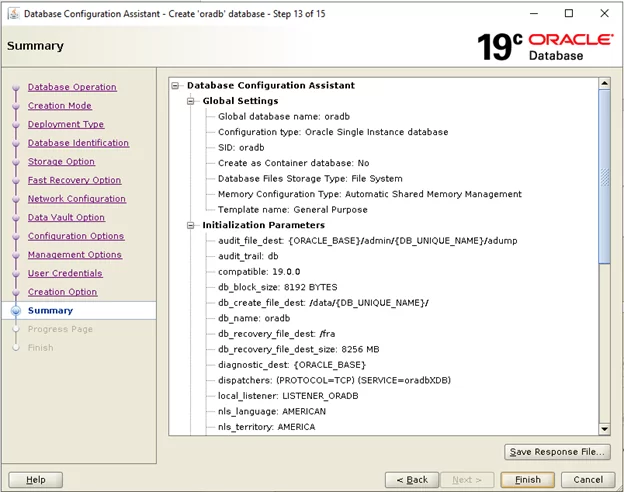

- Thực hiện cài đặt database

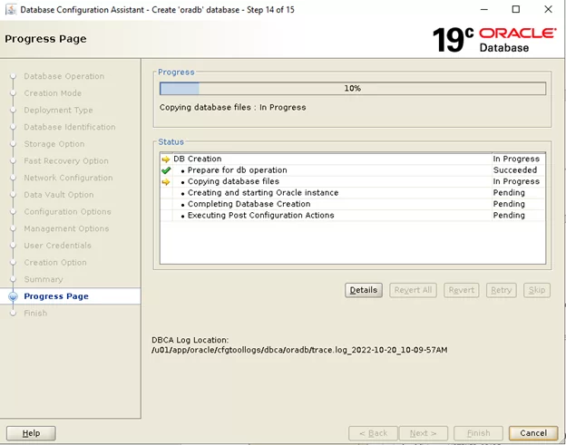

- Cài đặt database thành công.

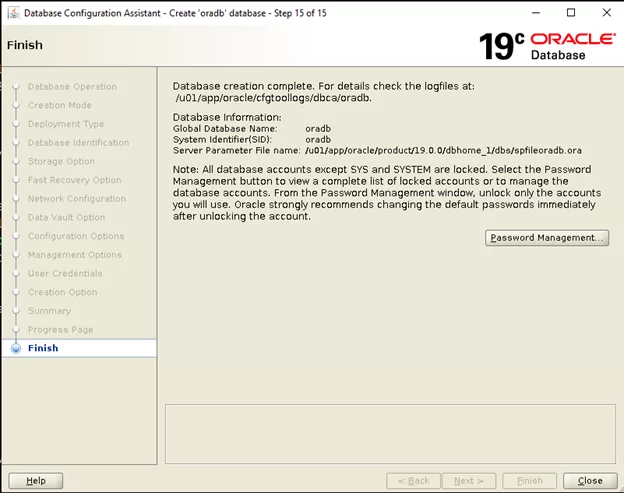

## 2.7 Cấu hình hugepage

### 2.7.1 Kiểm tra dung lượng 1 page đang cấu hình trên hệ thống

- Kiểm tra dung  lượng 1 page ta dùng câu lệnh sau:

``` sh
grep Huge /proc/meminfo
```

```
AnonHugePages:    102400 kB
ShmemHugePages:        0 kB
HugePages_Total:       0
HugePages_Free:        0
HugePages_Rsvd:        0
HugePages_Surp:        0
Hugepagesize:       2048 kB
```

- Từ kết quả câu lệnh thấy được dung lượng 1 page trên hệ thống của tôi đang là 2048KB.

### 2.7.2 Tính số page cần cấu hình

Ta thực hiện tạo script tính số page theo khuyến cáo của Oracle như sau:

- Tôi sẽ tạo script tại thư mục “/home/oracle“

``` sh
cd /home/oracle
vi hugepages_setting.sh
```

Nội dung script như sau:

```
more hugepages_setting.sh

# !/bin/bash

#

# hugepages_setting.sh

#

# Linux bash script to compute values for the

# recommended HugePages/HugeTLB configuration

#

# Note: This script does calculation for all shared memory

# segments available when the script is run, no matter it

# is an Oracle RDBMS shared memory segment or not

# Check for the kernel version

KERN=`uname -r | awk -F. '{ printf("%d.%dn",$1,$2); }'`

# Find out the HugePage size

HPG_SZ=`grep Hugepagesize /proc/meminfo | awk {'print $2'}`

# Start from 1 pages to be on the safe side and guarantee 1 free HugePage

NUM_PG=1

# Cumulative number of pages required to handle the running shared memory segments

for SEG_BYTES in `ipcs -m | awk {'print $5'} | grep "[0-9][0-9]*"`
do
   MIN_PG=`echo "$SEG_BYTES/($HPG_SZ*1024)" | bc -q`
   if [ $MIN_PG -gt 0 ]; then
      NUM_PG=`echo "$NUM_PG+$MIN_PG+1" | bc -q`
   fi
done

# Finish with results

case $KERN in
   '2.4') HUGETLB_POOL=`echo "$NUM_PG*$HPG_SZ/1024" | bc -q`;
          echo "Recommended setting: vm.hugetlb_pool = $HUGETLB_POOL" ;;
   '2.6' | '3.8' | '3.10' | '4.1' | '4.14' ) echo "Recommended setting: vm.nr_hugepages = $NUM_PG" ;;
    *) echo "Unrecognized kernel version $KERN. Exiting." ;;
esac

# End
```

- Thực hiện chày file script đã tạo ở bước trên để lấy tham số cấu hình

```
chmod u+x hugepages_setting.sh

./hugepages_setting.sh

Recommended setting: vm.nr_hugepages = 2052

```

- Thực hiện thêm tham số vm.nr_hugepages = 2052  vào file “/etc/sysctl.conf“

``` sh
vi /etc/sysctl.conf
```

Nội dung file sau khi chỉnh sửa:

```
fs.file-max = 6815744

kernel.sem = 250 32000 100 128

kernel.shmmni = 4096

kernel.shmall = 1073741824

kernel.shmmax = 4398046511104

kernel.panic_on_oops = 1

net.core.rmem_default = 262144

net.core.rmem_max = 4194304

net.core.wmem_default = 262144

net.core.wmem_max = 1048576

net.ipv4.conf.all.rp_filter = 2

net.ipv4.conf.default.rp_filter = 2

fs.aio-max-nr = 1048576

net.ipv4.ip_local_port_range = 9000 65500

vm.nr_hugepages = 2052
```

- Cuối cùng ta thực hiện reboot server để Os nhận tham số cấu hình.

``` sh
reboot
```

- Kiểm tra lại thông tin cấu hình

``` sh
grep Huge /proc/meminfo
```

```
AnonHugePages: 391168 kB
ShmemHugePages: 0 kB
HugePages_Total: 2052
HugePages_Free: 1009
HugePages_Rsvd: 978
HugePages_Surp: 0
Hugepagesize: 2048 kB
```

- Hệ thống đã nhận cấu hình với tham số HugePages_Total: 2052

## 2.8 Cấu hình tự động restart database sau khi reboot

- **Bước 1: Thực hiện chỉnh sử tham số trong Oratab bằng user root**

``` sh
vi /etc/oratab
```

Nội dung chỉnh sửa chuyển N thành Y trong dòng khai báo database:

```
oradb:/u01/app/oracle/product/19.0.0/dbhome_1:y
```

- **Bước 2: Thực hiện tạo script start database bằng user Oracle**
Tạo thư mục lưu script

``` sh
mkdir script
cd script
vi start_all.sh
```

Nội dung script start_all.sh như sau:

```
. /home/oracle/.bash_profile
export ORAENV_ASK=NO
. oraenv
export ORAENV_ASK=YES
dbstart /u01/app/oracle/product/19.0.0/dbhome_1
```

- **Bước 3: Thực hiện tạo script stop database bằng user Oracle**
Tạo thư mục lưu script

``` sh
vi stop_all.sh
```

Nội dung script stop_all.sh như sau:

```
export ORAENV_ASK=NO
. oraenv
export ORAENV_ASK=YES
dbshut /u01/app/oracle/product/19.0.0/dbhome_1
```

- **Bước 4: Khai báo tham số start Listener và cấp quyền cho các scrip đã tạo ở bước 2 và 3**
Chỉnh sử tham số ORACLE_HOME_LISTNER

``` sh
cd $ORACLE_HOME/bin/
vi dbstart
```

Chỉnh sửa tham số :

```
ORACLE_HOME_LISTNER=$ORACLE_HOME
Cấp quyền cho các script đã tạo
chmod u+x /home/oracle/script/*.sh
```

- **Bước 5: Tạo service trên Os để tự động start khi hệ điều hành reboot**
Bước này ta thực hiện bằng user root

``` sh
cd /lib/systemd/system/
vi dbora.service
```

Nội dung script như sau:

```
[Unit]
Description=The Oracle Database Service
After=syslog.target network.target
[Service]
LimitMEMLOCK=infinity
LimitNOFILE=65535
RemainAfterExit=yes
User=oracle
Group=oinstall
Restart=no
ExecStart=/bin/bash -c '/home/oracle/script/start_all.sh'
ExecStop=/bin/bash -c '/home/oracle/script/stop_all.sh'
[Install]
WantedBy=multi-user.target
```

Sau khi tạo xong ta thực hiện re reload tiến trình daemon:

``` sh
systemctl daemon-reload
```

Start service đã tạo:

``` sh
systemctl start dbora.service
systemctl enable dbora.service
```

Kiểm tra trang thái service

``` sh
systemctl status dbora.service
```

```
● dbora.service - The Oracle Database Service
Loaded: loaded (/usr/lib/systemd/system/dbora.service; enabled; vendor preset: disabled)
Active: active (exited) since Tue 2022-10-25 14:44:41 +07; 2 weeks 5 days ago
Process: 1768 ExecStart=/bin/bash -c /home/oracle/script/start_all.sh (code=exited, status=0/SUCCESS)
Main PID: 1768 (code=exited, status=0/SUCCESS)
Tasks: 2
CGroup: /system.slice/dbora.service
└─2393 /u01/app/oracle/product/19.0.0/dbhome_1/bin/tnslsnr LISTENER -inherit
```

## 2.9 Xây dựng chiến lược tự động backup database

Trong mục này tôi sẽ xây dựng chiến lược backup database định kỳ hàng ngày thường hay sử dụng trong các doanh nghiệp như ngân hàng, chứng khoán,.. Chiến lược backup như sau:

- Chủ nhật backup incremental level 0 database thực hiện vào 1h sáng. Nguyên nhân do ngày cuối tuần nghiệp vụ thường nghỉ,  hệ thống ít giao dich trên database nên thực hiện backupfull.
- Từ thứ 2 đến thứ 7 backup incremental level 1 database thực hiện vào 1 giờ sáng. Nguyên nhân do backup lv1 thường nhanh và đảm bảo sẽ backup xong trước 7h sáng (trước giờ giao dịch) tránh ảnh hưởng đến hiệu năng hệ thống. Bên cạnh đó còn giúp tiết kiệm dung lượng lưu trữ do backup lv1 là backup những thay đổi ngay hôm nay so với ngày hôm trước.
- Cơ chế lưu backup: Giữ lại 1 bản backup có thể khôi phục lại dữ liệu (Với cơ chế backup bên trên thì hệ thống sẽ giữ lại các bản backup trong 1 tuần).
- Lưu backup tại phân vùng : /backup
- Sử dụng 8 parallel khi backup.
- Lưu Archive log trong 5 ngày.

**Bước 1: Cấu hình parallel khi backup và cơ chế lưu backup**
Cấu hình parallel và cơ chế lưu backup trong RMAN

``` sh
rman target /
```

```
Recovery Manager: Release 19.0.0.0.0 – Production on Mon Nov 14 15:28:52 2022
Version 19.17.0.0.0

Copyright (c) 1982, 2019, Oracle and/or its affiliates. All rights reserved.

connected to target database: ORADB (DBID=2871837069)

RMAN> CONFIGURE RETENTION POLICY TO REDUNDANCY 1;

using target database control file instead of recovery catalog
new RMAN configuration parameters:
CONFIGURE RETENTION POLICY TO REDUNDANCY 1;
new RMAN configuration parameters are successfully stored

RMAN> CONFIGURE DEVICE TYPE DISK PARALLELISM 8 BACKUP TYPE TO BACKUPSET;

new RMAN configuration parameters:
CONFIGURE DEVICE TYPE DISK PARALLELISM 8 BACKUP TYPE TO BACKUPSET;
new RMAN configuration parameters are successfully stored
```

**Bước 2: Xây dựng script backup level 0**
Tạo script khai báo biến muôi trường cần thiết

``` sh
mkdir -p /home/oracle/script/backup
cd /home/oracle/script/backup
vi backup_level0_day0.sh
```

Nội dung file script:

```
# !/bin/bash

# su - oracle

logfile=`date +%Y%m%d`_level0.log
mkdir /backup/backup_`date +%Y%m%d`
export ORACLE_SID=oradb
export NLS_DATE_FORMAT="yyyy-mm-dd hh24:mi:ss"
export ORACLE_BASE=/u01/app/oracle
export ORACLE_HOME=/u01/app/oracle/product/19.0.0/dbhome_1
export PATH=$ORACLE_HOME/bin:$PATH
rman target / nocatalog cmdfile=/home/oracle/script/backup/backup_level0_day0.rman log=/home/oracle/script/backup/$logfile
exit
```

Tạo script backup

``` sh
vi backup_level0_day0.rman
```

Nội dung script:

```
run {
BACKUP AS COMPRESSED BACKUPSET INCREMENTAL LEVEL 0 DATABASE FORMAT '/backup/backup_%T/db_%T_%d_%u_%s' FILESPERSET 10 TAG BKFULL;
SQL 'ALTER SYSTEM ARCHIVE LOG CURRENT';
BACKUP AS COMPRESSED BACKUPSET ARCHIVELOG ALL FORMAT '/backup/backup_%T/arc_%T_%d_%u_%s_%U' FILESPERSET 10 TAG ARCH;
BACKUP AS COMPRESSED BACKUPSET CURRENT CONTROLFILE FORMAT '/backup/backup_%T/controlfile_%T_%d_%u_%s' TAG CTLFILE;
CROSSCHECK BACKUP;
CROSSCHECK ARCHIVELOG ALL;
delete noprompt archivelog until time 'SYSDATE-5';
DELETE NOPROMPT OBSOLETE;
DELETE NOPROMPT EXPIRED BACKUP;
}
EXIT;
```

**Bước 3: Xây dựng script backup level 1**

``` sh
vi backup_level1.sh
```

Nội dung file script:

```
# !/bin/bash

# su - oracle

logfile=`date +%Y%m%d`_level0.log
mkdir /backup/backup_`date +%Y%m%d`
export ORACLE_SID=oradb
export NLS_DATE_FORMAT="yyyy-mm-dd hh24:mi:ss"
export ORACLE_BASE=/u01/app/oracle
export ORACLE_HOME=/u01/app/oracle/product/19.0.0/dbhome_1
export PATH=$ORACLE_HOME/bin:$PATH
rman target / nocatalog cmdfile=/home/oracle/script/backup/backup_level1.rman log=/home/oracle/script/backup/$logfile
exit
Tạo script backup
vi backup_level1.rman
Nội dung script:

run {
BACKUP AS COMPRESSED BACKUPSET INCREMENTAL LEVEL 1 DATABASE FORMAT '/backup/backup_%T/db_%T_%d_%u_%s' FILESPERSET 10 TAG LEVEL1;
SQL 'ALTER SYSTEM ARCHIVE LOG CURRENT';
BACKUP AS COMPRESSED BACKUPSET ARCHIVELOG ALL FORMAT '/backup/backup_%T/arc_%T_%d_%u_%s_%U' FILESPERSET 10 TAG ARCH;
BACKUP AS COMPRESSED BACKUPSET CURRENT CONTROLFILE FORMAT '/backup/backup_%T/controlfile_%T_%d_%u_%s' TAG CTLFILE;
CROSSCHECK BACKUP;
CROSSCHECK ARCHIVELOG ALL;
delete noprompt archivelog until time 'SYSDATE-5';
DELETE NOPROMPT OBSOLETE;
DELETE NOPROMPT EXPIRED BACKUP;
}
EXIT;
```

**Bước 4: Cấp quyền cho script đã tạo tại bước 2 và bước 3**

```
cd /home/oracle/script/backup/
chmod +x backup*
```

**Bước 5: Cấu hình tự động backup**
Thực hiện cấu hình tự động backup bằng cách cấu hình **crontab** sử dụng **user Oracle**. Để chỉnh sử crontab ta thực hiện lệnh sau:

``` sh
crontab -e
```

Nội dung chỉnh sửa:

```
00 01 **0 /bin/sh /home/oracle/script/backup/backup_level0_day0.sh >> /home/oracle/script/backup/backup_level0_day0.log
00 01** 1,2,3,4,5,6 /bin/sh /home/oracle/script/backup/backup_level1.sh >> /home/oracle/script/backup/backup_level1.log
```

## 2.10 Một số câu lệnh thao tác cơ bản với database

- Bật database

```
SQL> startup
```

- Kiểm tra trạng thái database

``` sh
sqlplus / as sysdba
SQL> select INSTANCE_NAME, STATUS from v$instance;
```

INSTANCE_NAME STATUS
—————- ————
oradb OPEN

- Tắt database

```
SQL> shutdown immediate
```

- Kiểm tra trạng thái listener

``` sh
lsnrctl status
```
