[Bài viết](https://wecommit.com.vn/courses/chuong-trinh-dao-tao-toi-uu-co-so-du-lieu-cao-cap/lesson/quy-trinh-chuyen-doi-co-so-du-lieu-ap-dung-doi-voi-production-wecommit/)

# 1. Chuẩn Bị Môi Trường

Trước khi tiến hành export Schema, ta sẽ thực hiện kiểm tra các thông tin quan trọng của Schema cần thiết cho quá trình import. Các thông tin này sẽ được sử dụng để tạo dựng môi trường trên Database đích, đồng thời cũng được dùng để đối chiếu với chính nó sau khi import Schema xong, để đảm bảo quá trình export/import diễn ra và kết thúc tốt đẹp, ít lỗi phát sinh nhất có thể.

## 1.1. Kiểm tra thông tin Schema trước khi export

- Kiểm tra dung lượng hiện tại của toàn bộ Schema.

``` sql
SELECT
   ROUND(SUM(bytes)/1024/1024/1024, 6) AS size_in_gb
FROM dba_segments
WHERE owner = UPPER('wecommit');
```

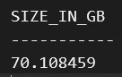

- Kiểm tra Default Tablespace của Schema.

``` sql
SELECT username, default_tablespace
FROM dba_users
WHERE username = UPPER('wecommit');
```

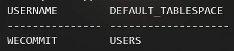

- Kiểm tra Tablespace của từng Segment trong Schema.\

``` sql
SELECT 
   owner, segment_name, segment_type,
   tablespace_name
FROM dba_segments
WHERE owner = UPPER('wecommit');
```

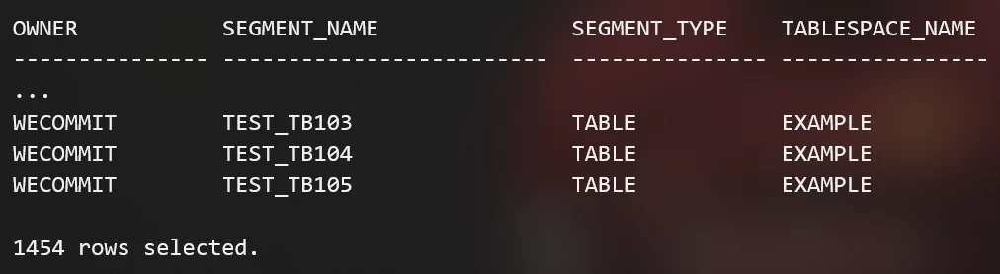

- Đếm tổng số lượng các Object trong Schema.

``` SQL
SELECT COUNT(*) AS number_of_objects 
FROM dba_objects 
WHERE owner = UPPER('wecommit');
```

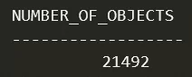

- Đếm số lượng Object của Schema chia theo trạng thái (VALID/INVALID).

``` SQL
SELECT
   status,
   COUNT(*) AS number_of_objects
FROM dba_objects
WHERE owner = UPPER('wecommit')
GROUP BY status;
```

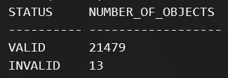

- Lấy danh sách các Invalid Object trong Schema.

``` SQL
SELECT
   owner, object_type, object_name
FROM dba_objects
WHERE owner = UPPER('wecommit')
   AND status != 'VALID';
```

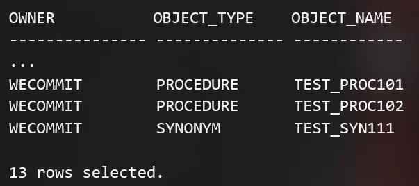

## 1.2. Chuẩn bị môi trường trên Database đích

- Khi import Schema, nếu bạn không chỉ định 1 Schema cụ thể Oracle sẽ tự động tìm Tablespace của Object trong Schema cần import để lưu trữ dữ liệu. Nếu Tablespace đó không tồn tại, thì quá trình import sẽ gặp lỗi “ORA-00959: tablespace does not exist” và không thể thực thi tiếp được.
- Ta sẽ tạo và chỉ định 1 Tablespace mới để lưu trữ dữ liệu của Schema WECOMMIT gọi là WECOMMIT_DATA. Dung lượng tối đa của 1 datafile là 32gb, bạn hãy tự tính toán tổng số lượng datafile của Tablespace mới sao cho đủ dung lượng chứa Schema mong muốn cần import mà vẫn còn thừa dung lượng trống để tăng trưởng sau này (ít nhất 30% tổng dung lượng max size Tablespace).
- Ví dụ với Schema WECOMMIT dung lượng nặng 70gb thì ta sẽ tạo 1 Tablespace có 3 datafile. Khi đó tổng max size của Tablespace sẽ là khoảng gần 100gb, dư 30gb dùng cho tăng trưởng trong tương lai. Lưu ý hãy tạo kích thước ban đầu của datafile đủ lớn để tránh việc datafile tự extend quá nhiều lần trong quá trình import dữ liệu.

``` SQL
CREATE TABLESPACE WECOMMIT_DATA
   DATAFILE SIZE 30G AUTOEXTEND ON NEXT 1G MAXSIZE UNLIMITED;

ALTER TABLESPACE WECOMMIT_DATA
   ADD DATAFILE SIZE 30G
   AUTOEXTEND ON NEXT 1G MAXSIZE UNLIMITED;

ALTER TABLESPACE WECOMMIT_DATA
   ADD DATAFILE SIZE 30G
   AUTOEXTEND ON NEXT 1G MAXSIZE UNLIMITED;
```

- Trong quá trình import bạn có thể cần thay đổi lại kích thước của Redo Log để tránh khi import dữ liệu lớn Database sẽ switch log liên tục quá nhiều lần. Mỗi giờ Database chỉ nên thực hiện switch log khoảng 4-8 lần. Ví dụ với kích thước Redo Log hiện tại là 500mb, Database switch khoảng 8-16 lần/h thì ta sẽ tăng kích thước Redo Log Group mới lên thành 1024mb.

- Sử dụng các câu lệnh sau để xem kích thước hiện tại của Redo Log và kiểm tra số lần switch log trung bình mỗi giờ trên Database trong vòng 1 tuần.

``` SQL
SELECT group#, status, bytes/1024/1024 size_in_mb
FROM gv$log;
```

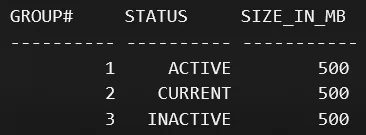

``` SQL
SELECT 
   TRUNC(first_time) date#, TO_CHAR(first_time, 'Dy') day_in_week, 
   inst_id, COUNT(1) total,
   SUM(DECODE(TO_CHAR(first_time,'hh24'), '00', 1, 0)) h0,
   SUM(DECODE(TO_CHAR(first_time,'hh24'), '01', 1, 0)) h1,
   SUM(DECODE(TO_CHAR(first_time,'hh24'), '02', 1, 0)) h2,
   SUM(DECODE(TO_CHAR(first_time,'hh24'), '03', 1, 0)) h3,
   SUM(DECODE(TO_CHAR(first_time,'hh24'), '04', 1, 0)) h4,
   SUM(DECODE(TO_CHAR(first_time,'hh24'), '05', 1, 0)) h5,
   SUM(DECODE(TO_CHAR(first_time,'hh24'), '06', 1, 0)) h6,
   SUM(DECODE(TO_CHAR(first_time,'hh24'), '07', 1, 0)) h7,
   SUM(DECODE(TO_CHAR(first_time,'hh24'), '08', 1, 0)) h8,
   SUM(DECODE(TO_CHAR(first_time,'hh24'), '09', 1, 0)) h9,
   SUM(DECODE(TO_CHAR(first_time,'hh24'), '10', 1, 0)) h10,
   SUM(DECODE(TO_CHAR(first_time,'hh24'), '11', 1, 0)) h11,
   SUM(DECODE(TO_CHAR(first_time,'hh24'), '12', 1, 0)) h12,
   SUM(DECODE(TO_CHAR(first_time,'hh24'), '13', 1, 0)) h13,
   SUM(DECODE(TO_CHAR(first_time,'hh24'), '14', 1, 0)) h14,
   SUM(DECODE(TO_CHAR(first_time,'hh24'), '15', 1, 0)) h15,
   SUM(DECODE(TO_CHAR(first_time,'hh24'), '16', 1, 0)) h16,
   SUM(DECODE(TO_CHAR(first_time,'hh24'), '17', 1, 0)) h17,
   SUM(DECODE(TO_CHAR(first_time,'hh24'), '18', 1, 0)) h18,
   SUM(DECODE(TO_CHAR(first_time,'hh24'), '19', 1, 0)) h19,
   SUM(DECODE(TO_CHAR(first_time,'hh24'), '20', 1, 0)) h20,
   SUM(DECODE(TO_CHAR(first_time,'hh24'), '21', 1, 0)) h21,
   SUM(DECODE(TO_CHAR(first_time,'hh24'), '22', 1, 0)) h22,
   SUM(DECODE(TO_CHAR(first_time,'hh24'), '23', 1, 0)) h23,
   ROUND (COUNT(1)/24, 2) avg
FROM gv$log_history
WHERE thread# = inst_id AND first_time > sysdate -7
GROUP BY TRUNC(first_time), inst_id, TO_CHAR(first_time, 'Dy')
ORDER BY 1,2;
```

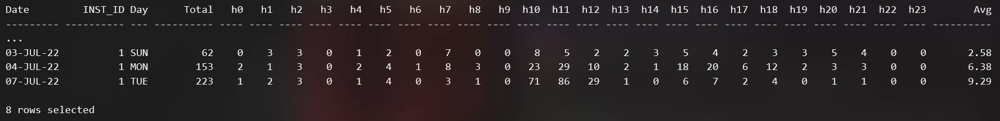

- Tạo Redo Log Group mới với kích thước lớn hơn, sau đó switch log file liên tục đến khi Database chuyển sang dùng Redo Log Group mới thì xóa các Redo Log Group cũ đi.

``` SQL
ALTER DATABASE ADD LOGFILE GROUP 4 SIZE 1024M;
ALTER DATABASE ADD LOGFILE GROUP 5 SIZE 1024M;
ALTER DATABASE ADD LOGFILE GROUP 6 SIZE 1024M;

ALTER SYSTEM SWITCH LOGFILE;

ALTER DATABASE DROP LOGFILE GROUP 1;
ALTER DATABASE DROP LOGFILE GROUP 2;
ALTER DATABASE DROP LOGFILE GROUP 3;
```

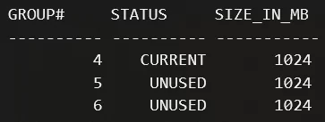

# 2. Triển Khai Export/Import

Sau khi đã có được đầy đủ thông tin và chuẩn bị sẵn sàng môi trường trên Database, tiếp theo ta sẽ tiến hành thực hiện export/import Schema WECOMMIT. Dưới đây là thông tin cơ bản của 2 Database được sử dụng trong quy trình.

- Database nguồn SID: ORCL, Host: ol79 / IP 192.168.1.100
- Database đích SID: ORCLNEW, Host: ol79-new / IP 192.168.1.111

## 2.1. Tiến hành Export Schema trên Database nguồn

- Tạo thư mục chứa các file Dump trên OS (sử dụng user oracle).

``` sh
mkdir -p /data/fra/ORCL/backup/dump/
```

- Chỉ định thư mục chứa các file Dump vừa tạo trên Database.

``` SQL
CREATE OR REPLACE DIRECTORY
   dump_dir AS '/data/fra/ORCL/backup/dump/';
```

- Tiến hành Export Schema. Lưu ý cách sử dụng của 1 vài tham số sau:
  - cluster: nếu đang sử dụng môi trường RAC thì đặt giá trị bằng “no” để chỉ export/import trên 1 Instance đang dùng để chạy job export/import.
  - parallel: tham số dùng để chạy đa luồng tiến trình export/import, đặt số lượng sao cho phù hợp với kích thước Schema và tài nguyên hệ thống. Lưu ý cần phải thêm ký tự “%U” sau tên file (tham số dumpfile) và ký tự “&” cuối câu lệnh expdp/impdp.

``` sh
cd /data/fra/ORCL/backup/dump/
nohup expdp "/ as sysdba"
   cluster=no
    parallel=3
   schemas=WECOMMIT
   directory=dump_dir
   dumpfile=export_schema_WECOMMIT_ORCL_`date +%Y%m%d`_%U.dmp
   logfile=export_schema_WECOMMIT_ORCL_`date +%Y%m%d`.log &
```

- Do tiến trình export/import được chạy với lệnh “nohup” để tránh trường hợp bị treo tiến trình khi mất kết nối session giữa chừng, nên ta sẽ theo dõi log quá trình export/import trong file “nohup.out”. Toàn bộ log cũng sẽ được khi vào file log đã chỉ định trước đó (tham số logfile) nên file “nohup.out” có thể được tái sử dụng hay ghi đè nhiều lần nếu cần thiết.

``` sh
cd /data/fra/ORCL/backup/dump/
tail -100f nohup.out
```

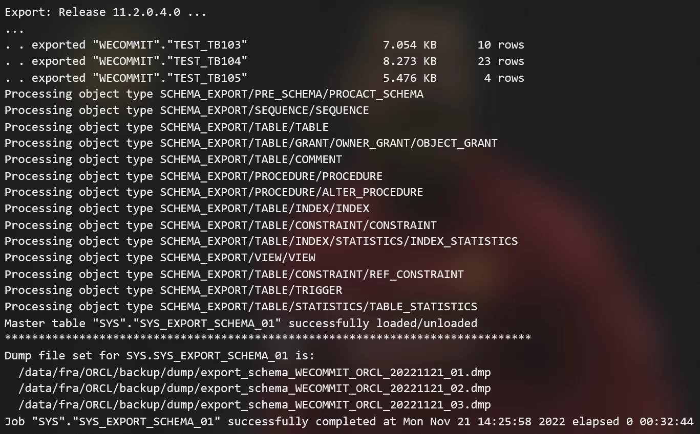

## 2.2. Tiến hành Import Schema trên Database đích

- Tạo thư mục chứa các file Dump trên OS.

``` sh
mkdir -p /data/fra/ORCLNEW/backup/dump/
```

- Chỉ định thư mục chứa các file Dump vừa tạo trên Database.

``` SQL
CREATE OR REPLACE DIRECTORY
   dump_dir AS '/data/fra/ORCLNEW/backup/dump/';
```

- Thực hiện di chuyển các file Dump đã export trước đó sang Database đích. Bạn có thể dùng lệnh “scp” nếu đứng trên Database nguồn để chuyển hoặc lệnh “rsync” nếu đứng trên Database đích. Lưu ý cấp quyền thực thi đầy đủ cho các file Dump và chuyển file bằng user oracle trên cả 2 Database.

  - Database nguồn

``` sh
scp -p
   /data/fra/ORCL/backup/dump/export_schema_WECOMMIT_ORCL_20221119_*.dmp
   oracle@192.168.1.100:/data/fra/ORCLNEW/backup/dump/
```

- Database đích

``` sh
rsync -avz -e 'ssh -p 22'
   oracle@192.168.1.111:/data/fra/ORCL/backup/dump/export_schema_WECOMMIT_ORCL_20221119_*.dmp
   /data/fra/ORCLNEW/backup/dump/
```

- Tiến hành import Schema. Lưu ý cách sử dụng của 1 vài tham số sau:
  - remap_schema: đổi tên Schema trên Database đích nếu không muốn dùng lại tên cũ.
  - remap_tablespace: đổi lại Tablespace khác để lưu trữ các object của Schema sang Tablespace mới đã tạo trước đó.

``` sh
[oracle@ol79-new ~]$ cd /data/fra/ORCLNEW/backup/dump/
[oracle@ol79-new dump]$ nohup impdp "/ as sysdba"
   parallel=3
   schemas=WECOMMIT
   remap_schema=WECOMMIT:WECOMMIT_NEW
   remap_tablespace=EXAMPLE:WECOMMIT_DATA
   directory=dump_dir
   dumpfile=export_schema_WECOMMIT_ORCL_`date +%Y%m%d`_%U.dmp
   logfile=import_schema_WECOMMIT_ORCL_`date +%Y%m%d`.log &
```

- Kiểm tra log tiến trình import trên OS.

``` sh
cd /data/fra/ORCLNEW/backup/dump/  
tail -100f nohup.out
```

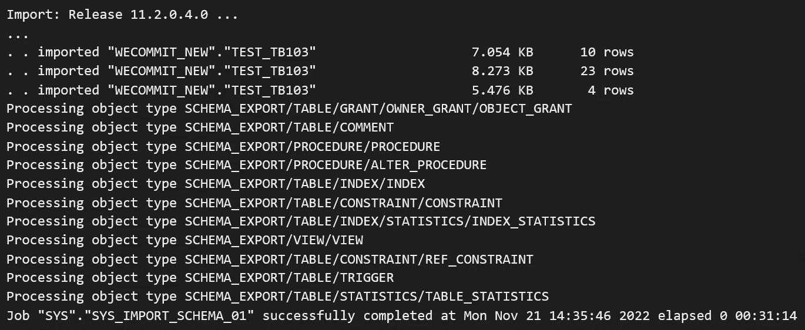

# 3. Xác thực và kiểm tra

## 3.1. Kiểm tra thông tin Schema sau khi import

Sau khi thực hiện thành công export/import Schema, ta sẽ tiến hành xác thực lại thông tin của Schema để kiểm tra các Object của nó có đầy đủ và có bị lỗi (INVALID) hay không.

- Kiểm tra dung lượng hiện tại của toàn bộ Schema.

``` SQL
SELECT
   ROUND(SUM(bytes)/1024/1024/1024, 6) AS size_in_gb
FROM dba_segments
WHERE owner = UPPER('wecommit_new');
```


- Kiểm tra Default Tablespace của Schema.

``` SQL
SELECT username, default_tablespace
FROM dba_users
WHERE username = UPPER('wecommit_new');
```

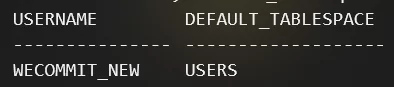

- Kiểm tra Tablespace của từng Segment trong Schema.

``` SQL
SELECT 
   owner, segment_name, segment_type,
   tablespace_name
FROM dba_segments
WHERE owner = UPPER('wecommit_new');
```

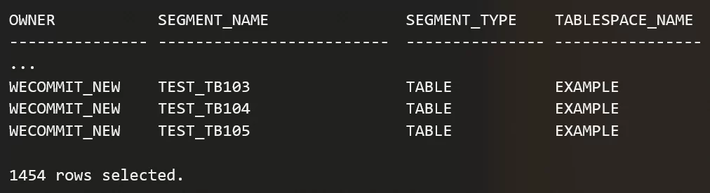

- Kiểm tra thêm mức sử dụng của Tablespace mới tạo và import trên Database đích. Lưu ý phần trăm đã sử dụng trên MAX SIZE của Tablespace (cột PCT_USED_OF_MAX).

``` SQL
SELECT A.TABLESPACE_NAME, 100 - ROUND((NVL(B.BYTES_FREE, 0) / A.BYTES_ALLOC) *100) USAGE,
   ROUND(A.BYTES_ALLOC / 1024 / 1024) CUR_SIZE,
   ROUND(NVL(B.BYTES_FREE, 0) / 1024 / 1024) FREE,
   ROUND((A.BYTES_ALLOC - NVL(B.BYTES_FREE, 0)) / 1024 / 1024) USED,
   ROUND((NVL(B.BYTES_FREE, 0) / A.BYTES_ALLOC)* 100) PCT_FREE,
   ROUND(MAXBYTES/1048576) MAX_SIZE,
   ROUND((ROUND((A.BYTES_ALLOC - NVL(B.BYTES_FREE, 0)) / 1024 / 1024) / ROUND(MAXBYTES/1048576)), 2) *100 PCT_USED_OF_MAX,
   C.STATUS, C.CONTENTS
FROM (
   SELECT F.TABLESPACE_NAME, SUM(F.BYTES) BYTES_ALLOC, SUM(DECODE(F.AUTOEXTENSIBLE, 'YES',F.MAXBYTES,'NO', F.BYTES)) MAXBYTES
   FROM DBA_DATA_FILES F GROUP BY TABLESPACE_NAME
) A, (
   SELECT TS.NAME TABLESPACE_NAME, SUM(FS.BLOCKS)* TS.BLOCKSIZE BYTES_FREE
   FROM DBA_LMT_FREE_SPACE FS, SYS.TS$ TS WHERE TS.TS# = FS.TABLESPACE_ID
   GROUP BY TS.NAME, TS.BLOCKSIZE
) B, DBA_TABLESPACES C
WHERE A.TABLESPACE_NAME = B.TABLESPACE_NAME (+) AND A.TABLESPACE_NAME = C.TABLESPACE_NAME
UNION ALL
SELECT H.TABLESPACE_NAME, 100 - ROUND((SUM((H.BYTES_FREE + H.BYTES_USED) - NVL(P.BYTES_USED, 0)) / SUM(H.BYTES_USED + H.BYTES_FREE)) * 100) USAGE,
   ROUND(SUM(H.BYTES_FREE + H.BYTES_USED) / 1048576) CUR_SIZE,
   ROUND(SUM((H.BYTES_FREE + H.BYTES_USED) - NVL(P.BYTES_USED, 0)) / 1048576) FREE,
   ROUND(SUM(NVL(P.BYTES_USED, 0))/ 1048576) USED,
   ROUND((SUM((H.BYTES_FREE + H.BYTES_USED) - NVL(P.BYTES_USED, 0)) / SUM(H.BYTES_USED + H.BYTES_FREE)) * 100) PCT_FREE,
   ROUND(SUM(DECODE(F.AUTOEXTENSIBLE, 'YES', F.MAXBYTES, 'NO', F.BYTES) / 1048576)) MAX_SIZE,
   ROUND((ROUND(SUM(NVL(P.BYTES_USED, 0))/ 1048576) / ROUND(SUM(DECODE(F.AUTOEXTENSIBLE, 'YES', F.MAXBYTES, 'NO', F.BYTES)), 2)*100 / 1048576)) PCT_USED_OF_MAX,
   C.STATUS, C.CONTENTS
FROM SYS.V_$TEMP_SPACE_HEADER H, (
   SELECT TABLESPACE_NAME, FILE_ID, SUM(BYTES_USED) BYTES_USED
   FROM SYS.GV_$TEMP_EXTENT_POOL
   GROUP BY TABLESPACE_NAME, FILE_ID
) P, DBA_TEMP_FILES F, DBA_TABLESPACES C
WHERE P.FILE_ID(+) = H.FILE_ID
   AND P.TABLESPACE_NAME(+) = H.TABLESPACE_NAME
   AND F.FILE_ID = H.FILE_ID
   AND F.TABLESPACE_NAME = H.TABLESPACE_NAME
   AND F.TABLESPACE_NAME = C.TABLESPACE_NAME
GROUP BY H.TABLESPACE_NAME, C.STATUS, C.CONTENTS
ORDER BY 1;
```

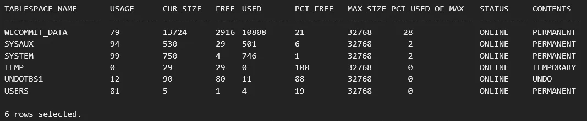

- Đếm tổng số lượng Object trong Schema.

``` SQL
SELECT COUNT(*) AS number_of_objects 
FROM dba_objects 
WHERE owner = UPPER('wecommit_new');
```


- Đếm số lượng Object của Schema phân loại theo trạng thái (VALID / INVALID).

``` SQL
SELECT
   status,
   COUNT(*) AS number_of_objects
FROM dba_objects
WHERE owner = UPPER('wecommit_new')
GROUP BY status;
```

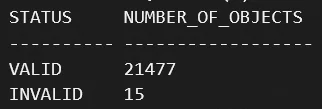

- Lấy danh sách Invalid Object bị trong Schema.

``` SQL
SELECT 
   owner, object_type, object_name
FROM dba_objects
WHERE owner = UPPER('wecommit_new') 
   AND status != 'VALID';
```

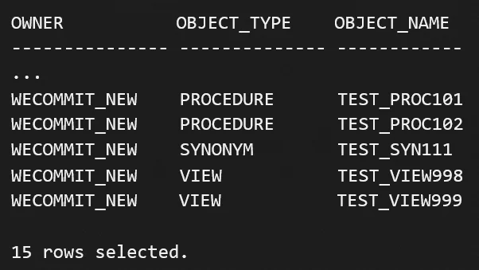

## 3.2. Recompile Invalid Object và Gather Statistic Schema

Khi đối chiếu thông tin Schema trước khi export và sau khi import, ta thấy đã xuất hiện thêm 2 Invalid Object. Lúc này ta sẽ cần phải xác thực lại các Object đó hay gọi là Compile lại Object (Recompile).

Bạn có thể tạm thời bỏ qua các Object ngay từ trước khi export đã bị Invalid, chỉ quan tâm đến các Object mới bị Invalid sau khi import. Vì tiêu chí đầu tiên khi thực hiện Export/Import là cố gắng giữ nguyên hiện trạng Schema không thay đổi trên 2 Database.

Ta có thể Recompile lại các Invalid Object đó bằng một trong những cách sau đây.

- Recompile thủ công bằng câu lệnh ALTER, thường dùng khi có ít Invalid Object bị. Ưu điểm là nhanh và có cú pháp câu lệnh khác dễ nhớ hơn các cách Recompile Invalid Object khác. Ví dụ câu lệnh Recompile 1 View của Schema sẽ như sau.

``` SQL
ALTER VIEW WECOMMIT_NEW.TEST_VIEW998 COMPILE;
-- cú pháp: ALTER <loại object> <tên schema>.<tên object> COMPILE;
Hoặc bạn có thể dùng câu lệnh sau để tự động cho ra output là các câu lệnh ALTER với tên và loại của từng Invalid Object tương ứng trong câu lệnh.
SQL> SELECT 'ALTER '
   || OBJECT_TYPE
   || ' '
   || OWNER
   || '.'
   || OBJECT_NAME
   || ' COMPILE;'
FROM dba_objects
WHERE owner = UPPER('wecommit_new')  
   AND status = 'INVALID';
```

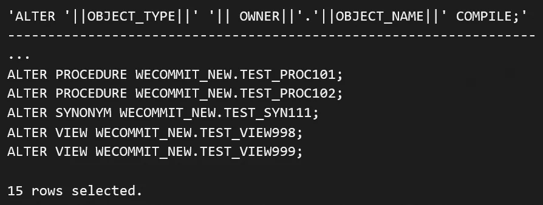

- Trong trường hợp có quá nhiều Invalid Object, bạn có thể Recompile bằng script có sẵn của Oracle Database trong đường dẫn “$ORACLE_HOME/rdbms/admin/”. Kết nối đến Database bằng SQL*PLUS và gõ lệnh như dưới đây để chạy script. Lưu ý script sẽ thực hiện Recompile lại toàn bộ các Invalid Object có trong Database trên mọi Schema.

``` SQL
@$ORACLE_HOME/rdbms/admin/utlrp.sql
```

- Việc thực hiện Recompile bằng script như trên bạn sẽ không chỉ định được cụ thể Schema mong muốn. Lúc này bạn có thể sử dụng Procedure UTL_RECOMP.RECOMP_SERIAL trong Oracle Database như sau đây. Lưu ý nếu không chỉ định rõ tên Schema, Procedure vẫn sẽ mặc định Recompile lại toàn bộ Object trong Database.

``` SQL
EXEC UTL_RECOMP.recomp_serial('WECOMMIT_NEW');
```

- Trong Oracle Database còn có 1 Procedure khác là DBMS_UTILITY.COMPILE_SCHEMA, Procedure này cũng được dùng để Compile các Object của 1 Schema. Khi giá trị tham số compile_all là false, Procedure sẽ chỉ compile lại các Invalid Object, nếu là true sẽ là toàn bộ Schema kể cả Object bình thường (VALID).

``` SQL
EXEC DBMS_UTILITY.compile_schema(
  schema => 'WECOMMIT_NEW',
  compile_all => false
);
```

- Bước cuối cùng trong quy trình Export/Import SChema đó là tổng hợp lại các thông tin thống kê hay gọi là Gather Statistic cho Schema để tối ưu các thao tác của Database thực hiện trên dữ liệu của Schema vừa mới được import.
- Thực hiện Gather Statistic bằng Procedure DBMS_STATS.gather_schema_stats có sẵn như sau trong Oracle Database.

``` SQL
EXEC DBMS_STATS.gather_schema_stats('WECOMMIT_NEW');
```
