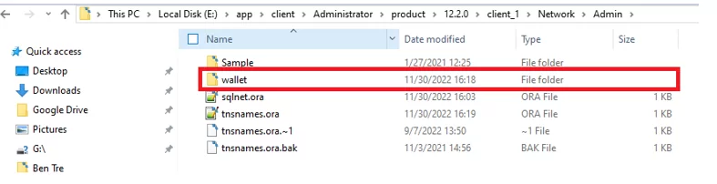
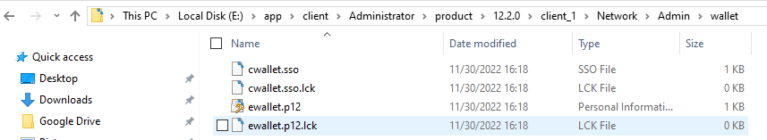
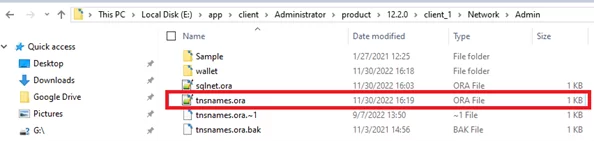
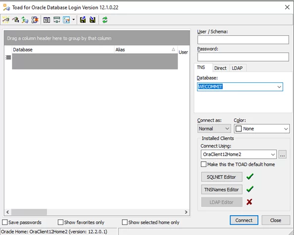
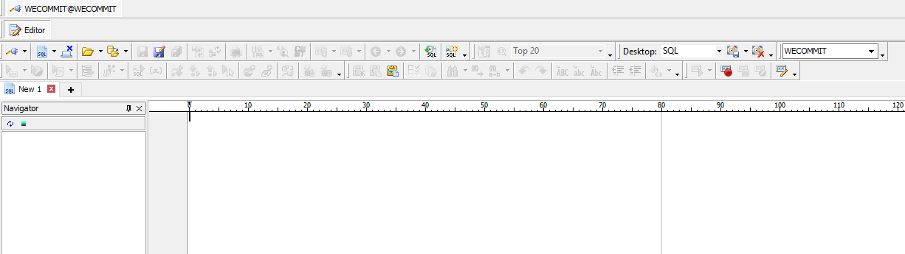

[Bài viết](https://wecommit.com.vn/courses/chuong-trinh-dao-tao-toi-uu-co-so-du-lieu-cao-cap/lesson/quy-trinh-huong-dan-cau-hinh-oracle-wallet-secure-external-password-store-tren-oracle-database-19c/)

Oracle Wallet Secure External Password Store là một cơ chế của Oracle giúp lưu trữ, mã hóa thông tin đăng nhập trên máy người dùng giúp tăng tính báo mật. Người dùng có thể đăng nhập vào database mà không cần nhập User và Password.

# 1. Môi trường thực hiện

- Oracle database version : 19.3.0.0.0
- OS version :  Oracle Linux Server release 7.7

# 2. Quy trình thực hiện cấu hình Oracle Wallet Secure External Password Store

### Bước 1: Tạo thư mục lưu Wallet

``` sh
cd $ORACLE_HOME/network/admin
mkdir wallet
```

### Bước 2: Chỉnh sửa cấu hình file sqlnet.ora

- Thực hiện chỉnh sửa cấu hình SQLNET

``` sh
vi sqlnet.ora
```

- Thêm nội dung sau vào file sqlnet.ora.  DIRECTORY là đường dẫn đến thư mục wallet đã tạo ở Bước 1.

```
WALLET_LOCATION =
   (SOURCE =
     (METHOD = FILE)
     (METHOD_DATA =
       (DIRECTORY = /u01/app/oracle/product/19.0.0/dbhome_1/network/admin/wallet)
     )
   )

SQLNET.WALLET_OVERRIDE = TRUE
SSL_CLIENT_AUTHENTICATION = FALSE
SSL_VERSION = 0
```

### Bước 3: Thêm chuỗi kết nối đến database

- Thực hiện thêm kết nối đến database trong Tnsname

``` sj
vi tnsnames.ora
```

- Nội dung cần thêm

```
WECOMMIT =
  (DESCRIPTION =
    (ADDRESS = (PROTOCOL = TCP)(HOST = 10.239.42.112)(PORT = 1521))
    (CONNECT_DATA =
      (SERVER = DEDICATED)
      (SERVICE_NAME = oradbsc)
```

### Bước 4: Tạo wallet

- Thực hiện tạo Password store bằng câu lệnh:

``` sh
mkstore -wrl <wallet_location> -create
```

- Sau đó nhập Password muốn đặt cho wallet:

```
[oracle@wecommit wallet]$ mkstore -wrl "/u01/app/oracle/product/19.0.0/dbhome_1/network/admin/wallet" -create
Oracle Secret Store Tool Release 19.0.0.0.0 - Production
Version 19.3.0.0.0
Copyright (c) 2004, 2019, Oracle and/or its affiliates. All rights reserved.

Enter password:  
Enter password again:
```

### Bước 5: Thêm user và password vào Password store

- Thực hiện câu lệnh:

``` sh
[oracle@wecommit admin]$ mkstore -wrl "/u01/app/oracle/product/19.0.0/dbhome_1/network/admin/wallet" -createCredential WECOMMIT WECOMMIT
```

```
Oracle Secret Store Tool Release 19.0.0.0.0 - Production
Version 19.3.0.0.0
Copyright (c) 2004, 2019, Oracle and/or its affiliates. All rights reserved.

Your secret/Password is missing in the command line
Enter your secret/Password:  
Re-enter your secret/Password:  
Enter wallet password:
```

- Thêm user/password vào Password store bằng câu lệnh:

``` sh
mkstore -wrl <wallet_location> -createCredential <db_connect_string> <username>
```

- Nhập Password của user vào mục:

```
Enter your secret/Password:  
Re-enter your secret/Password:
```

- Nhập Password của Password store ở bước 4 vào mục:

```
Enter wallet password:
```

### Bước 6: Kiểm tra chuỗi kết nối đã tạo

- Thực hiện câu lệnh:

``` sh
mkstore -wrl "/u01/app/oracle/product/19.0.0/dbhome_1/network/admin/wallet" -listCredential
```

```
Oracle Secret Store Tool Release 19.0.0.0.0 - Production
Version 19.3.0.0.0
Copyright (c) 2004, 2019, Oracle and/or its affiliates. All rights reserved.

Enter wallet password:  
List credential (index: connect_string username)
2: WECOMMIT WECOMMIT
1: ORADBSC tuantd
```

- Kiểm tra External Password Store Contents bằng câu lệnh:

``` sh
mkstore -wrl <wallet_location> -listCredential
```

- Sau khi tạo thành công thì các file cấu hình sẽ được lưu tại thư mục $ORACLE_HOME/network/admin/wallet

``` sh
ls
```

```
cwallet.sso cwallet.sso.lck ewallet.p12 ewallet.p12.lck
```

### Bước 7: Kiểm tra kết nối đến database

- Kêt nối vào database bằng Tnsname WECOMMIT

``` sh
sqlplus /@WECOMMIT
```

```
SQL*Plus: Release 19.0.0.0.0 - Production on Wed Nov 30 15:21:51 2022
Version 19.3.0.0.0
Copyright (c) 1982, 2019, Oracle.  All rights reserved.
Connected to:
Oracle Database 19c Enterprise Edition Release 19.0.0.0.0 - Production
Version 19.3.0.0.0
```

``` SQL
show user
```

```
USER is "WECOMMIT"
```

Đăng nhập thành công vào database với user WECOMMIT mà không cần nhập Password.

# 3. Thực hiện cấu hình kết nối trên máy người dùng

Chú ý: Trên máy người dùng phải cài Oracle Client để phục vụ kết nối đến database.

### Bước 1: Tạo thư zmục lưu wallet trên máy người dùng

Tôi tạo thư mục wallet trên máy người dùng tại thư mục $ORACLE_HOME/Network/Admin



### Bước 2: Copy file cấu hình wallet vào hệ thống người dùng

- Copy các file cấu hình đã tạo ở Mục 1 tại thư mục $ORACLE_HOME/network/admin/wallet sang thư mục wallet đã tạo trên máy người dùng.



### Bước 3: Cấu hình TNSNAME

Thêm chuỗi kết nối đến database vào file tnsnames.ora



- Nội dung cần thêm như Bước 3 – Mục 1:

 ```
 WECOMMIT =
  (DESCRIPTION =
    (ADDRESS = (PROTOCOL = TCP)(HOST = 10.239.42.112)(PORT = 1521))
    (CONNECT_DATA =
      (SERVER = DEDICATED)
      (SERVICE_NAME = oradbsc)
    )
  )
```

### Bước 4: Kiểm tra kết nối

Tôi thực hiện đăng nhập vào hệ thống với công cụ Toad.

- Thực hiện chọn phương thức đăng nhập TNS sau đó chọn tên chuỗi kết nối vừa tạo ở Bước 3
- Cuối cùng ấn connect



- Đăng nhập thành công vào User WECOMMIT mà không cần nhập User và Password


