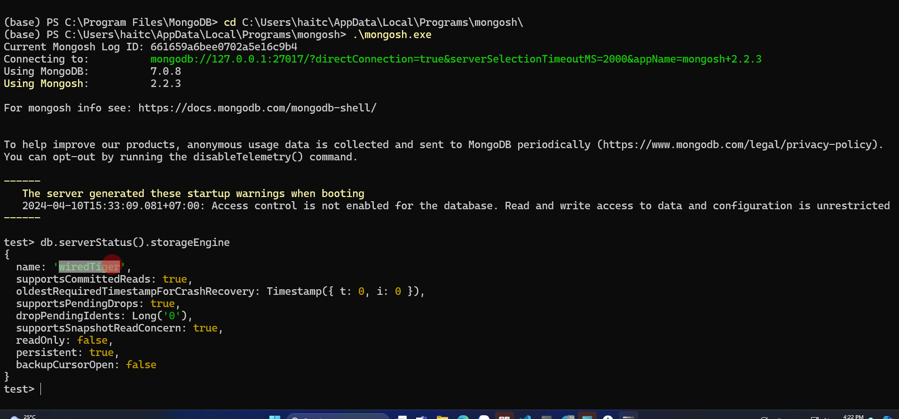
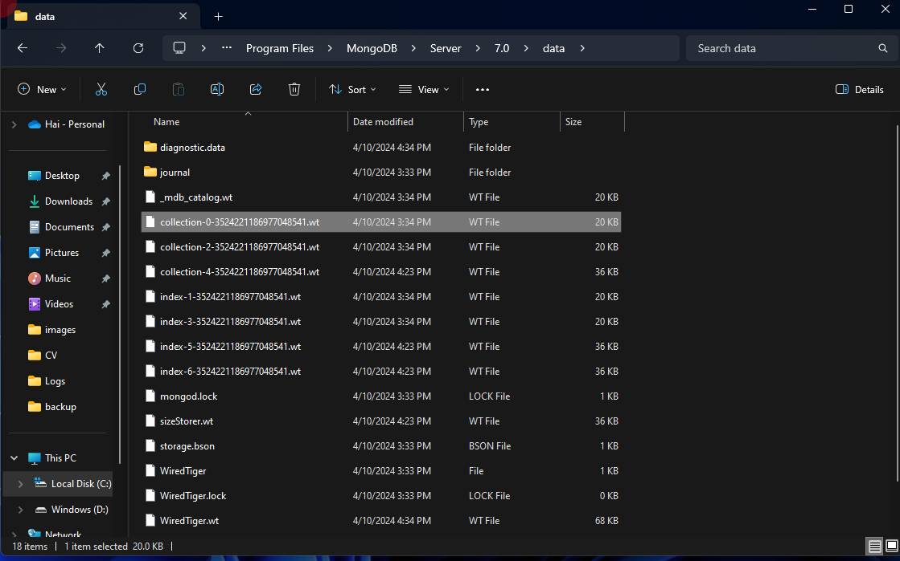
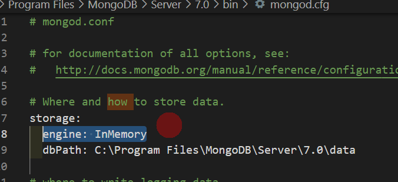
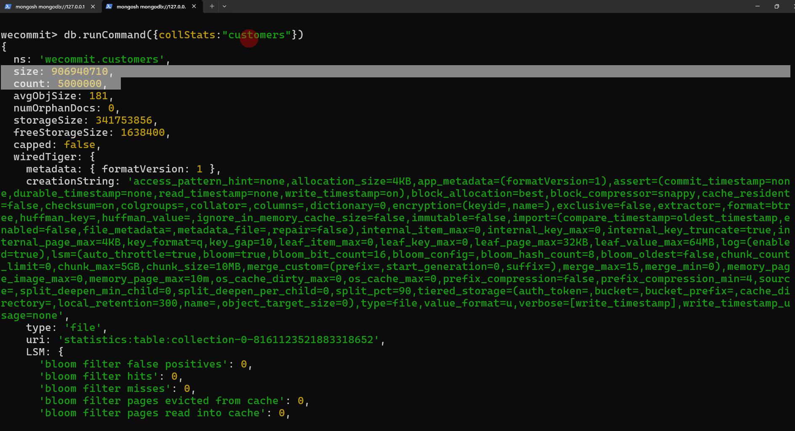
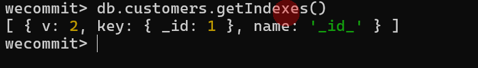
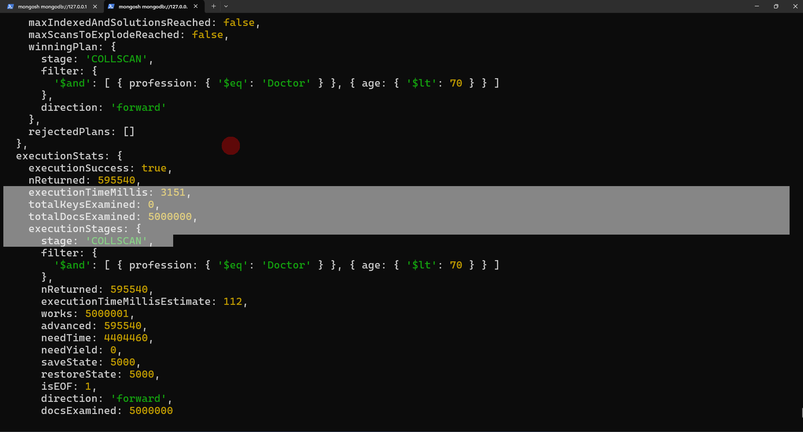
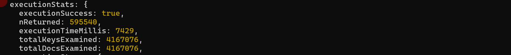
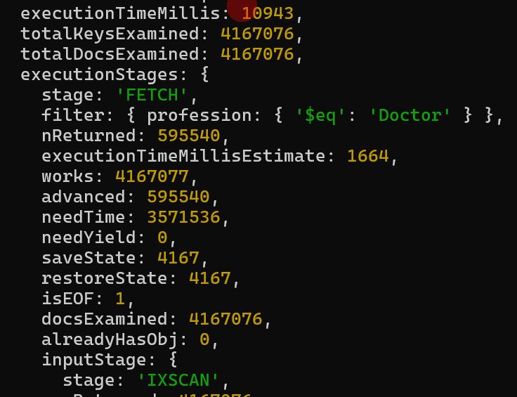
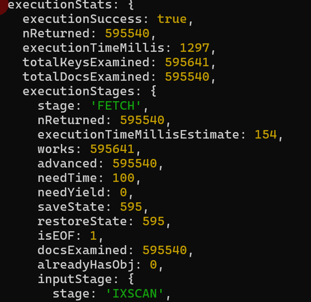
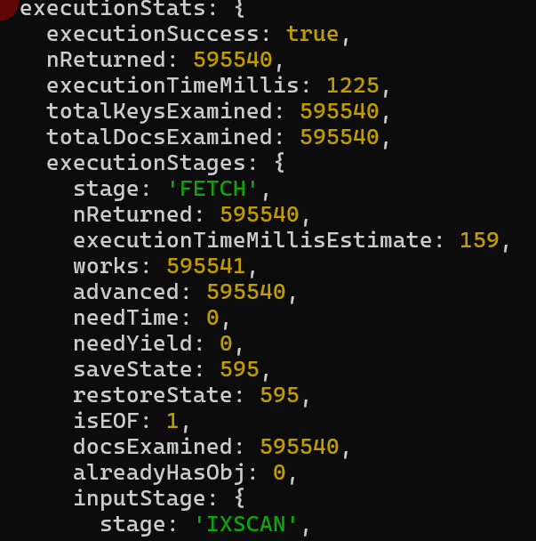

# Học MongoDB trọn vẹn trong 1 giờ 30 phút

[Link khóa học](https://www.youtube.com/watch?v=8Nx7cdwT86c&t=1247s)

## Thuật ngữ trong MongoDB

| RDBMS (CSDL quan hệ) | MongoDB    | Khác                                    |
|:--------------------:|:----------:|:---------------------------------------:|
| Database             | Database   |                                         |
| Table                | Collection |                                         |
| Coloumn              | Feild      | Feild không cần định nghĩa kiểu dữ liệu |
| Index                | Index      |                                         |

## Các mô hình triển khai MongoDB

- Standalone:
  - Triển khia trên 1 server duy nhất.
  - Ưu điểm: Đơn giản.
  - Nhược điểm: Tính sẵn sàng, hiệu năng, chỉ có thể mở rộng theo chiều dọc **vertical scale** tức là muốn nâng cấp phải nâng cấu hình server.
- Replication:
  - Có nhiều server cài MongoDB. Trong đó có 1 sv chính là sv **Primary** nhận lệnh từ các client rồi đẩy dữ liệu thay đổi đó sang các sv dự phòng **Secondary**
  - Ưu điểm: Tính sẵn sàng cao vì khi Primary gặp sự cố thì 1 Secondary có thể trở thành Primary.
  - Nhược điểm: Phức tạp, cũng chỉ có thể **vertical scale**.

- Sharding
  - Dữ liệu được phân chia lưu trữ ở nhiều server
  - Mở rộng theo chiều ngang **horizontal scale**
  - Có thể kết hợp với mô hình Replication.

## Các cách triển khai

- Cloud:  free 512MB, tạo theo mô hình Replication 1 Primary và 2 Secondatry.
- On-promise: Cài trực tiếp MongoDB trên server của mình.
  - [MongoDB Community Server](https://www.mongodb.com/try/download/community)
  - Port: 27017
  - [Mongo Shell](https://www.mongodb.com/try/download/shell)
  - Mongosh:

  ``` CMD
  cd C:\Users\haitc\AppData\Local\Programs\mongosh\
  .\mongosh.exe
  ```

## Kiến trúc Logic

- Database
  - Collection
    - Document
      - Document con
- Kiến trúc hoạt động
  - MOngoDB được cài trên Server và được cấp phát tài nguyên.
  - Dữ liệu của DB được lưu vào Memory sau đó chuyển về File lưu trên Disk.
  - **Storage Engine**: Quyết định thành phần Memory và FIle, giải thuật tương tác giữa chúng:
    - WireTiger Storage Engine (Default)
    - In-Memory Storage Engine: Chỉ có trong phiên bản Enterprise.

- Cách kiểm tra Storage Engine
  - Cách 1: Dùng mongosh

  ``` CMD
  cd C:\Users\haitc\AppData\Local\Programs\mongosh\
  .\mongosh.exe
  ```

  

  - Cách 2: Xem định dạng file trong thư mục lưu trữ Data: C:\Program Files\MongoDB\Server\7.0\data
  

- Thay đổi Storage Engine
  - Vào file: C:\Program Files\MongoDB\Server\7.0\bin\mongod.cfg
  

- Tổng quan kiến trúc

  - Jonal: File lưu nhật ký sử dụng để khôi phục. Tương tự như Transaction Log File trong SQL Server, Wal Log trong PostgreSQL.

## Các lệnh cơ bản

- Xem danh sách database

``` Mongosh
 show databases
 ```

- Sử dụng DB nếu chưa có thì tạo mới

 ``` Mongosh
use wecommit
 ```

- Thêm dữ liệu vào collection

 ```mongosh
db.mycollection.insertOne({name: "Trần Hải", age: 29, city:"Hà Nội"})
db.mycollection.insertMany([ {name: "Nguyễn Sơn", age: 30, city:"Hà Nội"}, {name: "Hà trang", phoneNumber: "0123456789"} ])
 ```

- Truy vấn dữ liệu trong collection

 ``` Mongosh
db.mycollection.find()
db.mycollection.find().limit(2)
db.mycollection.find({ phoneNumber: "0123456789"})
db.mycollection.find({ age: { $lt: 26 }})
db.mycollection.find( {$or: [ {age: 25}, {city:"Hà Nội"} ]} )
 ```

- Sắp xếp dữ liệu

 ``` Mongosh
 db.mycollection.find().sort({age: 1})
  db.mycollection.find().sort({age: -1})
 ```

- Sửa dữ liệu

 ``` Mongosh
  db.mycollection.updateOne( {name: "Nguyễn Sơn"}, {$set: {city: "Bắc Giang"}} )
  ```

- Xóa dữ liệu

```  Mongosh
 db.mycollection.deleteOne({age:23})
```

- Kiểm tra index trong collection

``` Mongosh
db.mycollection.getIndexes()
```

- Xem thông tin collection: Số document, dung lượng.

``` Mongosh
db.runCommand({collStats:"mycollection"})
```

- Xem chiến lược thực thi của câu lệnh

``` Mongosh

db.mycollection.find( {$or: [ {age: 25}, {city:"Hà Nội"} ].explain("executionStats")
```

- Tạo index

``` Mongosh
db.mycollection.createIndex({age: 1}, {name: "IDX_AGE"})
db.mycollection.createIndex({phoneNumber: 1, age: 1}, {name: "IDX_PHONENUMBER_AGE"})
```

>**NOTE** Thứ tự feild trong index **rất quan trọng**, đặt biệt **feild đầu tiên** khi query có thể không sử dụng. Như IDX_PHONENUMBER_AGE khi query điều kiện với age sẽ không được sử dụng và giải thuật vẫn sẽ quét toàn bộ collection (COLLSCAN).
>**NOTE** index trên nhiều feild và đúng thứ tự trong điều kiện trong câu query thì sẽ có hiệu quả hơn nhiều so với index trên 1 feild.

- Xóa collection

``` Mongosh
db.mycollection.drop()
```

## Tối ưu hiệu năng

- Tạo dữ liệu giả lập
  - Tạo collection

  ``` Mongosh
  use wecommit
  ```

  - Tạo dữ liệu

``` JS
// Function to generate a random customer
function createRandomCustomer() {
    // Sample data arrays
    const names = ["John", "Alice", "Bob", "Emma", "Michael", "Sophia", "James", "Olivia"];
    const lastNames = ["Smith", "Johnson", "Williams", "Brown", "Jones", "Miller", "Davis"];
    const professions = ["Engineer", "Doctor", "Teacher", "Artist", "Accountant", "Lawyer", "Chef"];
    const domains = ["gmail.com", "yahoo.com", "hotmail.com", "outlook.com", "example.com"];
    const streets = ["Main St", "Oak St", "Elm St", "Maple Ave", "Cedar St"];
    const cities = ["New York", "Los Angeles", "Chicago", "Houston", "Phoenix", "Philadelphia"];
    const states = ["CA", "TX", "FL", "NY", "PA", "IL"];
    
    // Randomly select data
    const name = names[Math.floor(Math.random() * names.length)];
    const lastName = lastNames[Math.floor(Math.random() * lastNames.length)];
    const email = `${name.toLowerCase()}.${lastName.toLowerCase()}@${domains[Math.floor(Math.random() * domains.length)]}`;
    const phoneNumber = `${Math.floor(Math.random() * 9000000000) + 1000000000}`; // Generates a 10-digit number
    const age = Math.floor(Math.random() * 60) + 20; // Generates age between 20 and 79
    const address = `${Math.floor(Math.random() * 9999) + 1} ${streets[Math.floor(Math.random() * streets.length)]}, ${cities[Math.floor(Math.random() * cities.length)]}, ${states[Math.floor(Math.random() * states.length)]}`;
    const profession = professions[Math.floor(Math.random() * professions.length)];

    // Construct customer object
    const customer = {
        name: `${name} ${lastName}`,
        email: email,
        phoneNumber: phoneNumber,
        age: age,
        address: address,
        profession: profession
    };

    return customer;
}

// Array to store random customers
const randomCustomers = [];

// Generate 5,000,000 random customers and push them to the array
for (let i = 0; i < 5000000; i++) {
    randomCustomers.push(createRandomCustomer());
}

// Function to insert documents in batches of 100,000
function insertBatch(startIndex, batchSize) {
    const batch = randomCustomers.slice(startIndex, startIndex + batchSize);
    if (batch.length > 0) {
        db.customers.insertMany(batch);
    }
}

// Insert documents in batches of 100,000
const batchSize = 100000;
for (let i = 0; i < randomCustomers.length; i += batchSize) {
    insertBatch(i, batchSize);
}

print("Documents inserted successfully.");
```

- Xem thoong tin collection customers

``` Mongoosh
db.runCommand({collStats:"customers"})
```



- Kiểm tra index trong customers:

``` Mongoosh
 db.customers.getIndexes()
```



- Câu truy vấn lấy khách hàng ít hơn 70 tuổi và làm nghề bác sỹ

``` Mongosh
db.customers.find({ age: { $lt: 70 }, profession: "Doctor" }).explain("executionStats")
```

- trước khi có index:
  - Thời gian: 3s
  - Quét 5 triệu doc
  - Giải thuật COLLSCAN
  
- tạo index trên trường age
  - Thời gian: 7s
  - Số doc quét: 4tr1
  - Giải thuật (stage): IXSCAN

``` Mongosh
 db.customers.createIndex({ age: 1}, {name:"IDX_AGE"})
 ```

 

- Xóa index IDX_AGE

 ``` Mongosh
db.customers.dropIndex("IDX_AGE")
 ```

- tạo index trên age, name

``` Mongosh
db.customers.createIndex({age: 1, name: 1},{name:"IDX_AGE_NAME"})
```

 

- Tạo index trên 2 trường age, profession

 ``` Mongosh
 db.customers.createIndex({ age: 1, profession: 1}, {name:"IDX_AGE_PROFESSION"})
 ```

 

- tạo index trên 2 trường profession, age (ngược so với trên)

``` mongosh
db.customers.createIndex({ profession: 1, age: 1}, {name:"IDX_PROFESSION_AGE"})
```



>### Kết luận

- Index trên nhiều feild theo điều kiện query là hiệu quả nhất. - Nếu index **trùng với điều kiện** thì thứ tự feild không quan trọng. Ngược lại nếu chỉ có 1 vài feild trong index khớp với câu query thì thứ tự sẽ ảnh hưởng đến hiệu năng.
- Nếu index chỉ có 1 vài trường trong câu query thì có thể không IXSCAN và hiệu năng còn thấp hơn index đơn.
