- [Nội dung bài học](https://wecommit.com.vn/mindmap-kien-thuc-postgresql-1h30ph/)
- [Cài đặt xmind](https://xmind.app/)
- [Mindmap](https://drive.google.com/file/d/1r9kYB-IGqz8nG01o971d3d2NR5C9kUQg/view)
- [Script giả lập dữ liệu](https://drive.google.com/file/d/1r9kYB-IGqz8nG01o971d3d2NR5C9kUQg/view)
- Video
{@youtube: <https://www.youtube.com/watch?v=OUlLQK_gN8k}>

# Kiến trúc Logic

- Postgre có kiến trúc chia thành: Cluster DataBase > Database > Schema > ....
- Mỗi object (databse, shcema, table, index, view.
..) trong PostgreSQL có 1 mã OID. Và chúng được lưu trữ trong thư mục tương ứng có tên là OID trong OS <thư mục cài đặt PostgreSQL>/data/base/<OID></OID>

``` SQL
SELECT * FROM pg_database;

SELECT * FROM pg_class WHERE relname = 'countries';

SELECT * FROM pg_tables;
```

- PostgreSQL tổ chức lại lưu trữ vật lý 1 cách khoa học gọi là table space.
- Khi tạo ra 1 DB thì mặc định postgreSQL sẽ tạo ra 2 **table space** là: **pg_global** và **pg_default**:
  - **pg_global**: Lưu các object của hệ thống.
  - **pg_default**: tất cả các object khác lưu vào pg_default.
- Có thể tạo table space lưu trữ ở bất kỳ đâu trong directory.
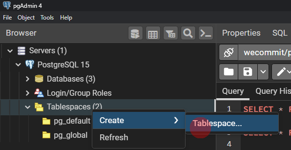
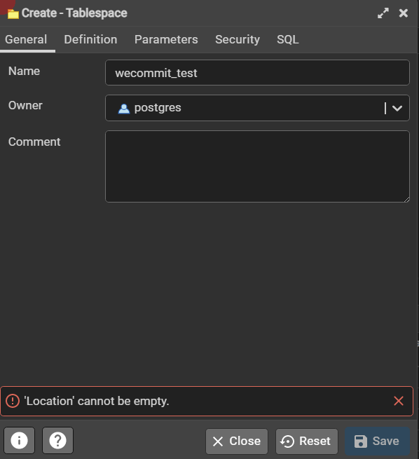
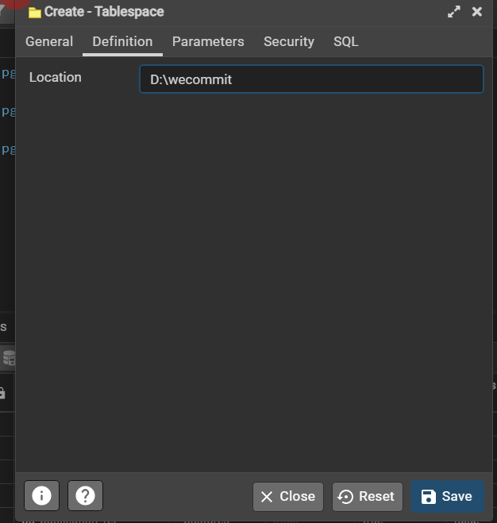
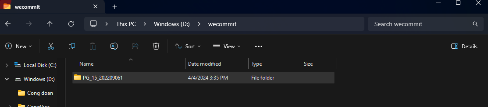

``` SQL
CREATE TABLE wecommit_test (id int) tablespace wecommit_test;
INSERT INTO wecommit_test VALUES (1);
SELECT * FROM wecommit_test;
SELECT * FROM pg_tables WHERE tablename = 'wecommit_test';
SELECT * FROM pg_class WHERE relname = 'wecommit_test';
```

- Tác dụng của table space:
  - Quy hoạch DB: Tạo table space cho các bảng tùy hiệu năng, quy hoạch index...
  - Mở rộng bộ nhớ lưu trữ.

# Cấu trúc vật lý

## File cấu hình kết nối

- **/data/pg_hba.conf**: Mặc định chỉ kết nối local, cần cấu hình ip để truy cập.
- /data/pg_ident.conf: Chứa file mapping. Cấu hình xác thực bằng bên thứ 3.

## File thông tin cơ bản

- /data/PG_VERSION: Thông tin phiên bản của CSDL.
- **current_logfiles**: Thông tin file log hiện tại.
- Thông tin tiến trình postmaster:
  - /data/postmaster.opts
  - /data/postmaster.pid

## File tham số cấu hình Database

- **/data/postgresql.conf**: Lưu thông tin cấu hình.
- **/data/postgresql.auto.conf**
  - Khi gõ lệnh **ALTER SYSTEM**  thì sẽ tự động cập nhật tham số đó vào file **postgresql.auto.conf**.
  - Nếu tham số có ở cả 2 fie cấu hình thì **postgresql.auto.conf** sẽ được ghi đè lên file **postgresql.conf**.
  - **Truyệt đối không sửa tay file này**.

## Thư mục /data/base

- Chứa dữ liệu của các Database: bảng, index, shema...

## thư mục /data/global

- Chứa các object sử dụng chung cho toàn bộ DataBase Cluster.

## thư mục /data/log

- Chưa các file log của Database.

## thư mục /data/pg_wal

- Chứa các file lưu thông tin thay đổi của DB.
- Sử dụng để **khôi phục khi có sự cố**.

# Làm việc với PostgreSQL

- Tạo bảng mới từ 1 bảng có sắn

``` SQL
CREATE TABLE COUNTRIES_NEW
AS SELECT * FROM COUNTRIES;
```

- tạo index

``` SQL
CREATE INDEX idx_first_name ON employees(first_name);
```

- Xem chiến lược thực thi của câu lệnh **Tối ưu hiệu năng**:
  - Seq scan: Sequance Scan quét toàn bộ bảngg
  - cost: Chi phí để thực hiện câu lệnh.

``` SQL
explain select * from employees;
```

# Backup - Restore

## Backup bảng

- Export
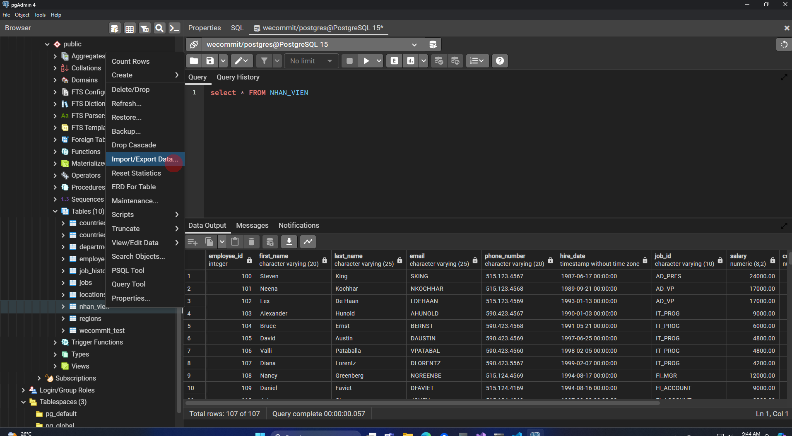
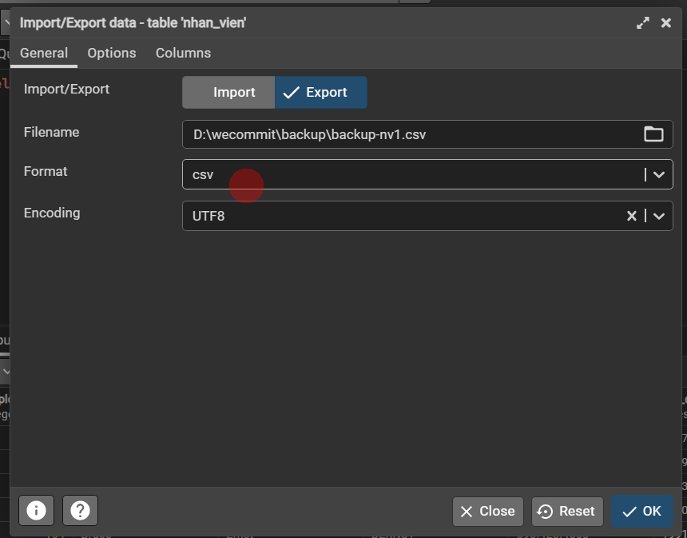
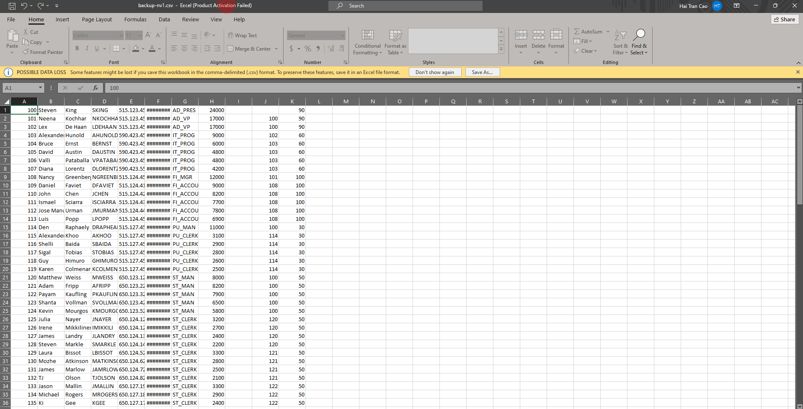

## Restore bảng

- Import
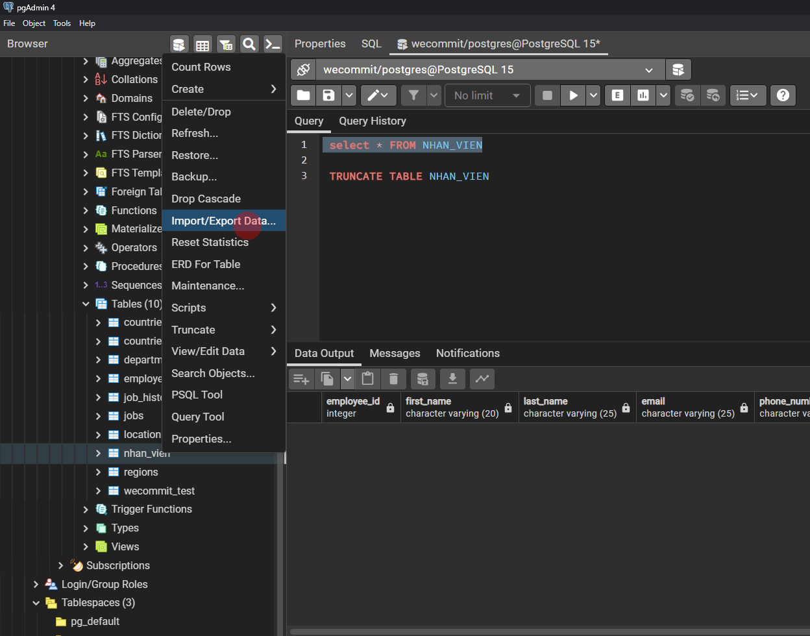
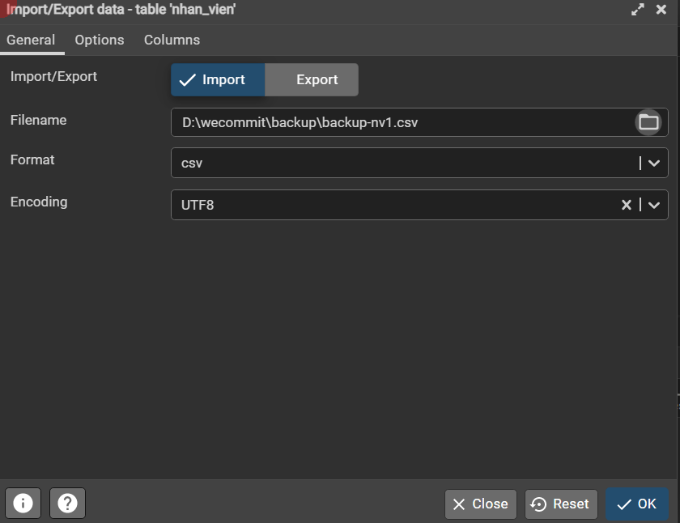

## Backup DB

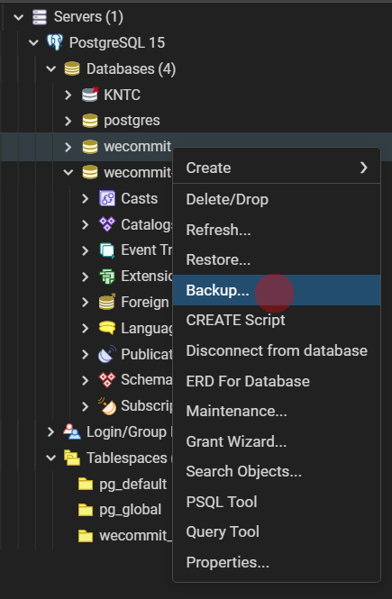
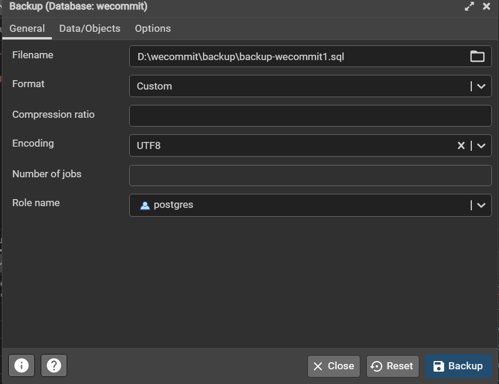

## Restore DB

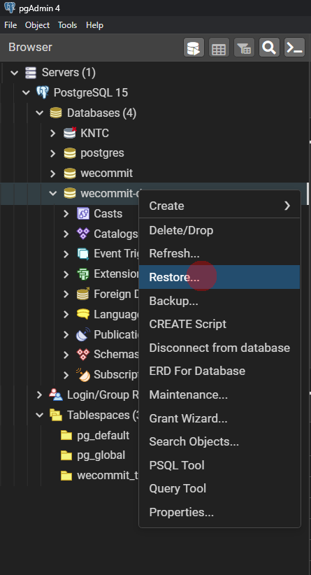
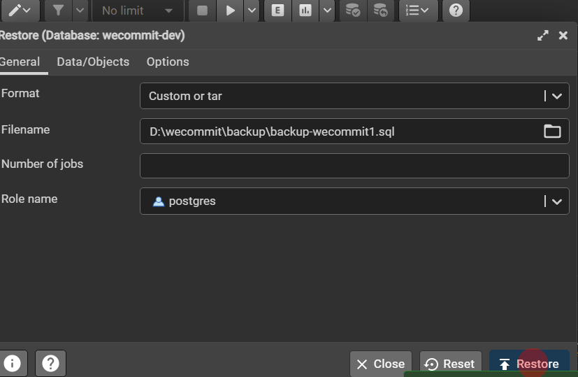

# Công cụ làm việc

## Psql (command line)

``` cmd
cd 'C:\Program Files\PostgreSQL\15\bin\'
.\psql.exe -h localhost -d wecommit -U postgres
<!-- danh sách db -->
\l
<!-- Danh sách bảng -->
\dt
<!-- Cấu trúc bảng -->
\d countries
<!-- Danh sách user -->
\du
<!-- Thoát -->
\q
```

## PG Admin 4

# DBeaver

[Trang chủ DBever](https://dbeaver.io/)
