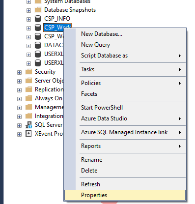
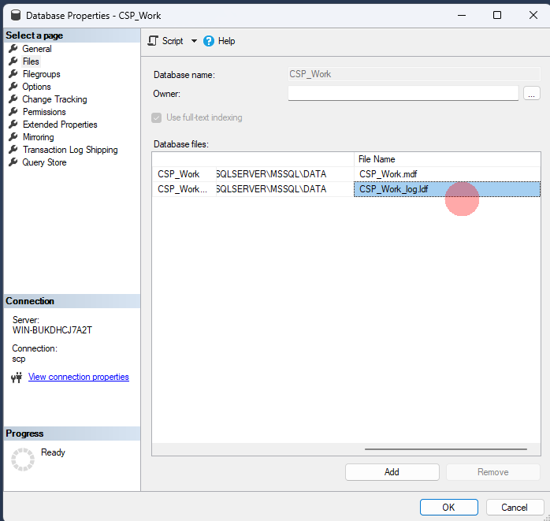
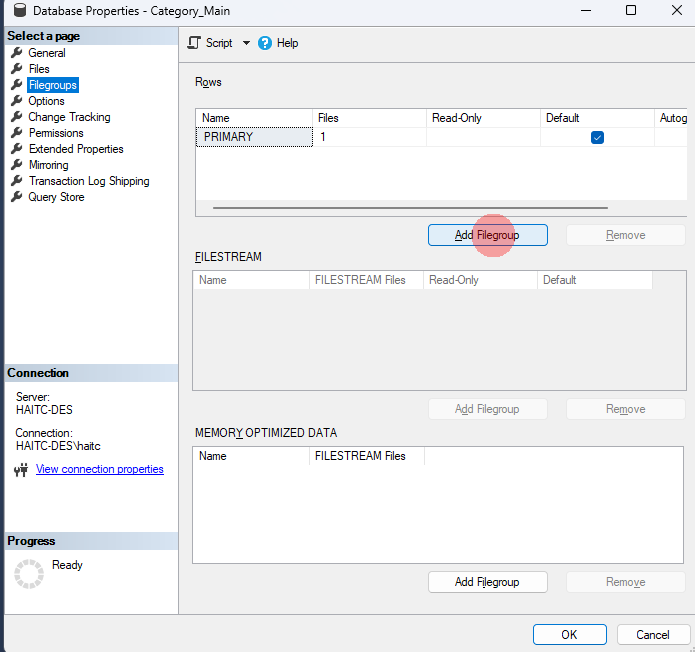
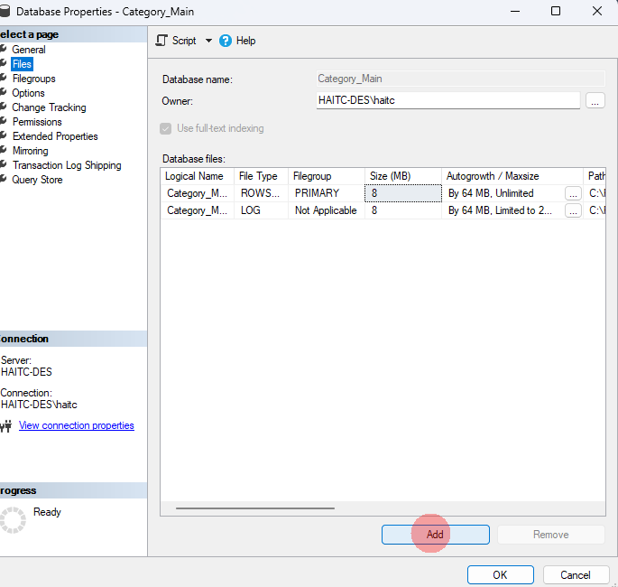

# Học SQL Server trong 60p

- [link khóa học](https://www.youtube.com/watch?v=alqEF4I23nw&t=633s)

## Kiến trúc logic

- System Database:

  - Lưu trữ System Catalogs:

    - Thông tin cấu hình.
    - Thông tin các DB trong instance.
    - thông tin Datafiles.
    - Login.

  - Bản chất **dữ liệu không nằm ở System Databas** mà nằm ở **Resource DataBase**.
- Model Database: Lưu trữ template để tạo DB cho nhan.
- **TampDB Database**:

  - Được tạo lại mỗi lần tạo DB: Không cần Recovery, Backup.
  - Chứa tất cả những gì dùng tạm khi thực thi câu lệnh: Tamp table, câu lệnh sort...
  - Cách tối ưu:
    - Tạo thêm Tempfile (mặc định SQL Server tạo 1 file gây nghẽn IO).
    - Ưu tiên lưu Tempfile ở phân vùng có tốc độ đọc ghi cao.
    - **Tempory table có thể tối ưu**: Index...

- MSDB:
  - Sử dụng cho SQL Server AgentService.
  - Sử dụng cho một số service quản trị khác: Đặt job, Cấu hình giải pháp HA.
- Resource Database (DB ẩn) trong thư mục \bin.

>**NOTE**:  Khi backup DB sang instance khác **phải backup DB hệ thông** để đảm bảo hoạt động.

## Kiến trúc vật lý




Tất cả DB đều bao gồm 2 loại file:

- Data File: Lưu trữ tất cả dữ liệu trong quá trình tạo bảng, insert, update, delete...
  - MDF File (Master Database FIle) **Bắt buộc có**
    - Đây là file lưu trữ thông tin chính:
      - INTERNAL CONFIGURATION
      - INTERNAL SYSTEM
    - Chứa thông tin vị trí các Data File khác.

  - NDF File (Secondary Database FIle):
    - Tất cả các Data Fuke khác đều gọi là Second Database File.
    - Có thể có hoặc không.
    - Có thể thay đổi định dạng mặc định NDF.

>**NOTE**: Trong các dự án lớn có thể có nhiều Data File (nên làm). Nhóm các file NDF cùng logic ví dụ: Sale vào 1 NDF, HR vào 1 NDF khác. Tất cả dữ liệu của Sale được đổ cùng vào 1 nươi là File Group.
>**NOTE**: **Không nên lưu dữ liệu người dùng vào MDF** Khi tạo DB tạo các File Group \>  NDF \> Khi tạo bảng chỉ định table đó ở FIle Group nào.



``` SQL
CREATE TABLE Employees (
  Id int,
  Name nvarchar(250)
) on HR;
```

- Transection Log File:
  - Lưu thông tin thay đổi dữ liệu.
  - Phục vụ cho khôi phục dữ liệu.

>**NOTE** Phải có chiến lược Backup Transacetion Logs. Không tự co kích thước file dẫn đến chậm dần.
